在软件开发中，为了提高软件系统的**可维护性**和**可复用性**，增加软件的**可扩展性**和**灵活性**，要尽量根据以下原则来开发程序。

> [单一职责、接口隔离、依赖倒转、里氏替换、开闭原则、迪米特、合成复用；单一原则与迪米特原则区别](https://blog.csdn.net/guorui_java/article/details/106469226)

## 单一职责原则

对于一个类，只有一个引起该类变化的原因；该类的职责是唯一的，且这个职责是唯一引起其他类变化的原因。

## 开闭原则

**对扩展开放，对修改关闭**。在程序需要进行拓展的时候，不能去修改原有的代码，实现一个热插拔的效果。
简言之，是为了使程序的扩展性好，易于维护和升级。 
想要达到这样的效果，我们需要使用接口和抽象类。 
因为抽象灵活性好，适应性广，只要抽象的合理，可以基本保持软件架构的稳定。而软件中易变的细节 可以从抽象派生来的实现类来进行扩展，当软件需要发生变化时，只需要根据需求重新派生一个实现类来扩展就可以了。
【例】搜狗输入法的皮肤设计。
分析：搜狗输入法 的皮肤是输入法背景图片、窗口颜色和声音等元素的组合。用户可以根据自己的喜 爱更换自己的输入法的皮肤，也可以从网上下载新的皮肤。这些皮肤有共同的特点，可以为其定义一个 抽象类（AbstractSkin），而每个具体的皮肤（DefaultSkin和FGOSkin）是其子类。用户窗体可以根据需要选择或者增加新的主题，而不需要修改原代码。

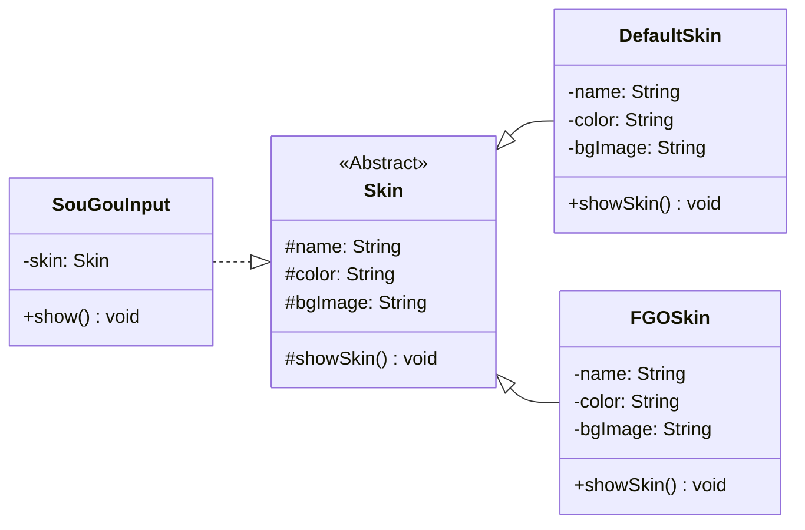

```java
public abstract class Skin {
    protected String name;
    protected String color;
    protected String bgImage;

    public Skin() {
    }

    public Skin(String name, String color, String bgImage) {
        this.name = name;
        this.color = color;
        this.bgImage = bgImage;
    }

    public void setName(String name) {
        this.name = name;
    }

    public void setColor(String color) {
        this.color = color;
    }

    public void setBgImage(String bgImage) {
        this.bgImage = bgImage;
    }

    protected abstract void showSkin();
}
```

```java
public class DefaultSkin extends Skin {

    public DefaultSkin() {
        super("default", "#000", null);
    }

    public DefaultSkin(String name, String color, String bgImage) {
        super(name, color, bgImage);
    }

    @Override
    public void showSkin() {
        System.out.println("默认主题");
        System.out.println("name = " + name);
        System.out.println("color = " + color);
        System.out.println("bgImage = " + bgImage);
    }
}
```

```java
public class FGOSkin extends Skin {
    public FGOSkin() {
    }

    public FGOSkin(String name, String color, String bgImage) {
        super(name, color, bgImage);
    }

    @Override
    public void showSkin() {
        System.out.println("FGO主题");
        System.out.println("name = " + name);
        System.out.println("color = " + color);
        System.out.println("bgImage = " + bgImage);
    }
}
```

```java
public class SouGouInput {
    private Skin skin;

    public SouGouInput(Skin skin) {
        this.skin = skin;
    }

    public void setSkin(Skin skin) {
        this.skin = skin;
    }

    public void show() {
        skin.showSkin();
    }
}
```

```java
public class Client {
    public static void main(String[] args) {
        Skin defaultSkin = new DefaultSkin();
        Skin FGOSkin = new FGOSkin("Fate Grand Order", "cyan", "FGO.png");

        SouGouInput souGou = new SouGouInput(defaultSkin);
        souGou.show();
        souGou.setSkin(FGOSkin);
        souGou.show();
    }
}
```

## 里氏代换原则

里氏代换原则是面向对象设计的基本原则之一,是开闭原则重要方式之一。 

定义：任何基类可以出现的地方，子类一定可以出现；即如果将一个父类对象替换成它的子类对象后，该程序不会发生异常。

通俗理解：**子类可以扩展父类的功能， 但不能改变父类原有的功能**。换句话说，子类继承父类时，除添加新的方法完成新增功能外，尽量不要重写父类的方法。 

如果通过重写父类的方法来完成新的功能，这样写起来虽然简单，但是整个继承体系的可复用性会比较差，特别是运用多态比较频繁时，程序运行出错的概率会非常大。 

### 案例1——正方形不是长方形

里氏替换原则中经典的一个例子：正方形不是长方形
在数学领域里，正方形毫无疑问是长方形，它是一个长宽相等的长方形。所以开发的一个与几何图形相关的软件系统，就可以顺理成章的让正方形继承自长方形。

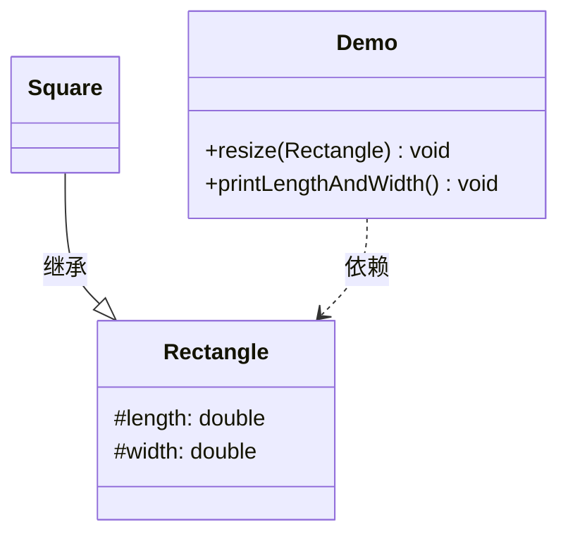

```java
public class Rectangle {
    private double length;
    private double width;
    public double getLength() {
        return length;
    }
    public void setLength(double length) {
        this.length = length;
    }
    public double getWidth() {
        return width;
    }
    public void setWidth(double width) {
        this.width = width;
    }
}
```

```java
public class Square extends Rectangle {
	/**
     * 由于正方形的长和宽相同，所以在方法setLength和setWidth中，对长度和宽度都需要赋相同值。
	 */
    public void setWidth(double width) {
        super.setLength(width);
        super.setWidth(width);
    }
    public void setLength(double length) {
        super.setLength(length);
        super.setWidth(length);
    }
}
```

类RectangleDemo是软件系统中的一个组件，它有一个`resize`方法依赖基类Rectangle，`resize`方法是RectandleDemo类中的一个方法，用来实现宽度逐渐增长的效果。

```java
public class RectangleDemo {
    public static void resize(Rectangle rectangle) {
        while (rectangle.getWidth() <= rectangle.getLength()) {
            rectangle.setWidth(rectangle.getWidth() + 1);
        }
    }
    //打印长方形的长和宽
    public static void printLengthAndWidth(Rectangle rectangle) {
        System.out.println(rectangle.getLength());
        System.out.println(rectangle.getWidth());
    }
    public static void main(String[] args) {
        Rectangle rectangle = new Rectangle();
        rectangle.setLength(20);
        rectangle.setWidth(10);
        resize(rectangle);
        printLengthAndWidth(rectangle);
        System.out.println("=============");
        Rectangle rectangle1 = new Square();
        rectangle1.setLength(10);
        resize(rectangle1);
        printLengthAndWidth(rectangle1);
    }
}
```

假如我们把一个普通长方形作为参数传入resize方法，就会看到长方形宽度逐渐增长的效果，当宽度大于长度,代码就会停止，这种行为的结果符合我们的预期；假如再把一个正方形作为参数传入resize方法后，就会看到正方形的宽度和长度都在不断增长，代码会 一直运行下去，直至系统产生溢出错误。所以，普通的长方形是适合这段代码的，正方形不适合。得出结论：在resize方法中，Rectangle类型的参数是不能被Square类型的参数所代替，如果进行了替换就得不到预期结果。因此，Square类和Rectangle类之间的继承关系违反了里氏代换原则， 它们之间的继承关系不成立，正方形不是长方形。 如何改进呢？此时需要重新设计他们之间的关系。抽象出来一个四边形接口(Quadrilateral)，让Rectangle类和Square类实现Quadrilateral接口

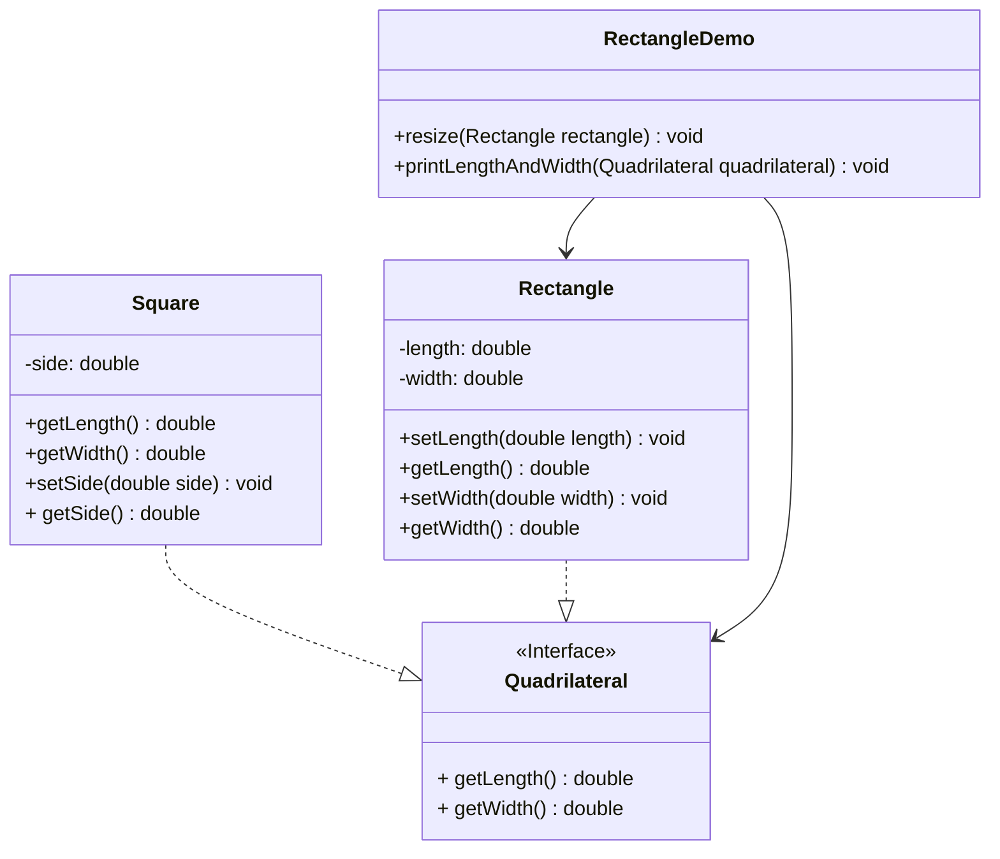

```java
public interface Quadrilateral {
    //获取长
    double getLength();
    //获取宽
    double getWidth();
}
```

```java
public class Rectangle implements Quadrilateral {

    private double length;
    private double width;

    public void setLength(double length) {
        this.length = length;
    }

    public void setWidth(double width) {
        this.width = width;
    }

    @Override
    public double getLength() {
        return length;
    }

    @Override
    public double getWidth() {
        return width;
    }
}
```

```java
public class Square implements Quadrilateral {

    private double side;

    public double getSide() {
        return side;
    }

    public void setSide(double side) {
        this.side = side;
    }

    @Override
    public double getLength() {
        return side;
    }

    @Override
    public double getWidth() {
        return side;
    }
}
```

```java
public class RectangleDemo {
    public static void main(String[] args) {
        //创建长方形对象
        Rectangle r = new Rectangle();
        r.setLength(20);
        r.setWidth(10);
        //调用方法进行扩宽操作
        resize(r);

        printLengthAndWidth(r);
    }

    //扩宽的方法
    public static void resize(Rectangle rectangle) {
        //判断宽如果比长小，进行扩宽的操作
        while(rectangle.getWidth() <= rectangle.getLength()) {
            rectangle.setWidth(rectangle.getWidth() + 1);
        }
    }

    //打印长和宽
    public static void printLengthAndWidth(Quadrilateral quadrilateral) {
        System.out.println(quadrilateral.getLength());
        System.out.println(quadrilateral.getWidth());
    }
}
```

### 案例2

> [https://blog.csdn.net/weixin_39327556/article/details/125268590](https://blog.csdn.net/weixin_39327556/article/details/125268590)

例如：鸟一般都会飞行，如燕子的飞行速度大概是每小时 120 千米。但是新西兰的几维鸟由于翅膀退化无法飞行。假如要设计一个实例，计算这两种鸟飞行 300 千米要花费的时间。显然，拿燕子来测试这段代码，结果正确，能计算出所需要的时间；但拿几维鸟来测试，结果会发生“除零异常”或是“无穷大”，明显不符合预期。

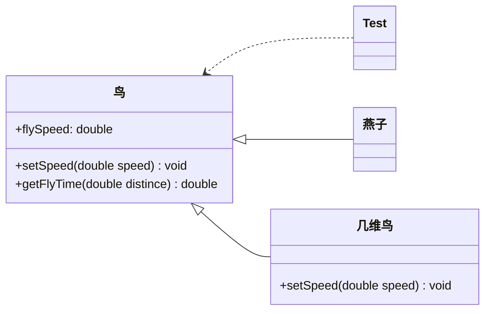

```java
public class LSPtest {
    public static void main(String[] args) {
        Bird bird1 = new Swallow();
        Bird bird2 = new BrownKiwi();
        bird1.setSpeed(120);
        bird2.setSpeed(120);
        System.out.println("如果飞行300公里：");
        try {
            System.out.println("燕子将飞行" + bird1.getFlyTime(300) + "小时.");
            System.out.println("几维鸟将飞行" + bird2.getFlyTime(300) + "小时。");
        } catch (Exception err) {
            System.out.println("发生错误了!");
        }
    }
}
 
//鸟类
class Bird {
    double flySpeed;
 
    public void setSpeed(double speed) {
        flySpeed = speed;
    }
 
    public double getFlyTime(double distance) {
        return (distance / flySpeed);
    }
}
 
//燕子类
class Swallow extends Bird {
}
 
//几维鸟类
class BrownKiwi extends Bird {
    public void setSpeed(double speed) {
        flySpeed = 0;
    }
}
 
------------------   运行结果   --------------------
 
如果飞行300公里：
燕子将飞行2.5小时.
几维鸟将飞行Infinity小时。
 
Process finished with exit code 0
```

这个设计存在的问题是：
    1、几维鸟类重写了鸟类的 setSpeed(double speed) 方法，这违背了里氏替换原则。
    2、燕子和几维鸟都是鸟类，但是父类抽取的共性有问题，几维鸟的的飞行不是正常鸟类的功能，需要特殊处理，应该抽取更加共性的功能。
正确的做法是：取消几维鸟原来的继承关系，定义鸟和几维鸟的更一般的父类，如动物类，它们都有奔跑的能力。几维鸟的飞行速度虽然为 0，但奔跑速度不为 0，可以计算出其奔跑 300 千米所要花费的时间。

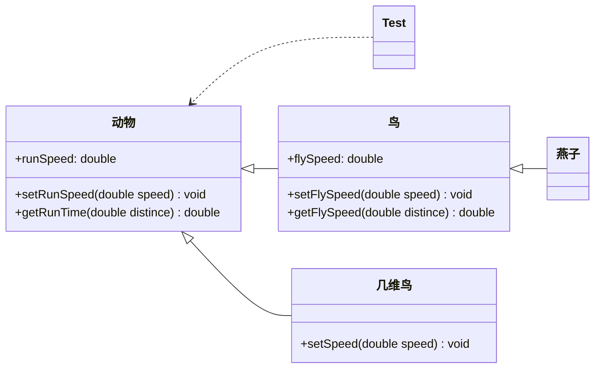

这样设计虽然增加了一个动物类，但是我的子类仅仅是继承父类，不去重写父类的方法。这样在代码层面，父类若是替换成子类，那么程序仍然能够正常运行。

```java
public class Lsptest2 {
    public static void main(String[] args) {
 
        Animal animal1 = new Bird();
        Animal animal2 = new BrownKiwi();
        animal1.setRunSpeed(120);
        animal2.setRunSpeed(180);
        System.out.println("如果奔跑300公里：");
        try {
            System.out.println("鸟类将奔跑" + animal1.getRunSpeed(300) + "小时.");
            System.out.println("几维鸟将奔跑" + animal2.getRunSpeed(300) + "小时。");
            Bird bird = new Swallow();
            bird.setFlySpeed(150);
            System.out.println("如果飞行300公里：");
            System.out.println("燕子将飞行" + bird.getFlyTime(300) + "小时.");
        } catch (Exception err) {
            System.out.println("发生错误了!");
        }
    }
}
    /**
     * 动物类，抽象的功能更加具有共性
     */
       class  Animal{
        Double runSpeed;
 
        public void setRunSpeed(double runSpeed) {
            this.runSpeed = runSpeed;
        }
 
        public double getRunSpeed(double distince) {
        return distince/runSpeed;
        }
    }
 
    /**
     * 鸟类继承动物类
     */
    class Bird extends Animal{
           double flySpeed;
 
        public void setFlySpeed(double flySpeed) {
            this.flySpeed = flySpeed;
        }
 
 
        public double getFlyTime(double distince) {
            return distince/flySpeed;
        }
    }
 
 
    /**
     * 几维鸟继承动物类
     */
    class  BrownKiwi extends  Animal{
 
    }
 
    /**
     * 燕子继承鸟类  飞行属于燕子的特性，
     */
  class Swallow extends  Bird{
 
  }

 
---------   运行结果  -----------------
如果奔跑300公里：
鸟类将奔跑2.5小时.
几维鸟将奔跑1.6666666666666667小时。
如果飞行300公里：
燕子将飞行2.0小时.
```

---

总结：里氏替换原则的主要作用如下

- 里氏替换原则是实现开闭原则的重要方式之一。
- 它克服了继承中重写父类造成的可复用性变差的缺点。
- 它是动作正确性的保证。即类的扩展不会给已有的系统引入新的错误，降低了代码出错的可能性。
- 加强程序的健壮性，同时变更时可以做到非常好的兼容性，提高程序的维护性、可扩展性，降低需求变更时引入的风险。

## 依赖倒转原则

高层模块不应该依赖低层模块，两者都应该依赖其抽象；抽象不应该依赖细节，细节应该依赖抽象。简单的说就是**要求对抽象进行编程，不要对实现进行编程**，这样就降低了客户与实现模块间的耦合。
【例】组装电脑
现要组装一台电脑，需要配件cpu，硬盘，内存条。只有这些配置都有了，计算机才能正常的运行。CPU可以选择Intel，AMD，硬盘可以选择希捷、西数等，内存条可以选择金士顿，海盗船等。

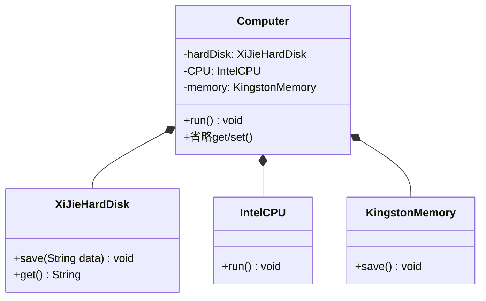

```java
public class IntelCpu {
    public void run() {
        System.out.println("使用Intel处理器");
    }
}
```

```java
public class KingstonMemory {
    public void save() {
        System.out.println("使用金士顿内存条");
    }
}
```

```java
public class XiJieHardDisk {

    //存储数据的方法
    public void save(String data) {
        System.out.println("使用希捷硬盘存储数据为：" + data);
    }

    //获取数据的方法
    public String get() {
        System.out.println("使用希捷希捷硬盘取数据");
        return "数据";
    }
}
```

```java
public class Computer {

    private XiJieHardDisk hardDisk;
    private IntelCpu cpu;
    private KingstonMemory memory;

    public XiJieHardDisk getHardDisk() {
        return hardDisk;
    }

    public void setHardDisk(XiJieHardDisk hardDisk) {
        this.hardDisk = hardDisk;
    }

    public IntelCpu getCpu() {
        return cpu;
    }

    public void setCpu(IntelCpu cpu) {
        this.cpu = cpu;
    }

    public KingstonMemory getMemory() {
        return memory;
    }

    public void setMemory(KingstonMemory memory) {
        this.memory = memory;
    }

    public void run() {
        System.out.println("运行计算机");
        String data = hardDisk.get();
        System.out.println("从硬盘上获取的数据是：" + data);
        cpu.run();
        memory.save();
    }
}
```

```java
public class ComputerDemo {
    public static void main(String[] args) {
        //创建组件对象
        XiJieHardDisk hardDisk = new XiJieHardDisk();
        IntelCpu cpu = new IntelCpu();
        KingstonMemory memory = new KingstonMemory();

        //创建计算机对象
        Computer c = new Computer();
        //组装计算机
        c.setCpu(cpu);
        c.setHardDisk(hardDisk);
        c.setMemory(memory);

        //运行计算机
        c.run();
    }
}
```

上面代码可以看到已经组装了一台电脑，但是似乎组装的电脑的cpu只能是Intel的，内存条只能是金士顿的，硬盘只能是希捷的，这对用户肯定是不友好的，用户有了机箱肯定是想按照自己的喜好，选择自己喜欢的配件。 
根据依赖倒转原则进行改进： 
代码我们只需要修改Computer类，让Computer类依赖抽象（各个配件的接口），而不是依赖于各个组件具体的实现类。

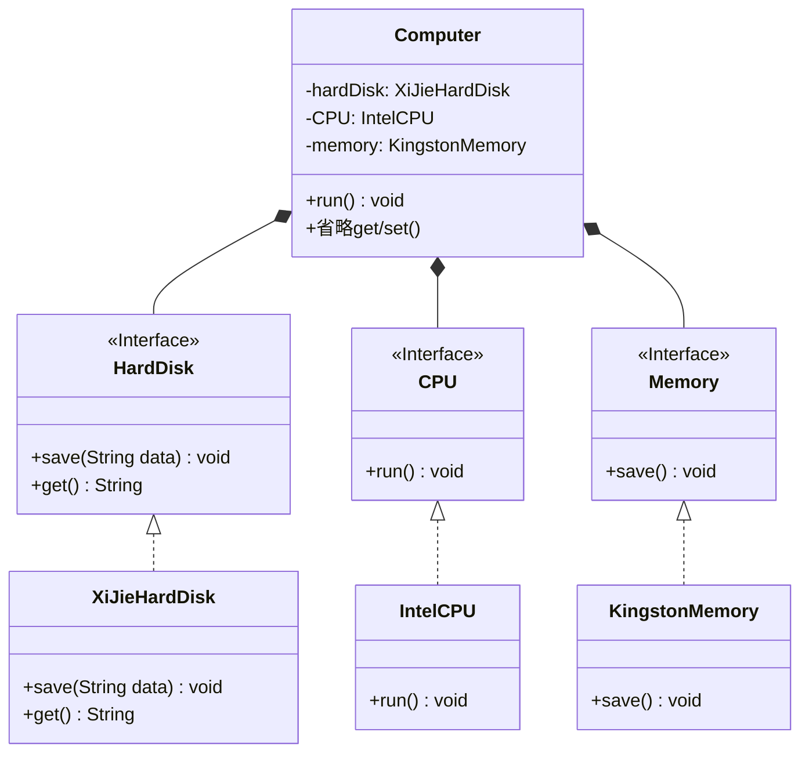

```java
public interface Cpu {
    //运行cpu
    public void run();
}
```

```java
public interface HardDisk {

    //存储数据
    public void save(String data);

    //获取数据
    public String get();
}
```

```java
public interface Memory {

    public void save();
}
```

```java
public class IntelCpu implements Cpu {

    @Override
    public void run() {
        System.out.println("使用Intel处理器");
    }
}
```

```java
public class XiJieHardDisk implements HardDisk {

    //存储数据的方法
    @Override
    public void save(String data) {
        System.out.println("使用希捷硬盘存储数据为：" + data);
    }

    //获取数据的方法
    @Override
    public String get() {
        System.out.println("使用希捷希捷硬盘取数据");
        return "数据";
    }
}
```

```java
public class KingstonMemory implements Memory {

    @Override
    public void save() {
        System.out.println("使用金士顿内存条");
    }
}
```

```java
public class Computer {

    private HardDisk hardDisk;
    private Cpu cpu;
    private Memory memory;

    public HardDisk getHardDisk() {
        return hardDisk;
    }

    public void setHardDisk(HardDisk hardDisk) {
        this.hardDisk = hardDisk;
    }

    public Cpu getCpu() {
        return cpu;
    }

    public void setCpu(Cpu cpu) {
        this.cpu = cpu;
    }

    public Memory getMemory() {
        return memory;
    }

    public void setMemory(Memory memory) {
        this.memory = memory;
    }

    //运行计算机
    public void run() {
        System.out.println("运行计算机");
        String data = hardDisk.get();
        System.out.println("从硬盘上获取的数据是：" + data);
        cpu.run();
        memory.save();
    }
}
```

```java
public class ComputerDemo {
    public static void main(String[] args) {

        //创建计算机的组件对象
        HardDisk hardDisk = new XiJieHardDisk();
        Cpu cpu = new IntelCpu();
        Memory memory = new KingstonMemory();

        //创建计算机对象
        Computer c = new Computer();
        //组装计算机
        c.setCpu(cpu);
        c.setHardDisk(hardDisk);
        c.setMemory(memory);

        //运行计算机
        c.run();
    }
}
```

面向对象的开发很好的解决了这个问题，一般情况下抽象的变化概率很小，让用户程序依赖于抽象，实现的细节也依赖于抽象。即使实现细节不断变动，只要抽象不变，客户程序就不需要变化。这大大降低了客户程序与实现细节的耦合度。

## 接口隔离原则

客户端不应该被迫依赖于它不使用的方法；**一个类对另一个类的依赖应该建立在最小的接口上**。 
【例】安全门案例 
我们需要创建一个黑马品牌的安全门，该安全门具有防火、防水、防盗的功能。可以将防火，防水，防盗功能提取成一个接口，形成一套规范。

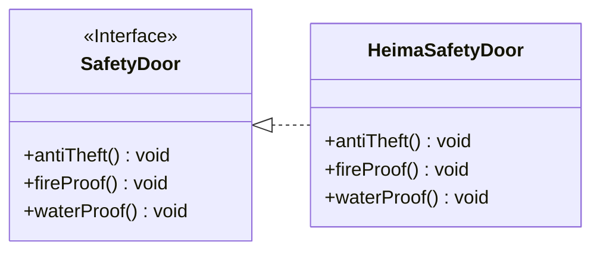

```java
public interface SafetyDoor {
    //防盗
    void antiTheft();
    
    //防火
    void fireProof();
    
    //防水
    void waterProof();
}
```

```java
public class HeimaSafetyDoor implements SafetyDoor {
    @Override
    public void antiTheft() {
        System.out.println("防盗");
    }
    
    @Override
    public void fireProof() {
        System.out.println("防火");
    }
    
    @Override
    public void waterProof() {
        System.out.println("防水");
    }
}
```

```java
public class Client {
    public static void main(String[] args) {
        HeimaSafetyDoor door = new HeimaSafetyDoor();
        door.antiTheft();
        door.fireProof();
        door.waterProof();
    }
}
```

上面的设计我们发现了它存在的问题，黑马品牌的安全门具有防盗，防水，防火的功能。现在如果我们还需要再创建一个传智品牌的安全门，而该安全门只具有防盗、防水功能呢？很显然如果实现 SafetyDoor接口就违背了接口隔离原则，那么我们如何进行修改呢？

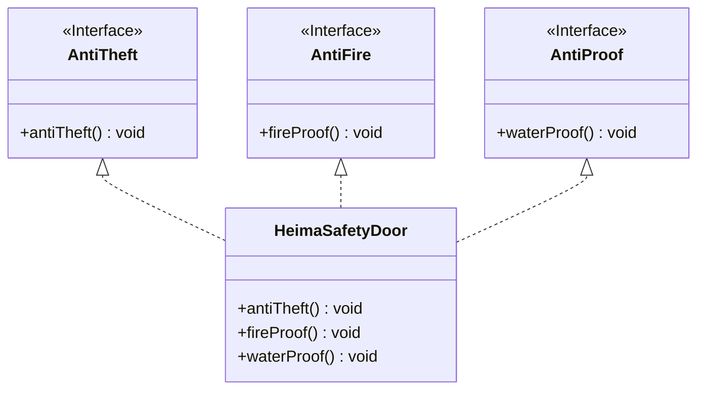

```java
public interface AntiTheft {
    void antiTheft();
}
```

```java
public interface Fireproof {
    void fireproof();
}
```

```java
public interface Waterproof {
    void waterproof();
}
```

```java
public class HeiMaSafetyDoor implements AntiTheft,Fireproof,Waterproof {
    @Override
    public void antiTheft() {
        System.out.println("防盗");
    }

    @Override
    public void fireproof() {
        System.out.println("防火");
    }

    @Override
    public void waterproof() {
        System.out.println("防水");
    }
}
```

```java
public class ItcastSafetyDoor implements AntiTheft,Fireproof {
    @Override
    public void antiTheft() {
        System.out.println("防盗");
    }

    @Override
    public void fireproof() {
        System.out.println("防火");
    }
}
```

```java
public class Client {
    public static void main(String[] args) {
        //创建黑马安全门对象
        HeimaSafetyDoor door = new HeimaSafetyDoor();
        //调用功能
        door.antiTheft();
        door.fireProof();
        door.waterProof();
        System.out.println("======================");
        //创建传智安全门对象
        ItcastSafetyDoor door1 = new ItcastSafetyDoor();
        //调用功能
        door1.antiTheft();
        door1.fireproof();
    }
}
```

## 迪米特法则

迪米特法则又叫最少知识原则。 
只和你的直接朋友交谈，不跟“陌生人”说话（Talk only to your immediate friends and not to strangers）。 
**如果两个软件实体无须直接通信，那么就不应当发生直接的相互调用，可以通过第三方转发该调用**。目的是降低类之间的耦合度，提高模块的相对独立性。 
迪米特法则中的“朋友”是指：当前对象本身、当前对象的成员对象、当前对象所创建的对象、当前对象的方法参数等，这些对象同当前对象存在关联、聚合或组合关系，可以直接访问这些对象的方法。 
【例】明星与经纪人的关系实例 
明星由于全身心投入艺术，所以许多日常事务由经纪人负责处理，如和粉丝的见面会，和媒体公司的业务洽淡等。这里的经纪人是明星的朋友，而粉丝和媒体公司是陌生人，所以适合使用迪米特法则。 

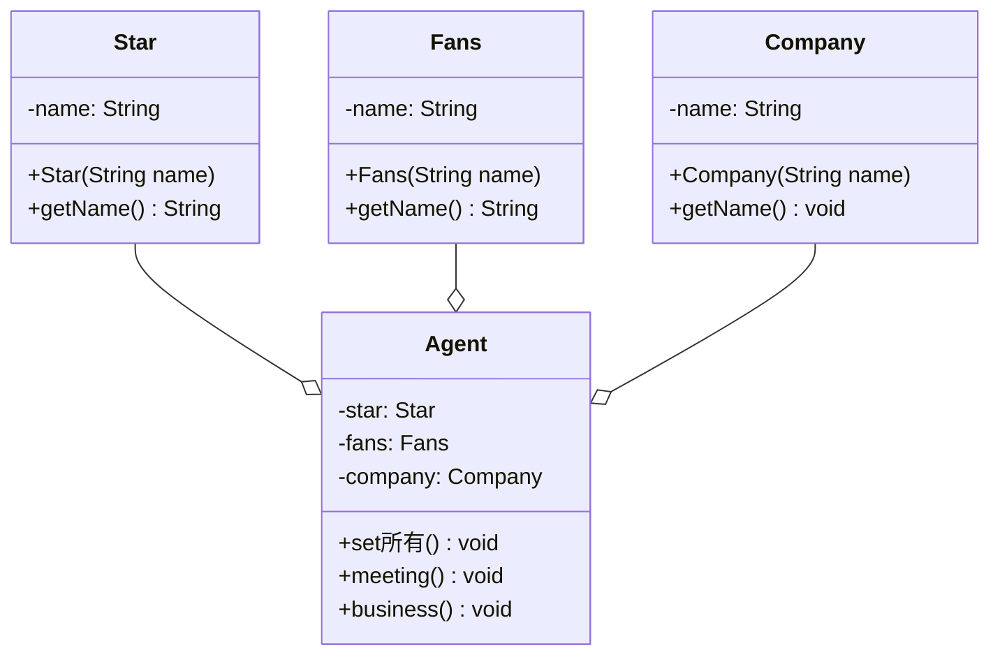

```java
public class Fans {

    private String name;

    public String getName() {
        return name;
    }

    public Fans(String name) {
        this.name = name;
    }
}
```

```java
public class Star {
    private String name;

    public Star(String name) {
        this.name = name;
    }

    public String getName() {
        return name;
    }
}
```

```java
public class Company {
    private String name;

    public String getName() {
        return name;
    }

    public Company(String name) {
        this.name = name;
    }
}
```

```java
public class Agent {

    private Star star;
    private Fans fans;
    private Company company;

    public void setStar(Star star) {
        this.star = star;
    }

    public void setFans(Fans fans) {
        this.fans = fans;
    }

    public void setCompany(Company company) {
        this.company = company;
    }

    //和粉丝见面的方法
    public void meeting() {
        System.out.println(star.getName() + "和粉丝" + fans.getName() + "见面");
    }

    //和媒体公司洽谈的方法
    public void business() {
        System.out.println(star.getName() + "和" + company.getName() + "洽谈");
    }
}
```

```java
public class Client {
    public static void main(String[] args) {
        //创建经纪人类
        Agent agent = new Agent();
        //创建明星对象
        Star star = new Star("林青霞");
        agent.setStar(star);
        //创建粉丝对象
        Fans fans = new Fans("李四");
        agent.setFans(fans);
        //创建媒体公司对象
        Company company = new Company("黑马媒体公司");
        agent.setCompany(company);

        agent.meeting();//和粉丝见面
        agent.business();//和媒体公司洽谈业务
    }
}
```

## 合成复用原则

合成复用原则是指：尽量先使用**组合**或者**聚合**等关联关系来实现，其次才考虑使用继承关系来实现。
通常类的复用分为继承复用和合成复用两种。
继承复用虽然有简单和易实现的优点，但它也存在以下缺点：

1. 继承复用破坏了类的封装性。因为继承会将父类的实现细节暴露给子类，父类对子类是透明的，所以这种复用又称为“白箱”复用。
2. 子类与父类的耦合度高。父类的实现的任何改变都会导致子类的实现发生变化，这不利于类的扩展与维护。
3. 它限制了复用的灵活性。从父类继承而来的实现是静态的，在编译时已经定义，所以在运行时不可能发生变化。

采用组合或聚合复用时，可以将已有对象纳入新对象中，使之成为新对象的一部分，新对象可以调用已有对象的功能，它有以下优点：

1. 它维持了类的封装性。因为成分对象的内部细节是新对象看不见的，所以这种复用又称为“黑箱”复用。
2. 对象间的耦合度低。可以在类的成员位置声明抽象。
3. 复用的灵活性高。这种复用可以在运行时动态进行，新对象可以动态地引用与成分对象类型相同的对象。

【例】汽车分类管理程序
汽车按“动力源”划分可分为汽油汽车、电动汽车等；按“颜色”划分可分为白色汽车、黑色汽车和红色汽车等。如果同时考虑这两种分类，其组合就很多。

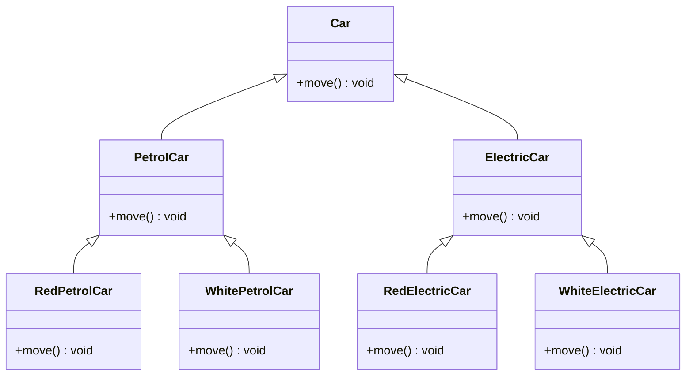

上图可以看到使用继承复用产生了很多子类，如果现在又有新的动力源或者新的颜色的话，就需要再定义新的类。试着将继承复用改为聚合复用再看一下:

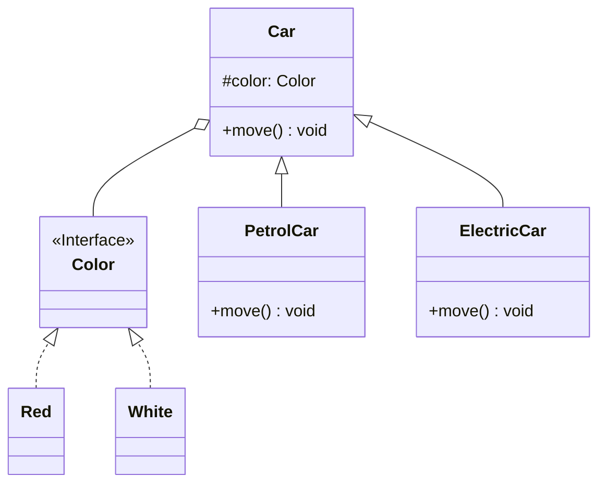

```java
public interface Color {
    String getColor();
}
```

```java
public class Blue implements Color {

    @Override
    public String getColor() {
        return "BLUE";
    }
}
```

```java
public class Red implements Color{
    @Override
    public String getColor() {
        return "RED";
    }
}
```

```java
public abstract class Car {
    protected Color color;

    public Car(Color color) {
        this.color = color;
    }

    public abstract void run();
}
```

```java
public class PetrolCar extends Car {

    public PetrolCar(Color color) {
        super(color);
    }

    @Override
    public void run() {
        System.out.println();
    }
}
```

```java
public class ElectricCar extends Car {
    public ElectricCar(Color color) {
        super(color);
    }

    @Override
    public void run() {
        System.out.println(color.getColor() + "电车");
    }
}
```

```java
public class Test {
    public static void main(String[] args) {
        Red red = new Red();
        ElectricCar redElectricCar = new ElectricCar(red);
        redElectricCar.run();
    }
}
```