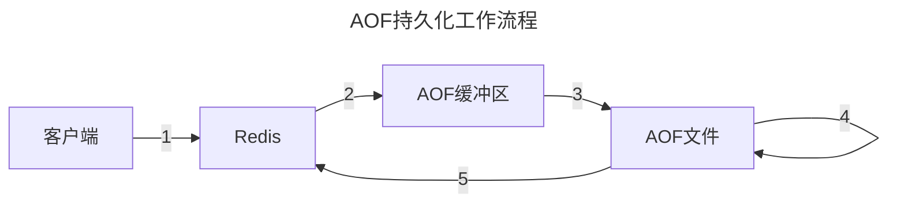
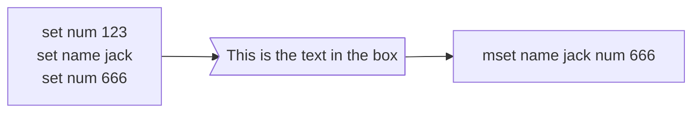
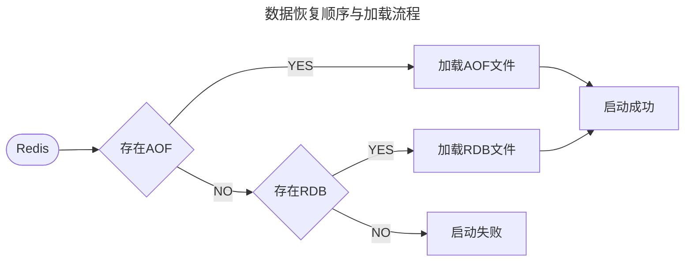
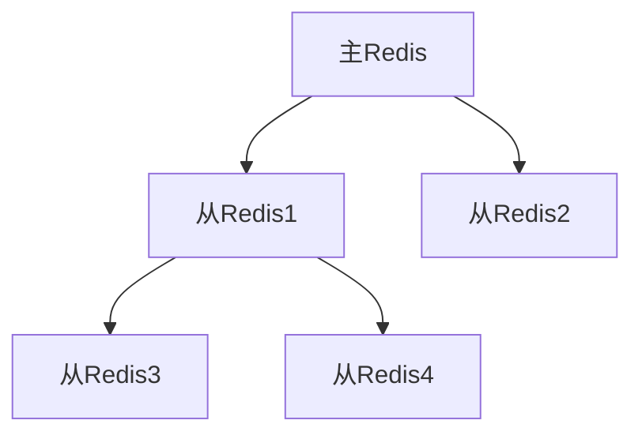
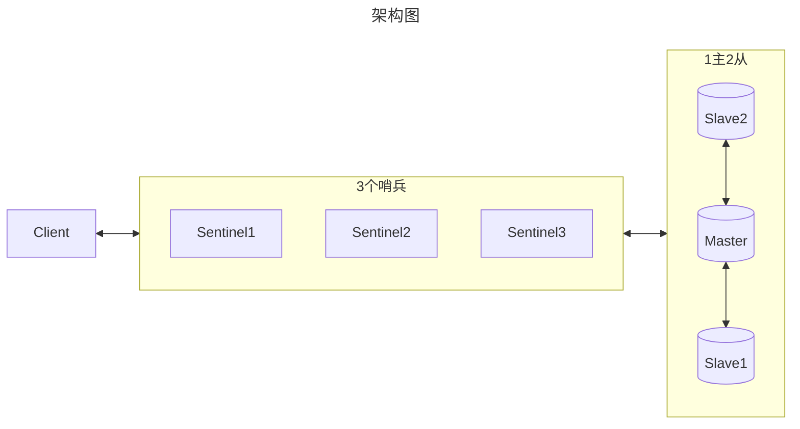
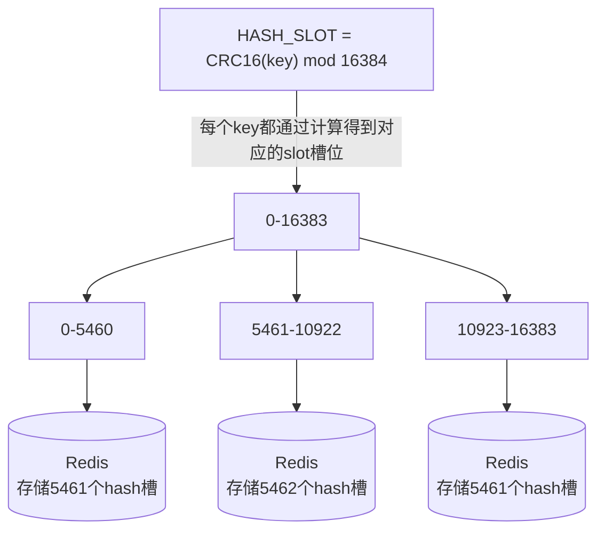
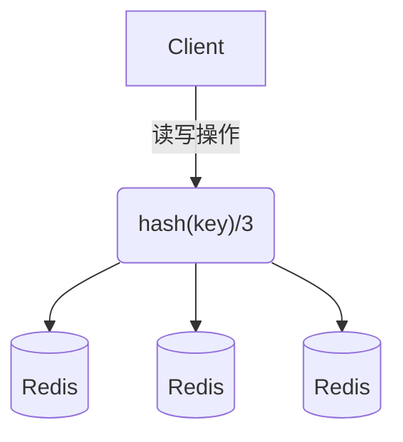
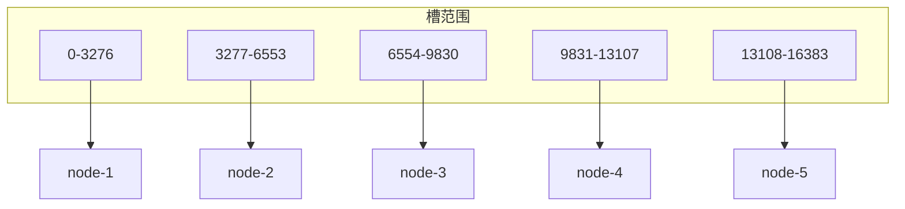
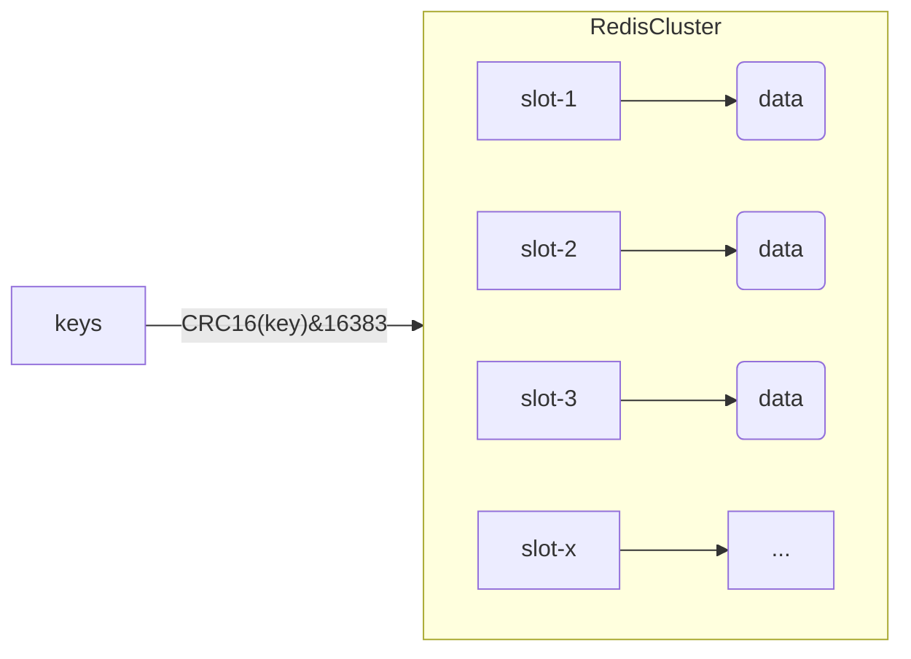

## 环境搭建

Redis基于C语言编写，因此需要先gcc依赖：`yum install -y gcc tcl`

下载Redis、解压缩、进入目录后运行编译命令：`make && make install`

默认安装路径在`/usr/local/bin`目录下，该目录默认配置到环境变量，因此能在任意目录下运行，其中：

- `redis-cli`: 命令行客户端
- `redis-server`: 服务端启动脚本
- `redis-sentinel`：哨兵启动脚本

---

Redis启动方式：

1. 默认启动

`redis-server`：这种启动属于`前台启动`，会阻塞整个会话窗口，窗口关闭或者按下`CTRL + C`则Redis停止。

2. 指定配置启动

需要修改Redis配置文件，位于Redis安装包根目录下`redis.conf`，改之前最好备份一下`cp redis.conf redis.conf.bak`

```properties
# 允许访问的地址，默认是127.0.0.1，只能在本地访问。0.0.0.0可以在任意IP访问
bind 0.0.0.0
# 守护进程，修改为yes后即可后台运行
daemonize yes 
# 密码，设置后访问Redis必须输入密码
requirepass 123321

# 其它常见配置
# 监听的端口
port 6379
# 工作目录，默认是当前目录，也就是运行redis-server时的命令，日志.持久化等文件会保存在这个目录
dir .
# 数据库数量，设置为1，代表只使用1个库，默认有16个库，编号0~15
databases 1
# 设置redis能够使用的最大内存
maxmemory 512mb
# 日志文件，默认为空，不记录日志，可以指定日志文件名
logfile "redis.log"
```

启动:

```shell
# 进入redis安装目录 
cd /usr/local/src/redis-6.2.6
# 启动
redis-server redis.conf
```

停止:

```shell
# 利用redis-cli来执行 shutdown 命令，即可停止 Redis 服务，
# 因为之前配置了密码，因此需要通过 -u 来指定密码
redis-cli -u 123321 shutdown
```

3. 开机自动启动

新建系统服务文件

```shell
vi /etc/systemd/system/redis.service
```

```shell title="redis.service"
[Unit]
Description=redis-server
After=network.target

[Service]
Type=forking
ExecStart=/usr/local/bin/redis-server /opt/redis-7.0.15/redis.conf
PrivateTmp=true

[Install]
WantedBy=multi-user.target
```

重载系统服务

```shell
systemctl daemon-reload
```

让Redis开机自动启动

```shell
systemctl enable redis
```

以后可以使用新的命令控制Redis服务启动了

```shell
# 启动
systemctl start redis
# 停止
systemctl stop redis
# 重启
systemctl restart redis
# 查看状态
systemctl status redis
```

---

Redis安装完成后就自带了命令行客户端：redis-cli，使用方式如下：

```shell
redis-cli [options] [commonds]
```

常见的options有：

- `-h 127.0.0.1`：指定要连接的redis节点的IP地址，默认是127.0.0.1

- `-p 6379`：指定要连接的redis节点的端口，默认是6379

- `-a 123321`：指定redis的访问密码

其中的commonds就是Redis的操作命令，例如：

- `ping`：与redis服务端做心跳测试，服务端正常会返回`pong`

不指定commond时，会进入`redis-cli`的交互控制台

----

`sysctl vm.overcommit_memory=1`

## 数据结构

Redis是一个key-value的数据库，key一般是String类型，不过value的类型多种多样
|  Type   |          Example           |
| :-------: | :---------------------: |
|  String   |          hello          |
|   Hash    | \{ name: "Jack", age: 21 \} |
|   List    |   [ A -> B -> C -> C ]    |
|    Set    |        \{ A, B, C \}        |
| SortedSet |   \{ A: 1, B: 2, C: 3 \}    |
|    GEO    |   \{ A: (120.3, 30.5) \}   |
|  BitMap   |   0110110101110101011   |
| BitField | \{ 23334 \} \{ 6634728 \} \{ 916 \} |
| HyperLogLog |   0110110101110101011   |
| Stream | \{ id1=time.seq((a: "foo", a: "bar")) \} |

> help可以查看命令

### 通用命令

通用指令是部分数据类型的，都可以使用的指令

- KEYS: 查看符合模板的所有key

- TYPE: 返回key储存的值的类型

- RANDOMKEY: 从当前数据库随机返回一个key

- RENAME: 修改key的名称

- RENAMENX: 仅当newkey不存在时，将key改名为newkey

- DEL: 删除一个指定的key

- UNLINK: 非阻塞删除，仅仅将keys从keyspace元数据中删除，真正的删除会在后续异步操作中完成

- MOVE: 将当前数据库的key移动到给定的数据库db中

- DUMP: 序列化给定key,返回被序列化的值

- EXISTS: 判断key是否存在

- EXPIRE: 给一个key设置有效期，有效期到期时该key会被自动删除

- EXPIREAT: 作用同上，但接受的时间参数是UNIX时间戳

- PERSIST: 移除过期时间，key将永久保存

- TTL: 查看一个KEY的剩余有效期，单位秒

- PTTL: 作用同上，但返回单位是毫秒

- SELECT: 切换数据库【0-15】，默认为0

- DBSIZE: 查看当前数据库key的数量

- FLUSHDB: 清空当前库

- FLUSHALL: 清空所有库

通过`help [command]`可以查看一个命令的具体用法，例如：`help keys`

- `KEYS`

```shell
127.0.0.1:6379> keys *
1) "name"
2) "age"
127.0.0.1:6379>

# 查询以a开头的key
127.0.0.1:6379> keys a*
1) "age"
127.0.0.1:6379>
```

> 生产环境下，不推荐使用keys命令，因为这个命令在key过多的情况下，效率较低

- `DEL`

```shell
127.0.0.1:6379> help del

  DEL key [key ...]
  summary: Delete a key
  since: 1.0.0
  group: generic

127.0.0.1:6379> del name #删除单个
(integer) 1  #成功删除1个

127.0.0.1:6379> keys *
1) "age"

127.0.0.1:6379> MSET k1 v1 k2 v2 k3 v3 #批量添加数据
OK

127.0.0.1:6379> keys *
1) "k3"
2) "k2"
3) "k1"
4) "age"

127.0.0.1:6379> del k1 k2 k3 k4
(integer) 3   #此处返回的是成功删除的key，由于redis中只有k1,k2,k3 所以只成功删除3个，最终返回
127.0.0.1:6379>

127.0.0.1:6379> keys * #再查询全部的key
1) "age"	#只剩下一个了
127.0.0.1:6379>
```

- `EXISTS`

```shell
127.0.0.1:6379> help EXISTS

  EXISTS key [key ...]
  summary: Determine if a key exists
  since: 1.0.0
  group: generic

127.0.0.1:6379> exists age
(integer) 1

127.0.0.1:6379> exists name
(integer) 0
```

- `EXPIRE`

内存非常宝贵，对于一些数据，我们应当设置一些过期时间，当过期时间到了之后，他就会自动被删除

```shell
127.0.0.1:6379> expire age 10
(integer) 1

127.0.0.1:6379> ttl age
(integer) 8

127.0.0.1:6379> ttl age
(integer) 6

127.0.0.1:6379> ttl age
(integer) -2

127.0.0.1:6379> ttl age
(integer) -2  #当这个key过期了，那么此时查询出来就是-2 

127.0.0.1:6379> keys *
(empty list or set)

127.0.0.1:6379> set age 10 #如果没有设置过期时间
OK

127.0.0.1:6379> ttl age
(integer) -1  # ttl的返回值就是-1
```

### String

String类型，也就是字符串类型，是Redis中最简单的存储类型。

其value是字符串，不过根据字符串的格式不同，又可以分为3类：

- string：普通字符串

- int：整数类型，可以做自增/自减操作

- float：浮点类型，可以做自增/自减操作

|  KEY  |    VALUE    |
| :---: | :---------: |
|  msg  | Hello World |
|  num  |     10      |
| score |    92.5     |

String的常见命令有：

- SET：添加或者修改已经存在的一个String类型的键值对
  - 如果key不存在则是新增，如果存在则是修改

- GET：根据key获取String类型的value
  - 如果key不存在则是新增，如果存在则是修改

- MSET：批量添加多个String类型的键值对

- MGET：根据多个key获取多个String类型的value

- INCR：让一个整型的key自增1

- INCRBY:让一个整型的key自增并指定步长，例如：incrby num 2 让num值自增2

- INCRBYFLOAT：让一个浮点类型的数字自增并指定步长

- SETNX：添加一个String类型的键值对，前提是这个key不存在，否则不执行

- SETEX：添加一个String类型的键值对，并且指定有效期

> 以上命令除了INCRBYFLOAT 都是常用命令

#### Key的层级结构

Redis没有类似MySQL中的Table的概念，如何区分不同类型的key呢？

例如，需要存储用户.商品信息到redis，有一个用户id是1，有一个商品id恰好也是1，此时如果使用id作为key，那就会冲突了，怎么办？可以通过给key添加前缀加以区分，不过这个前缀不是随便加的，有一定的规范：

Redis的key允许有多个单词形成层级结构，多个单词之间用'**:**'隔开，格式如下：
`项目名：业务名：类型：ID`

格式并非固定，也可以根据自己的需求来删除或添加词条。

例如项目名称叫 heima，有user和product两种不同类型的数据，我们可以这样定义key：

-  user相关的key：**heima:user:1** 

-  product相关的key：**heima:product:1** 

如果Value是一个Java对象，例如一个User对象，则可以将对象序列化为JSON字符串后存储
|       KEY       |                  VALUE                  |
| :-------------: | :-------------------------------------: |
|  heima:user:1   |    \{ "id":1, "name":"Jack", "age":21 \}    |
| heima:product:1 | \{ "id":1, "name":"小米11", "price":4999 \} |

一旦向redis采用这样的方式存储，那么在可视化界面中，redis会以层级结构来进行存储

### Hash

Hash类型，也叫散列，其value是一个无序字典，类似于Java中的HashMap结构。

String结构是将对象序列化为JSON字符串后存储，当需要修改对象某个字段时很不方便

|     KEY      |           VALUE            |
| :----------: | :------------------------: |
| heima:user:1 | \{ "name":"Jack", "age":21 \}  |
| heima:user:2 | \{ "name":"Marry", "age":22 \} |

Hash结构可以将对象中的每个字段独立存储，可以针对单个字段做CRUD

<table style="text-align: center">
    <tr>
    	<th rowspan=2>KEY</th>
        <th colspan=2>VALUE</th>
    </tr>
    <tr>
    	<td>field</td>
        <td>value</td>
    </tr>
    <tr>
    	<td rowspan=2>heima:user:1</td>
        <td>name</td>
        <td>Jack</td>
    </tr>
    <tr>
    	<td>age</td>
        <td>21</td>
    </tr>
    <tr>
    	<td rowspan=2>heima:user:2</td>
        <td>name</td>
        <td>Marry</td>
    </tr>
    <tr>
    	<td>age</td>
        <td>22</td>
    </tr>
</table>


**Hash类型的常见命令**

-  HSET key field value：添加或者修改hash类型key的field的值 

-  HGET key field：获取一个hash类型key的field的值 

-  HMSET：批量添加多个hash类型key的field的值 

-  HMGET：批量获取多个hash类型key的field的值 

-  HGETALL：获取一个hash类型的key中的所有的field和value 

-  HKEYS：获取一个hash类型的key中的所有的field 

-  HINCRBY:让一个hash类型key的字段值自增并指定步长 

-  HSETNX：添加一个hash类型的key的field值，前提是这个field不存在，否则不执行 

### List

Redis中的List类型与Java中的LinkedList类似，可以看做是一个双向链表结构。既可以支持正向检索和也可以支持反向检索。

特征也与LinkedList类似：

- 有序

- 元素可以重复

- 插入和删除快

- 查询速度一般

常用来存储一个有序数据，例如：朋友圈点赞列表，评论列表等。

**List的常见命令有：**

- LPUSH key element ... ：向列表左侧插入一个或多个元素

- LPOP key：移除并返回列表左侧的第一个元素，没有则返回nil

- RPUSH key element ... ：向列表右侧插入一个或多个元素

- RPOP key：移除并返回列表右侧的第一个元素

- LRANGE key start end：返回一段角标范围内的所有元素

- BLPOP和BRPOP：与LPOP和RPOP类似，只不过在没有元素时等待指定时间，而不是直接返回nil


### Set

Redis的Set结构与Java中的HashSet类似，可以看做是一个value为null的HashMap。因为也是一个hash表，因此具备与HashSet类似的特征：

- 无序

- 元素不可重复

- 查找快

- 支持交集.并集.差集等功能

**Set类型的常见命令**

- SADD key member ... ：向set中添加一个或多个元素

- SREM key member ... : 移除set中的指定元素

- SCARD key： 返回set中元素的个数

- SISMEMBER key member：判断一个元素是否存在于set中

- SMEMBERS：获取set中的所有元素

- SINTER key1 key2 ... ：求key1与key2的交集

- SDIFF key1 key2 ... ：求key1与key2的差集

- SUNION key1 key2 ..：求key1和key2的并集

例如两个集合：s1和s2

S1: A	B	C

S2: B	C	D

求交集：`SINTER s1 s2`

求s1与s2的不同：`SDIFF s1 s2`


### SortedSet

Redis的SortedSet是一个可排序的set集合，与Java中的TreeSet有些类似，但底层数据结构却差别很大。SortedSet中的每一个元素都带有一个score属性，可以基于score属性对元素排序，底层的实现是一个跳表（SkipList）加 hash表。

SortedSet具备下列特性：

- 可排序

- 元素不重复

- 查询速度快

因为SortedSet的可排序特性，经常被用来实现排行榜这样的功能。

SortedSet的常见命令有：

- ZADD key score member：添加一个或多个元素到sorted set ，如果已经存在则更新其score值

- ZREM key member：删除sorted set中的一个指定元素

- ZSCORE key member : 获取sorted set中的指定元素的score值

- ZRANK key member：获取sorted set 中的指定元素的排名

- ZCARD key：获取sorted set中的元素个数

- ZCOUNT key min max：统计score值在给定范围内的所有元素的个数

- ZINCRBY key increment member：让sorted set中的指定元素自增，步长为指定的increment值

- ZRANGE key min max：按照score排序后，获取指定排名范围内的元素

- ZRANGEBYSCORE key min max：按照score排序后，获取指定score范围内的元素

- ZDIFF.ZINTER.ZUNION：求差集.交集.并集

>  注意：所有的排名默认都是升序，如果要降序则在命令的Z后面添加REV即可，例如：

- **升序**获取sorted set 中的指定元素的排名：ZRANK key member

- **降序**获取sorted set 中的指定元素的排名：ZREVRANK key member


### BitMap

BitMap 是一种用于处理单个位的操作方法，基于 Redis 的字符串类型来实现。它主要用于存储和操作大量的布尔值，每个布尔值对应一个位。

**主要操作**

- **SETBIT**：设置特定位的值（0 或 1）。
- **GETBIT**：获取特定位的值（0 或 1）。
- **BITCOUNT**：计算所有设置为 1 的位的总数。
- **BITOP**：对多个 BitMap 进行按位操作（如 AND、OR、NOT、XOR）。
- **BITPOS**：查找第一个设置为 1 或 0 的位的位置。

```shell
# 设置偏移量为 10 的位为 1
SETBIT mykey 10 1

# 获取偏移量为 10 的位的值
GETBIT mykey 10

# 计算所有设置为 1 的位的总数
BITCOUNT mykey

# 对多个 BitMap 进行按位 OR 操作
BITOP OR destkey key1 key2
```

**使用场景**

- **用户签到**：记录用户每日签到情况。
- **活动统计**：统计用户是否在某天内活跃。
- **布尔数组**：用于高效存储大量布尔值。

### BitField

可以一次性操作多个比特位域(指的是连续的多个比特位)，它会执行一系列操作并返回一个响应数组，这个数组中的元素对应参数列表中的相应操作的执行结果

**主要操作**

- **GET**：获取特定位置和长度的值。
- **SET**：设置特定位置和长度的值。
- **INCRBY**：对特定位置和长度的值进行递增或递减。

```shell
# 设置不同字段的值
BITFIELD mykey SET u8 0 100   # 将偏移量为 0 的 8 位无符号整数设置为 100
BITFIELD mykey SET u8 8 200   # 将偏移量为 8 的 8 位无符号整数设置为 200

# 获取字段的值
BITFIELD mykey GET u8 0       # 获取偏移量为 0 的 8 位无符号整数的值

# 递增字段的值
BITFIELD mykey INCRBY u8 0 1  # 将偏移量为 0 的 8 位无符号整数的值增加 1
```

**使用场景**

- **紧凑存储**：在单个键中存储多个字段，节省内存空间。
- **状态标志**：存储多个紧凑的标志位，如用户权限、配置选项等。
- **计数器**：存储多个紧凑的计数器。

**BitMap VS BitField**

- **用途不同**：BitMap 主要用于单个位的操作，适合布尔值存储和简单的按位操作。BitField 适合存储和操作不同长度的整数字段，提供更灵活的位操作能力。
- **操作粒度**：BitMap 关注单个位的设置和获取，BitField 则关注多个位的组合操作。
- **灵活性**：BitField 提供了更高的灵活性，可以处理不同类型和长度的整数，而 BitMap 主要处理布尔值。

### Stream

Redis Stream 主要用于消息队列，Redis 本身有一个发布/订阅 (pub/sub) 来实现消息队列的功能，但缺点是消息无法持久化，如果出现网络断开、Redis 宕机等，消息就会被丢弃。

而 Redis Stream 提供了消息的持久化和主备复制功能，可以让任何客户端访问任何时刻的数据，并且能记住每一个客户端的访问位置，还能保证消息不丢失

**特点**

1. **按序写入和读取**：数据按写入顺序存储，可以方便地进行时间顺序操作。
2. **消费组**：支持多个消费者分组，可以实现消息的广播和负载均衡。
3. **阻塞读取**：支持阻塞等待新消息的到来，适用于实时处理场景。
4. **持久化**：数据存储在内存中，可以选择性地持久化到磁盘。

**主要操作**

- **XADD**：向流中添加新条目。
- **XRANGE**：按范围读取流中的条目。
- **XREAD**：从流中读取新条目，可以阻塞等待。
- **XGROUP**：管理消费者组。
- **XACK**：确认消息已被处理。

```shell
# 向名为 mystream 的流中添加一个新条目，字段是 field1 和 field2
XADD mystream * field1 value1 field2 value2

# 读取 mystream 流中所有条目
XRANGE mystream - +
# 读取指定范围的条目
XRANGE mystream 0-0 5-0

# 创建一个名为 mygroup 的消费组
XGROUP CREATE mystream mygroup 0
# 从消费组读取条目
XREADGROUP GROUP mygroup consumer1 STREAMS mystream >
# 确认消息已处理
XACK mystream mygroup message-id
```

**使用场景**

1. **消息队列**：可以替代传统消息队列系统，如 Kafka 或 RabbitMQ，用于任务调度、异步处理等。
2. **实时日志处理**：记录和处理实时日志数据，如用户行为日志、系统监控日志等。
3. **事件溯源**：记录系统中的所有事件，以便后续进行事件回放或故障排查。

### GEO

用于存储和操作地理空间数据

1. **存储地理位置**：使用经度和纬度来存储地理坐标。
2. **距离计算**：计算两个地理位置之间的距离。
3. **范围查询**：查找某个半径范围内的所有地理位置。
4. **排序查询**：按距离进行排序，找到最近的地理位置。

**主要操作**

- **GEOADD**：将地理位置添加到键中。
- **GEODIST**：计算两个地理位置之间的距离。
- **GEOHASH**：获取地理位置的 GeoHash 表示。
- **GEOPOS**：获取存储的地理位置。
- **GEORADIUS**：根据指定半径查找范围内的地理位置。
- **GEORADIUSBYMEMBER**：根据成员位置查找范围内的地理位置。

```shell
# 将地理位置（经度，纬度）添加到 key 'cities' 中
GEOADD cities 13.361389 38.115556 "Palermo"
GEOADD cities 15.087269 37.502669 "Catania"

# 获取 'Palermo' 和 'Catania' 的地理坐标
GEOPOS cities "Palermo" "Catania"

# 计算 'Palermo' 和 'Catania' 之间的距离（单位：公里）
GEODIST cities "Palermo" "Catania" km

# 查找半径 100 公里内的所有位置，以 'Palermo' 为中心
GEORADIUS cities 13.361389 38.115556 100 km
```

### HyperLogLog

用于近似计算集合的基数（即集合中不同元素的数量）。它通过牺牲一定的精度来大幅减少内存使用，非常适合在内存有限的情况下进行大规模数据的去重计数。

**特点**

1. **内存高效**：无论被添加到集合中的元素数量有多少，HyperLogLog 的内存占用**始终**为 12KB。
2. **近似计数**：虽然结果是近似的，但误差率可以控制在 0.81% 以内。
3. **去重计数**：适合用于统计大型数据集的唯一元素数量，如网页访问量、用户行为等。

**主要操作**

- **PFADD**：向 HyperLogLog 添加元素。
- **PFCOUNT**：返回 HyperLogLog 中唯一元素的近似数量。
- **PFMERGE**：合并多个 HyperLogLog。

```shell
# 向名为 'hll' 的 HyperLogLog 中添加元素 'a', 'b', 'c'
PFADD hll a b c

# 获取 HyperLogLog 'hll' 中唯一元素的近似数量
PFCOUNT hll

# 将 'hll1' 和 'hll2' 合并到 'hll'
PFMERGE hll hll1 hll2
```

## 客户端

- Jedis和Lettuce：这两个主要是提供了Redis命令对应的API，方便我们操作Redis，而SpringDataRedis又对这两种做了抽象和封装。

- Redisson：是在Redis基础上实现了分布式的可伸缩的java数据结构，例如Map.Queue等，而且支持跨进程的同步机制：Lock.Semaphore等待，比较适合用来实现特殊的功能需求。

### Jedis

#### 快速入门

1. 引入依赖

```xml
<!--jedis-->
<dependency>
    <groupId>redis.clients</groupId>
    <artifactId>jedis</artifactId>
    <version>3.7.0</version>
</dependency>
<!--单元测试-->
<dependency>
    <groupId>org.junit.jupiter</groupId>
    <artifactId>junit-jupiter</artifactId>
    <version>5.7.0</version>
    <scope>test</scope>
</dependency>
```

2. 建立连接

```java
private Jedis jedis;

@BeforeEach
void setUp() {
    // 1.建立连接
    // jedis = new Jedis("192.168.150.101", 6379);
    jedis = JedisConnectionFactory.getJedis();
    // 2.设置密码
    jedis.auth("123321");
    // 3.选择库
    jedis.select(0);
}
```

3. 测试

```java
@Test
@DisplayName("测试字符串")
void testString() {
    String result = jedis.set("name", "秦智耘");
    System.out.println("result = " + result);
    String name = jedis.get("name");
    System.out.println("name = " + name);
}

@Test
@DisplayName("哈希表测试")
void testHash() {
    jedis.hset("pc:user:5", "name", "hlf");
    jedis.hset("pc:user:5", "password", "123");
    String name5 = jedis.hget("pc:user:5", "name");
    System.out.println("name5 = " + name5);
    Map<String, String> user5 = jedis.hgetAll("pc:user:5");
    System.out.println("user5 = " + user5);
}
```

4. 释放资源

```java
@AfterEach
void tearDown() {
    if (jedis != null) {
        jedis.close();
    }
}
```

#### 连接池

Jedis本身是线程不安全的，并且频繁的创建和销毁连接会有性能损耗，因此推荐使用Jedis连接池代替Jedis的直连方式

有关池化思想，并不仅仅是这里会使用，很多地方都有，比如说数据库连接池、tomcat中的线程池，这些都是池化思想的体现。

创建Jedis的连接池

```java
public class JedisConnectionFactory {
    private static final JedisPool jedisPool;
    static {
        //配置连接池
        JedisPoolConfig poolConfig = new JedisPoolConfig();
        poolConfig.setMaxTotal(8);//最大总量为8个连接池
        poolConfig.setMinIdle(8);//最多预备8个连接
        poolConfig.setMinIdle(0);//最小空闲连接为0
        //创建连接池对象
        jedisPool = new JedisPool(poolConfig, "192.168.1.10", 6379, 1000, "root");
    }

    public static JedisPool getJedisPool() {
        return jedisPool;
    }
}
```

代码说明

- JedisConnectionFacotry：工厂设计模式是实际开发中非常常用的一种设计模式，我们可以使用工厂，去降低代的耦合，比如Spring中的Bean的创建，就用到了工厂设计模式 

- 静态代码块：随着类的加载而加载，确保只能执行一次，我们在加载当前工厂类的时候，就可以执行static的操作完成对 连接池的初始化 

- 最后提供返回连接池中连接的方法. 

改造原始代码

- 在使用工厂设计模式来完成代码的编写之后，我们在获得连接时，就可以通过工厂来获得。而不用直接去new对象，降低耦合，并且使用的还是连接池对象。

- 当使用了连接池后，当我们关闭连接其实并不是关闭，而是将Jedis还回连接池的。

```java
@BeforeEach
void setUp(){
    //建立连接
    /*jedis = new Jedis("127.0.0.1",6379);*/
    jedis = JedisConnectionFacotry.getJedis();
     //选择库
    jedis.select(0);
}

@AfterEach
void tearDown() {
    if (jedis != null) {
        jedis.close();
    }
}
```

### SpringDataRedis

SpringData是Spring中数据操作的模块，包含对各种数据库的集成，其中对Redis的集成模块就叫做SpringDataRedis，官网地址：https://spring.io/projects/spring-data-redis

- 提供了对不同Redis客户端的整合（Lettuce和Jedis）

- 提供了RedisTemplate统一API来操作Redis

- 支持Redis的发布订阅模型

- 支持Redis哨兵和Redis集群

- 支持基于Lettuce的响应式编程

- 支持基于JDK.JSON.字符串.Spring对象的数据序列化及反序列化

- 支持基于Redis的JDKCollection实现

SpringDataRedis中提供了RedisTemplate工具类，其中封装了各种对Redis的操作。并且将不同数据类型的操作API封装到了不同的类型中。

#### 快速入门

1. 引入依赖

```xml
<dependency>
    <groupId>org.springframework.boot</groupId>
    <artifactId>spring-boot-starter-data-redis</artifactId>
</dependency>
```

2. 配置文件

```yaml
spring:
  redis:
    host: 192.168.150.101
    port: 6379
    password: 123321
    lettuce:
      pool:
        max-active: 8  #最大连接
        max-idle: 8   #最大空闲连接
        min-idle: 0   #最小空闲连接
        max-wait: 100ms #连接等待时间
```

3. 测试代码

```java
@SpringBootTest
class SpringDataRedisApplicationTests {

    @Autowired
    private RedisTemplate<String, Object> redisTemplate;

    @Test
    @DisplayName("测试字符串")
    void testString() {
        redisTemplate.opsForValue().set("name", "QinZhiyun");
        Object name = redisTemplate.opsForValue().get("name");
        System.out.println("name = " + name);
    }

    @Test
    @DisplayName("测试实体类")
    void testUser() {
        redisTemplate.opsForValue().set("pc:user:0", new User("admin", "123456"));
        User user = (User) redisTemplate.opsForValue().get("pc:user:0");
        System.out.println("user = " + user);
    }

}
```

#### 数据序列化器

RedisTemplate可以接收任意Object作为值写入Redis，写入前会把Object序列化为字节形式，默认是采用JDK序列化，得到的结果是"看不懂的16进制"，不仅看不懂，并且占用内存大。

自定义RedisTemplate序列化方式：采用JSON序列化替代默认的JDK序列化

```java
@Configuration
public class RedisConfig {

    @Bean
    public RedisTemplate<String, Object> redisTemplate(RedisConnectionFactory connectionFactory){
        // 创建RedisTemplate对象
        RedisTemplate<String, Object> template = new RedisTemplate<>();
        // 设置连接工厂
        template.setConnectionFactory(connectionFactory);
        // 创建JSON序列化工具
        GenericJackson2JsonRedisSerializer jsonRedisSerializer = 
            							new GenericJackson2JsonRedisSerializer();
        // 设置Key的序列化
        template.setKeySerializer(RedisSerializer.string());
        template.setHashKeySerializer(RedisSerializer.string());
        // 设置Value的序列化
        template.setValueSerializer(jsonRedisSerializer);
        template.setHashValueSerializer(jsonRedisSerializer);
        // 返回
        return template;
    }
}
```

#### StringRedisTemplate

尽管JSON的序列化方式可以满足我们的需求，但依然存在一些问题：

为了在反序列化时知道对象的类型，JSON序列化器会将类的class类型写入json结果中，存入Redis，会带来额外的内存开销。内容举例：`@class: "com.heima.redis.pojo.User"`

为了减少内存的消耗，我们可以采用手动序列化的方式，换句话说，就是不借助默认的序列化器，而是我们自己来控制序列化的动作，同时，我们只采用String的序列化器，这样，在存储value时，我们就不需要在内存中就不用多存储数据，从而节约我们的内存空间。

这种用法比较普遍，因此SpringDataRedis就提供了RedisTemplate的子类：StringRedisTemplate，它的key和value的序列化方式默认就是String方式。

省去了自定义RedisTemplate的序列化方式的步骤，直接使用：

```java
@SpringBootTest
class RedisStringTests {

    @Autowired
    private StringRedisTemplate stringRedisTemplate;

    @Test
    void testString() {
        // 写入一条String数据
        stringRedisTemplate.opsForValue().set("verify:phone:13600527634", "124143");
        // 获取string数据
        Object name = stringRedisTemplate.opsForValue().get("name");
        System.out.println("name = " + name);
    }

    private static final ObjectMapper mapper = new ObjectMapper();

    @Test
    void testSaveUser() throws JsonProcessingException {
        // 创建对象
        User user = new User("虎哥", 21);
        // 手动序列化
        String json = mapper.writeValueAsString(user);
        // 写入数据
        stringRedisTemplate.opsForValue().set("user:200", json);

        // 获取数据
        String jsonUser = stringRedisTemplate.opsForValue().get("user:200");
        // 手动反序列化
        User user1 = mapper.readValue(jsonUser, User.class);
        System.out.println("user1 = " + user1);
    }

}
```

RedisTemplate的两种序列化实践方案：

-  方案一： 

   - 自定义RedisTemplate

   - 修改RedisTemplate的序列化器为GenericJackson2JsonRedisSerializer

-  方案二： 

   - 使用StringRedisTemplate

   - 写入Redis时，手动把对象序列化为JSON

   - 读取Redis时，手动把读取到的JSON反序列化为对象

----

测试用代码

```java
@SpringBootTest
public class StringRedisTemplateTests {
    @Autowired
    private StringRedisTemplate stringRedisTemplate;

    @Test
    @DisplayName("测试字符串")
    void testString() {
        stringRedisTemplate.opsForValue().set("name", "QinZhiyun1");
        Object name = stringRedisTemplate.opsForValue().get("name");
        System.out.println("name = " + name);
    }


    //SpringMVC默认的JSON处理工具
    private static final ObjectMapper objectMapper = new ObjectMapper();

    @Test
    @DisplayName("测试实体类")
    @SneakyThrows
    void testUser() {
        User admin = new User("admin", "123");
        //手动序列化
        String json = objectMapper.writeValueAsString(admin);
        stringRedisTemplate.opsForValue().set("pc:user:0", json);
        String jsonAdmin = stringRedisTemplate.opsForValue().get("pc:user:0");
        //手动反序列化
        User user = objectMapper.readValue(jsonAdmin, User.class);
        System.out.println("user = " + user);
    }

    @Test
    @DisplayName("测试Hash表")
    void testHash() {
        stringRedisTemplate.opsForHash().put("pc:user:100", "name", "Redis");
        stringRedisTemplate.opsForHash().put("pc:user:100", "password", "NOSQL");
        Map<Object, Object> entries = stringRedisTemplate.opsForHash().entries("pc:user:100");
        System.out.println("entries = " + entries);
    }

    @Test
    @DisplayName("测试List类型")
    void testList() {
        stringRedisTemplate.opsForList().leftPush("list", "3");
        stringRedisTemplate.opsForList().leftPushAll("list", "2", "1");
        String leftPop = stringRedisTemplate.opsForList().leftPop("list");
        System.out.println("leftPop = " + leftPop);
    }

    @Test
    @DisplayName("测试Set")
    void testSet() {
        stringRedisTemplate.opsForSet().add("set", "1", "2", "3");
        Set<String> set = stringRedisTemplate.opsForSet().members("set");
        System.out.println("set = " + set);
    }

}
```

## 持久化

> [!tip]
>
> 若Redis仅用于缓存，则无需使用任何持久化技术


|                |                     RDB                      |                             AOF                              |
| :------------: | :------------------------------------------: | :----------------------------------------------------------: |
|   持久化方式   |             定时对整个内存做快照             |                     记录每一次执行的命令                     |
|   数据完整性   |          不完整，两次备份之间会丢失          |                   相对完整，取决于刷盘策略                   |
|    文件大小    |              有压缩，文件体积小              |                    记录命令，文件体积很大                    |
|  宕机恢复速度  |                     很快                     |                              慢                              |
| 数据恢复优先级 |          低，因为数据完整性不如AOF           |                    高，因为数据完整性更高                    |
|  系统资源占用  |            高，大量CPU和内存消耗             | 低，主要是磁盘IO资源<br />但AOF重写时会占用大量CPU和内存资源 |
|    使用场景    | 可以容忍数分钟的数据丢失，追求更快的启动速度 |                     对数据安全性有高要求                     |

### RDB

> 若对数据安全性要求不高，则推荐使用纯 RDB 持久化方式。

RDB全称Redis Database Backup file（Redis数据备份文件），也被叫做Redis数据快照。

简单来说就是把内存中的所有数据都记录到磁盘中。当Redis实例故障重启后，从磁盘读取快照文件，恢复数据。快照文件`dump.rdb`称为RDB文件，默认是保存在当前运行目录。

**快速上手**

*自动触发，需要修改`redis.conf`的配置项*

- `save <seconds> <changes>`: 每X秒内，若至少有Y个key被修改，则执行`BGSAVE`
  - `save 900 1`: 900秒内，如果至少有1个key被修改，则执行bgsave
  - `save ""`: 禁用RDB(即使禁用，依然可以使用`save`、`bgsave`生成RDB文件)
- `dir`: dump文件保存路径
- `dbfilename`: dump文件名称
- `rdbcompression`: 是否压缩存储到磁盘中的快照,默认yes,压缩算法为LZF；建议不开启，压缩会消耗CPU
- `stop-writes-onbgsave-error`: 控制在后台保存（BGSAVE）过程中发生错误时的行为
  - 默认yes: 如果后台保存进程（BGSAVE）发生错误，Redis 将停止接受写入操作，直到下一次成功执行后台保存为止
  - no: 表示你不在乎数据不一致或者有其他的手段发现和控制这种不一致，那么在快照写入失败时，也能确保redis继续接受新的写请求
- `rdbchecksum`: 默认yes，存储快照后，可以让redis使用CRC64算法来进行数据校验，但是这样做会增加大约10%的性能消耗，如果希望获取到最大的性能提升，可以关闭此功能
- `rdb-del-sync-files`: 在没有持久性的情况下删除复制中使用的RDB文件。默认情况下no，此选项是禁用的

*手动触发*

- `SAVE`: 在主程序执行会**阻塞**当前Redis服务器，直到持久化工作完成，期间Redis不能处理其它命令，**线上禁止使用**
- `BGSAVE`: Redis会在后台异步进行快照操作，**不阻塞**快照同时还可以响应客户端请求，该触发方式会fork一个子进程，由子进程复制持久化过程
  - fork: 在Linux程序中，fork()会产生一个和父进程完全相同的子进程，但子进程在此后会exec系统调用，出于效率考虑，尽量避免膨胀。

**触发时机**

1. 手动`SAVE/BGSAVE`
2. 配置文件中的默认快照配置
3. 执行`FLUSHALL/FLUSHDB`，但里面是空的，无意义
4. 执行`SHUTDOWN`且没有设置开启AOF持久化
5. 主从复制时，主节点自动触发

**恢复方法**

将生成的dump文件移动到redis安装目录然后重启服务即可。

`redis-check-rdb dump文件名`可以检查修复rdb文件

`LASTSAVE`可以获取最后一次成功执行快照的时间

> [!warning]
>
> 不可以把备份文件`dump.rdb`和生产redis服务器放在同一台机器，必须分开各自存储，以防生产机物理损坏后备份文件也挂了

**优势**

1. 适合大规模的数据恢复
2. 按照业务定时备份
3. 对数据完整性和一致性要求不高
4. RDB在内存中的加载速度比AOF快很多

**劣势**

1. 一定时间内做一次备份，若Redis意外宕机，就会丢失当前至最近一次快照期间的数据
2. 内存数据的全量同步，若数据量太大会导致I/O严重影响服务器性能
3. RDB依赖于主进程的fork，在更大的数据集中，可能会导致服务请求的瞬间延迟。fork时内存中的数据被克隆了一份，大致2倍的膨胀性是需要考虑的。

**原理**

bgsave开始时会fork主进程得到子进程，子进程共享主进程的内存数据。完成fork后读取内存数据并写入 RDB 文件

fork采用的是copy-on-write技术：

- 当主进程执行读操作时，访问共享内存；
- 当主进程执行写操作时，则会拷贝一份数据，执行写操作。


### AOF

> 不推荐使用纯 AOF 持久化方式。

以日志的形式来记录每个写操作，将Redis执行过的所有写指令记录下来（不记录读操作）

只允许追加文件，不能够改写文件，Redis启动之初会读取该文件重新构建数据，换言之，Redis重启时根据日志文件的内容将写指令从前到后执行一次以完成数据的恢复工作。



1. 客户端作为命令的来源，会有多个源头以及源源不断的请求命令
2. 这些命令到达Redis Server以后并不是直接写入AOF文件，会将其这些命令先放入AOF缓存中进行保存。这里的AOF缓冲区实际上是内存中的一片区域，存在的目的是当这些命令达到一定量以后再写入磁盘，避免频繁的磁盘IO操作。
3. AOF缓冲会根据AOF缓冲区**同步文件的三种写回策略**将命令写入磁盘上的AOF文件。
4. 随着写入AOF内容的增加为避免文件膨胀，会根据规则进行命令的合并(又称**AOF重写**)，从而起到AOF文件压缩的目的。
5. 当Redis Server服务器重启的时候会从AOF文件载入数据。

**快速上手**

修改`redis.conf`

- `appendonly`: 默认为no关闭，设置yes即打开AOF持久化支持(即使禁用，依然可以使用`BGREWRITEAOF`生成AOF文件)

- `appenddirname`: AOF文件保存路径

- `appendfilename`: AOF文件名称，该文件分3个部分，为了管理它们，引入manifest(清单)文件进行跟踪

  - `BASE`: 基础AOF，由子进程通过重写产生，该文件最多1个
  - `INCR`: 增量AOF，在AOF重写开始执行时被创建，该文件可能存在多个
  - `HISTORY`: 历史AOF，由BASE、INCR变化而来，每次AOF RW成功完成时，本次AOF RW之前对应的BASE和INCR AOF都将变为HISTORY，HISTORY类型会被Redis自动删除

- `no-appendfsync-on-rewrite`: AOF重写期间是否同步

- `auto-aof-rewrite-percentage`: AOF文件比上次文件增长超过多少百分比则触发重写【同时满足↓才触发】

- `auto-aof-rewrite-min-size`: AOF文件体积最小多大以上才触发重写 【同时满足↑才触发】

- `appendfsync`: 同步方式

  |   配置项    |     写回时机     |           优点           |              缺点              |
  | :---------: | :--------------: | :----------------------: | :----------------------------: |
  |   Always    |     同步写回     | 可靠性高，数据基本不丢失 | 每个写命令都要落盘，性能影响大 |
  | Everysecond |     每秒写回     |         性能适中         |      宕机时丢失1秒的数据       |
  |     No      | 操作系统控制写回 |          性能好          |  可靠性差，宕机时丢失数据较多  |

**优势**

- 更好的保护数据不丢失、性能高、可做紧急恢复

**劣势**

- 相同数据集的数据而言aof文件要远大于rdb文件,恢复速度慢于rdb
- aof运行效率要慢于rdb,每秒同步策略效率较好,不同步效率和rdb相同

**AOF文件重写**

因为是记录命令，AOF文件会比RDB文件大的多。而且AOF会记录对同一个key的多次写操作，但只有最后一次写操作才有意义。通过执行bgrewriteaof命令，可以让AOF文件执行重写功能，用最少的命令达到相同效果。



AOF原本有三个命令，但是`set num 123 和 set num 666`都是对num的操作，第二次会覆盖第一次的值，因此第一个命令记录下来没有意义。所以重写命令后，AOF文件内容就是：``mset name jack num 666``

---

触发机制

- 自动触发：满足配置文件中的选项后，Redis会记录上次重写时的AOF大小，默认配置是当AOF文件大小是上次rewrite后大小的一倍并且文件大于64M
- 手动触发：客户端向服务器发送`bgrewriteaof`命令

---

重写原理

1. 在重写开始前，redis会创建一个“重写子进程”，这个子进程会读取现有的AOF文件，并将其包含的指令进行分析压缩并写入到一个临时文件中。
2. 与此同时，主进程会将新接收到的写指令一边累积到内存缓冲区中，一边继续写入到原有的AOF文件中，这样做是保证原有的AOF文件的可用性，避免在重写过程中出现意外。
3. 当“重写子进程”完成重写工作后，它会给父进程发一个信号，父进程收到信号后就会将内存中缓存的写指令追加到新AOF文件中
4. 当追加结束后，redis就会用新AOF文件来代替旧AOF文件，之后再有新的写指令，就都会追加到新的AOF文件中
5. 重写AOF文件的操作，并没有读取旧的AOF文件，而是将整个内存中的数据库内容用命令的方式重写了一个新的AOF文件，这点和快照有点类似

### RDB+AOF

RDB持久化方式能够在指定的时间间隔内对你的数据进行快照存储

AOF持久化方式记录每次对服务器写的操作,当服务器重启的时候会重新执行这些命令来恢复原始的数据,AOF命令以redis协议追加保存每次写的操作到文件末尾

> [!TIP]
>
> 官方建议同时开启 RDB 与 AOF，在这种情况下，重启时只会加载 AOF 文件，不会加载 RDB 文件



RDB镜像做全量持久化，AOF做增量持久化

先使用RDB进行快照存储，然后使用AOF持久化记录所有的写操作，当重写策略满足或手动触发重写的时候，将最新的数据存储为新的RDB记录。这样的话，重启服务的时候会从RDB和AOF两部分恢复数据，既保证了数据完整性，又提高了恢复数据的性能。简单来说：混合持久化方式产生的文件一部分是RDB格式，一部分是AOF格式

---

开启混合方式的配置：打开`redis.conf`，设置`aof-use-rdb-preamble`值为`yes`（需要保证AOF已经开启）

## 事务

定义：Redis事务是一次性、顺序性、排他性地执行一个队列中的一系列命令

相关命令：

- `MULTI`：启动一个事务。之后的所有命令将被放入一个队列，直到执行 `EXEC `命令。
- `EXEC`：执行之前通过 `MULTI`命令入队的所有命令。所有命令将按照入队顺序一次性、原子性地执行。
- `DISCARD`：取消事务，放弃自 `MULTI` 之后入队的所有命令。
- `WATCH`：监视一个或多个键，防止其他客户端在事务执行期间对这些键进行修改。如果监视的键在事务执行前被其他客户端修改，则事务将会失败(所有命令都失败)并返回 `nil` 。
- `UNWATCH`：取消所有 `WATCH` 命令对键的监视。

三个阶段：

1. 开始事务：以`MULTI`开启一个事务
2. 命令入队：将多个命令入队到事务中,接到这些命令并不会立即执行，而是放到等待执行的事务队列里面
3. 执行事务：由`EXEC`命令触发事务

执行机制：

1. 全体连坐：事务中的命令任意一条有语法错误，所有命令都无法执行

```sh
127.0.0.1:6379> multi	# 开启事务
OK
127.0.0.1:6379(TX)> set k1 v1	# 正常入队命令
QUEUED
127.0.0.1:6379(TX)> set k2 v2	# 正常入队命令
QUEUED
127.0.0.1:6379(TX)> sett k3 v3	# 错误入队命令
(error) ERR unknown command 'sett', with args beginning with: 'k3' 'v3' 
127.0.0.1:6379(TX)> set k4 v4	# 正常入队命令
QUEUED
127.0.0.1:6379(TX)> exec	# 执行事务，出错
(error) EXECABORT Transaction discarded because of previous errors.
127.0.0.1:6379> get k1	# 命令未能执行
(nil)
```

2. 冤头债主：事务中命令不保证原子性，已经执行的命令无法回滚

```sh
127.0.0.1:6379> MULTI	# 开启事务
OK
127.0.0.1:6379(TX)> SET k1 v1	# 正常命令
QUEUED
127.0.0.1:6379(TX)> GETSET k2 v2	# 此时k2尚不存在
QUEUED
127.0.0.1:6379(TX)> SET k3 v3	# 正常命令
QUEUED
127.0.0.1:6379(TX)> EXEC	# 执行事务
1) OK
2) (nil)
3) OK
127.0.0.1:6379> GET k1	# 不影响出错命令的前后命令
"v1"
127.0.0.1:6379> GET k3	# 不影响出错命令的前后命令
"v3"
```

数据库事务 VS Redis事务

- 单独的隔离操作：Redis的事务仅仅是保证事务里的操作会被连续独占的执行，redis命令执行是单线程架构，在执行完事务内所有指令前不可能再去同时执行其他客户端的请求
- 没有隔离级别的概念：因为事务提交前任何指令都不会被实际执行，也就不存在”事务内的查询要看到事务里的更新，在事务外查询不能看到”这种问题了
- 不保证原子性：Redis的事务不保证原子性，也就是不保证所有指令同时成功或同时失败，只有决定是否开始执行全部指令的能力，没有执行到一半进行回滚的能力
- 排它性：Redis会保证一个事务内的命令依次执行，而不会被其它命令插入

## 管道

**问题引入**

Redis是一种基于客户端-服务端模型以及请求/响应协议的TCP服务。

一个请求会遵循以下步骤：

1. 客户端向服务端发送命令,分四步(发送命令→命令排队→命令执行→返回结果)，并监听Socket返回，通常以阻塞模式等待服务端响应。
2. 服务端处理命令，并将结果返回给客户端。

上述两步称为：**Round Trip Time(简称RTT,数据包往返于两端的时间)**

如果同时需要执行大量的命令,那么就要等待上一条命令应答后再执行,这中间不仅仅多了RTT(RoundTimeTrip),而且还频繁调用系统IO,发送网络请求,同时需要redis调用多次read()和write()系统方法,系统方法会将数据从用户态转移到内核态，这对进程上下文的影响很大。

**解决方案**

Redis 管道（Pipelining）是一种通过减少客户端与服务器之间往返次数来提高性能的方法。使用管道，可以在不等待每个命令的单独回复的情况下，一次性发送多个命令，然后读取所有命令的回复。

关键点：

- 批量命令发送：一次性发送多个命令，减少网络延迟。
- 支持所有 Redis 命令：管道可以与任何 Redis 命令一起使用。
- 提升性能：通过减少网络往返次数，显著提升性能，特别是在高延迟网络环境中。

使用示例：

```sh
[root@VM-4-10-centos tmp]# cat hello.txt 
SET k1 v1
SET k2 v2
GETSET k1 v11
[root@VM-4-10-centos tmp]# cat hello.txt | redis-cli --pipe
All data transferred. Waiting for the last reply...
Last reply received from server.
errors: 0, replies: 3
[root@VM-4-10-centos tmp]# redis-cli
127.0.0.1:6379> keys *
1) "k1"
2) "k2"
```

> [!note]
>
> 1. pipeline缓冲的指令只是会依次执行,不保证原子性,如果执行中指令发生异常,将会继续执行后续的指令
> 2. 使用pipeline组装的命令个数不能太多,不然数据量过大客户端阻塞的时间可能过久,同时服务端此时也被迫回复一个队列答复,占用很多内存

Pipeline对比原生批量命令：

|        Pipeline        |     原生批量命令     |
| :--------------------: | :------------------: |
|        非原子性        |        原子性        |
|  批量执行各种不同命令  | 一次只能执行一种命令 |
| 服务端与客户端共同完成 |      服务端实现      |

Pipeline对比事务：

|                Pipeline                |                  事务                  |
| :------------------------------------: | :------------------------------------: |
| 一次性将多条命令发送到服务器，然后执行 | 一条一条地发送，接受到`EXEC`命令才执行 |
|          不阻塞其它命令的执行          |           阻塞其它命令的执行           |

## 复制

**定义**：主从复制，master写为主，slave读为主；当master数据变化时，自动将新数据异步地同步到其他slave库

**作用**：读写分离、容灾回复、数据备份、水平扩容支撑高并发

**相关命令**

- `info replication`：查看复制节点的主从关系和配置信息
- `replicaof 主库IP 主库端口`：设置主节点的IP和端口（一般会在`redis.conf`中设置）【主从复制】
- `slaveof 主库IP 主库端口`：运行期间修改slave节点信息，若该库已经是某个主数据库的从库，那么将会停止和原主数据库的同步关系，转而与新的主数据库同步【改换门庭】
- `slaveof no one`：使当前数据库停止与其他数据库的同步，转为主数据库【自立为王】

---

**主从复制**

1. 多台Redis服务器互相ping通，注意防火墙配置

2. 修改配置文件`redis.conf`

   - daemonize yes
   - 注释掉 bind 127.0.0.1
   - protected-mode no
   - port 端口号
   - dir 工作目录
   - pidfile pid文件名
   - logfile log文件名
   - requirepass 密码
     - master若配置了此参数，slave必须配置masterauth校验密码，否则master将拒绝slalve访问请求
   - dbfilename dump.rbd文件名
   - appendfilename AOF文件名
   - masterauth 从机访问主机的通行码

3. 【方案1——持久稳定】配置文件固定写死

   1. 从库修改`redis.conf`

      ```conf
      replicaof 主库IP 主库端口
      masterauth 访问主库的校验密码
      ```

   2. 主库先启动，从库再启动

      ```sh
      redis-server 工作目录 redis6379.conf
      redis-server 工作目录 redis6380.conf
      redis-server 工作目录 redis6381.conf
      ```

   3. `info replication` 检查日志

   相关知识点：

   - 从机不能执行写命令
   - 从机停服一段时间重启后仍然能同步跟上主机的数据进度
   - 从机切入点：首次全盘复制；后续跟随：master写、slave跟
   - 主机停服后，从机原地待命，数据可以正常使用，等待主机重启归来

3. 【方案2——临时使用】命令操作手动指定
   1. 在预设的从机上执行：`slaveof 主库IP 主库端口`
   2. `info replication` 检查日志
   3. 重启后失效，须重新执行命令

**薪火相传**

上一个slave可以是下一个slave的master,slave同样可以接收其他slaves的连接和同步请求,那么该slave作为链条中下一个的master,可以有效减轻主master的写压力

中途变更转向会清除之前的数据,重新建立拷贝最新的:`slaveof 新主库IP 新主库端口`

**反客为主**

`slaveof on one`：使当前数据库停止与其他数据库的同步，转为主数据库

---

**工作流程**

1. slave启动,同步初请

   slave启动成功连接到master后会发送一个sync命令,slave首次全新连接master,一次完全同步(全量复制)将被自动执行,slave自身原有数据会被master数据覆盖清除

2. 首次连接,全量复制

   master节点收到sync命令后会开始在后台保存快照(即RDB持久化,主从复制时会触发RDB),同时收集所有接收到的用于修改数据集命令缓存起来,master节点执行RDB持久化完后,master将rdb快照文件和所有缓存的命令发送到所有slave,以完成一次完全同步，而slave服务在接收到数据库文件数据后,将其存盘并加载到内存中,从而完成复制初始化

3. 心跳持续,保持通信

   master发出ping包的周期默认为10秒 `repl-ping-replica-period 10`

4. 进入平稳,增量复制

   master继续将收集到的所有新的修改命令自动依次传给slave完成同步

5. 从机下线,重连续传

   master会检查backlog里面的offset,master和slave都会保存一个复制的offset还有一个masterId,

   offset是保存在backlog中的。**Master只会把已经复制的offset后面的数据复制给Slave**,类似断点续传

---

**复制的缺陷**

1. 复制延时，信号衰减

由于所有的写操作都是先在Master上操作，然后同步更新到Slave上，所以从Master同步到Slave机器有一定的延迟，当系统很繁忙的时候，延迟问题会更加严重，Slave机器数量的增加也会使这个问题更加严重。



2. 主机宕机

默认情况下，不会在slave节点中自动重新选择master，需要人工干预/无人值守安装。

> [!tip]
>
> 下面一章的哨兵就是解决方案

## 哨兵

**定义**：监控后台master主机是否故障，若故障则根据**投票数**自动将某一个从库转为新的主库以继续对外服务，实现无人值守运维效果

**作用**

- 主从监控：监控主从Redis库运行是否正常
- 消息通知：哨兵可以将故障转移的结果发送给客户端
- 故障转移：若master异常，则进行主从切换，将其中一个slave作为新的master
- 配置中心：客户端通过连接哨兵来获得当前Redis服务的主节点地址

**实操步骤**



1. 修改配置文件`sentinel.conf`,参数说明

- **`sentinel monitor <master-name> <ip> <redis-port> <quorum>`**：设置要监控的master服务器

  - 可以同时监控多个，一行写一个

  - `quorum`表示故障迁移的票数，最少需要几个哨兵的认可才能下线

    > 网络是不可靠的，有时候一个sentinel会因为网络堵塞而误以为一个master redis已经死掉了，在sentinel集群环境下需要多个sentinel互相沟通来确认某个master是否真的死了，quorum这个参数就是进行客观下线的一个依据
    
    > 建议sentinel采取单数台，哨兵节点数量为奇数时，可以确保在网络分区的情况下，至少有一个分区可以获得大多数（过半数）哨兵节点的投票，从而避免“脑裂”现象。脑裂指的是在网络分区时，各个分区认为自己是唯一的合法主节点，导致系统出现多个主节点，数据不一致。

- **`sentinel auth-pass <master-name> <password>`**：连接master服务的密码
- `sentinel down-after-milliseconds <master-name> <milliseconds>`：指定多少毫秒之后，主节点没有应答哨兵，此时哨兵主观上认为主节点下线
- `sentinel parallel-syncs <master-name> <nums>`：表示允许并行同步的slave个数，当Master挂了后，哨兵会选出新的Master，此时，剩余的slave会向新的master发起同步数据
- `sentinel failover-timeout <master-name> <milliseconds>`：故障转移的超时时间，进行故障转移时，如果超过设置的毫秒，表示故障转移失败
- `sentinel notification-script <master-name> <script-path>`：配置当某一事件发生时所需要执行的脚本
- `sentinel client-reconfig-script <master-name> <script-path>`：客户端重新配置主节点参数脚本

2. 启动Redis服务`redis-cli -a 123456 -p 6379/80/81`
3. 启动Redis哨兵`redis-sentinel sentinel26379/80/81 sentinel26379/80/81.conf --sentinel`

---

**运行流程，故障切换**：当一个主从配置中的master失效之后，sentinel可以选举出一个新的master用于解题原来master的工作，主从配置中的其它Redis服务器自动指向新的master同步数据。

1. 哨兵集群监控1主N从，正常运行中……

2. 主观下线（Subjecively Down）

   - 主观不可用是**单个sentinel自己主观上**检测到的关于master的状态，从sentinel角度看，若发送ping心跳后，一定时间内没有收到合法答复，就达到了SDOWN的条件
   - `sentinel.conf`中设置了判断主观下线的时间长度`down-after-milliseconds <master-name> <timeout>`，默认30秒

3. 客观下线（Objectively Down）

   - ODOWN需一定数量的sentinel达成一致，才能认定一个master客观上已经宕机,进行后续的下线、故障转移，数量取决于上方配置的`quorum`

4. 选出哨兵领导者

   - 主节点被客观判断下线后，哨兵集群将采用**Raft算法**推选一个领导者以进行故障转移
   - Raft基本思路是先到先得，在一轮选举中，哨兵A向B发送成为领导者的申请，若B还没有同意过其它哨兵，则同意A成为领导者

5. 领导者推动故障切换并选出新的master

   1. 新主登基：剩余slave节点健康前提下，按照以下优先级

      1. `redis.conf`中，`slave-priority`或者`replica-priority`最高的从节点（数字越小优先级越高）【优先级靠前的】

      2. 复制偏移位置offset最大的从节点【偏移量最大的】

         > 偏移量是指获得原主数据最多的

      3. 最小Run ID的从节点（字典顺序，ASCII码）【runid最小的】

         > 每个Redis实例启动后都会生成随机的40位runid

      ```mermaid
      ---
      title: 一图流
      ---
      flowchart LR
      i1{priority} -->|高| n(new master)
      i1 -->|相同| i2{replication offset} -->|大| n
      i2 -->|相同| i3{Run ID} -->|最小| n
      ```

      

   2. 群臣俯首：执行`slaveof no one`命令让选出来的从节点成为新的主节点，通过`slaveof`让其它结点成为其从节点

      1. 哨兵领导者对选举出的新master执行`slave no one`，使其提升为master
      2. 哨兵领导者对其它slave发送命令，让剩余的slave成为新master的slave

   3. 旧主拜服：将之前已下线的老master设置为新master的从节点

      1. 哨兵领导者让原来的master降级为slave并恢复正常工作

> 上述所有操作均由哨兵自主完成，无需人工干预

**使用建议**

- 哨兵节点数量应为多个，哨兵本身应该集群，保证高可用
- 哨兵节点数量应是奇数
- 各个哨兵节点的配置应一致
- 若哨兵节点部署在Docker等容器里，尤其注意端口的映射
- 哨兵集群+主从复制，不能保证数据0丢失【下一章集群是解决方案】

## 集群

**定义**

由于数据量过大，单个Master复制集难以承担，因此需要对多个复制集进行集群，形成水平扩展。

每个复制集只负责存储整个数据集的一部分，这就是Redis的集群，提供在多个Redis节点间共享数据的程序集。


**功能**

1. 集群支持多个Master，每个Master又可以挂载多个Slave
2. 集群自带了哨兵的故障转移机制，内置了高可用支持，无需再使用哨兵功能
3. 客户端与Redis的节点连接，不再需要连接集群中所有节点，只要任意连接集群中的一个可用节点即可
4. 槽位slot负责分配到各个物理结点，由对应的集群来负责维护节点、插槽和数据之间的关系

**限制**

> 集群服务是Redis多机运行的最完美的终极方案, 其完全抛弃了主从同步和哨兵模式, 真正实现了多主多从，但相对单机来说在功能上存在一些限制

- key批量操作支持有限。如mset(批量赋值)、mget(批量取值)，目前只支持具有相同slot值的 key执行批量操作。对于映射为不同slot值的key由于执行mget、mget等操作可能存在于多个节点上因此不被支持
- key事务操作支持有限。同理只支持多key在同一节点上的事务操作，当多个key分布在不同的节点上时无法使用事务功能
- key作为数据分区的最小粒度，因此不能将一个大的键值对象如 hash、list等映射到不同的节点

### 快速上手

**集群配置**

1. 3台机器，在各自的Redis安装目录下新增`cluster`文件夹，新建`redisCluster端口.conf`（2个：主从）

   ```conf
   cluster-enabled yes
   cluster-config-file nodes-端口.conf
   cluster-node-timeout 5000
   ```

2. 启动6台Redis主机实例`redis-server Redis安装目录/cluster/redisCluter端口.conf`

3. 构建集群关系

   ```sh
   redis-cli -a 123456 --cluster create --cluster-replicas 1 192.168.111.175:6381 192.168.111.175:6382 192.168.111.172:6383 192.168.111.172:6384 192.168.111.174:6385 192.168.111.174:6386
   ```

   > --cluster-replicas 1 表示为每个master创建一个slave节点

4. 分别使用`info replication`、`cluster info`、`cluster nodes`查看校验节点状态

**三主三从集群读写**

1. `redis-cli -a 123456 -p 6381 -c`，-c用于优化路由
2. `CLUSTER KEYSLOT 键名称`，查看某个key的槽位值

**主从容错切换迁移**

1. 主机6381停止后，其对应的从机将会成为新的主机；当原主机6381重启后，会以从节点形式回归
2. 若想让新从机恢复成原主机、新主机恢复成原从机，可以使用`CLUSTER FAILOVER`
3. Redis集群不保证强一致性，在特定条件下可能会丢失一些被系统收到的写入请求命令

**主从扩容**

1. 新建2个服务实例配置文件，然后启动，此时它们都作为master节点加入原来的集群

2. 重新分派槽号:`redis-cli -a 密码 --cluster reshard 新机ip地址:端口号`

3. 检查集群情况`redis-cli --cluster check ip地址:6381`

   > 新加进来的槽位是 原来的3个区间各自匀出来的一部分，不全部重新分配连续的槽位是因为成本太高

4. 为主节点分配从节点`redis-cli -a 密码 --cluster add-node ip:新slave端口 ip:新master端口 --cluster-slave --cluster-master-id 新主机节点ID`

**主从缩容**

1. 删除某从节点：`redis-cli -a 密码 --cluster del-node ip地址:从机端口 从机节点ID`
2. 清空删除掉的主机槽号，重新分配：`redis-cli -a 密码 --cluster reshard 现有机ip地址:6381`
3. 删除从节点对应的主节点：`redis-cli -a 密码 --cluster del-node ip:端口 主机节点ID`

### 槽位&分片

**槽位**

Redis集群没有使用一致性Hash，而是引入了**哈希槽**的概念

集群有16384个哈希槽，每个key通过CRC16校验后对16384取模来决定放置哪个槽，集群每个节点负责一部分Hash槽

> 槽位个数为什么是2^14^16384而不是2^16^65536:[Redis作者原文链接]([why redis-cluster use 16384 slots? · Issue #2576 · redis/redis (github.com)](https://github.com/redis/redis/issues/2576))
>
> 1. 如果槽位为65536，发送心跳信息的消息头达8k，发送的心跳包过于庞大。
>
> 在消息头中最占空间的是myslots[CLUSTER_SLOTS/8]。 当槽位为65536时，这块的大小是: 65536÷8÷1024=8kb 
>
> 在消息头中最占空间的是myslots[CLUSTER_SLOTS/8]。 当槽位为16384时，这块的大小是: 16384÷8÷1024=2kb 
>
> 因为每秒钟，redis节点需要发送一定数量的ping消息作为心跳包，如果槽位为65536，这个ping消息的消息头太大了，浪费带宽。
>
> 2. redis的集群主节点数量基本不可能超过1000个。
>
> 集群节点越多，心跳包的消息体内携带的数据越多。如果节点过1000个，也会导致网络拥堵。因此redis作者不建议redis cluster节点数量超过1000个。 那么，对于节点数在1000以内的redis cluster集群，16384个槽位够用了。没有必要拓展到65536个。
>
> 3. 槽位越小，节点少的情况下，压缩比高，容易传输
>
> Redis主节点的配置信息中它所负责的哈希槽是通过一张bitmap的形式来保存的，在传输过程中会对bitmap进行压缩，但是如果bitmap的填充率slots / N很高的话(N表示节点数)，bitmap的压缩率就很低。 如果节点数很少，而哈希槽数量很多的话，bitmap的压缩率就很低。

**分片**

使用Redis集群时我们会将存储的数据分散到多台redis机器上，这称为分片。简言之，集群中的每个Redis实例都被认为是整个数据的一个分片

为了找到给定key的分片，我们对key进行CRC16(key)算法处理并通过对总分片数量取模。然后，使用确定性哈希函数，这意味着给定的key将多次始终映射到同一个分片，我们可以推断将来读取特定key的位置

**优势**：方便扩缩容和数据分派查找

很容易添加或者删除节点，例如想添加新的节点D，只要从A,B,C中得到一部分槽位移动到D。若想删除节点A，就将A中的槽移动到B/C节点上，然后将没有任何槽的A节点从集群中移除。由于从一个节点将哈希槽移动到另一个节点不会停止服务，所以无论添加删除或者改变某个节点的哈希槽的数量都不会造成集群不可用的状态




### 数据与机器映射的解决方案

#### 简单哈希取余分区



2亿条记录就是2亿个k,v，单机不行必须要分布式多机，假设有3台机器构成一个集群，用户每次读写操作都是根据公式：`hash(key) % N个机器台数`，计算出哈希值，用来决定数据映射到哪一个节点上。

**优点**

简单粗暴，直接有效

只要预估好数据规划好节点，例如3台、8台、10台，就能保证一段时间的数据支撑。使用Hash算法让固定的一部分请求落到同一台服务器上，这样每台服务器固定处理一部分请求（并维护这些请求的信息），起到负载均衡+分而治之的作用

**缺点**

原来规划好的节点，进行扩容或者缩容很麻烦。

不管扩缩，每次数据变动导致节点有变动，映射关系需要重新进行计算，在服务器个数固定不变时没有问题，如果需要弹性扩容或故障停机的情况下，原来的取模公式就会发生变化：`Hash(key)/3`会变成`Hash(key)/?`。此时地址经过取余运算的结果将发生很大变化，根据公式获取的服务器也会变得不可控。某个redis机器宕机了，由于台数数量变化，会导致hash取余全部数据重新洗牌

#### 一致性哈希算法分区

> 用于解决上一个方案的问题

当服务器个数发生变动时，尽量减少客户端到服务器的映射关系

**三大步骤**

1. 一致性哈希环

    一致性哈希算法有个hash函数并按照算法产生hash值，这个算法的所有可能哈希值会构成一个全量集，这个集合可以成为一个hash空间[0,2^32^-1]，这个是一个线性空间，但是在算法中，我们通过适当的逻辑控制将它首尾相连(0 = 2^32^),这样让它逻辑上形成了一个环形空间。

     它也是按照使用取模的方法，前面介绍的节点取模法是对节点（服务器）的数量进行取模。而一致性Hash算法是对2^32^取模，简单来说，一致性Hash算法将整个哈希值空间组织成一个虚拟的圆环，如假设某哈希函数H的值空间为0-2^32^-1（即哈希值是一个32位无符号整形），整个哈希环如下图：整个空间按顺时针方向组织，圆环的正上方的点代表0，0点右侧的第一个点代表1，以此类推，2、3、4、……直到2^32^-1，也就是说0点左侧的第一个点代表2^32^-1， 0和2^32^-1在零点中方向重合,这个由2^32^个点组成的圆环称为Hash环。

   

2. Redis服务器IP节点映射

   将集群中各个IP节点映射到环上的某一个位置。

   将各个服务器使用Hash进行一个哈希，具体可以选择服务器的IP或主机名作为关键字进行哈希，这样每台机器就能确定其在哈希环上的位置。假如4个节点NodeA、B、C、D，经过IP地址的哈希函数计算(hash(ip))，使用IP地址哈希后在环空间的位置如下

   

3. key落到服务器的落键规则

   当需要存储一个kv键值对时，首先计算key的hash值，hash(key)，将这个key使用相同的函数Hash计算出哈希值并确定此数据在环上的位置，**从此位置沿环顺时针“行走”**，第一台遇到的服务器就是其应该定位到的服务器，并将该键值对存储在该节点上。

   如有Object A、Object B、Object C、Object D四个数据对象，经过哈希计算后，在环空间上的位置如下：根据一致性Hash算法，数据A会被定为到Node A上，B被定为到Node B上，C被定为到Node C上，D被定为到Node D上。

   

**优点**

容错性：假设Node C宕机，可以看到此时对象A、B、D不会受到影响。一般的，在一致性Hash算法中，如果一台服务器不可用，则受影响的数据仅仅是此服务器到其环空间中前一台服务器（即沿着逆时针方向行走遇到的第一台服务器）之间数据，其它不会受到影响。简单说，就是C挂了，受到影响的只是B、C之间的数据且这些数据会转移到D进行存储。


扩展性：数据量增加了，需要增加一台节点NodeX，X的位置在A和B之间，受到影响的也就是A到X之间的数据，重新把A到X的数据录入到X上即可，不会导致hash取余全部数据重新洗牌。


总结：加入和删除节点只影响哈希环中顺时针方向的相邻的节点，对其他节点无影响

**缺点**

数据倾斜：一致性Hash算法在服务**节点太少时**，容易因为节点分布不均匀而造成**数据倾斜**（被缓存的对象大部分集中缓存在某一台服务器上）问题，例如系统中只有两台服务器：


但是这个缺点可以通过引入**虚拟节点**解决：对每个服务节点进行多次哈希映射，每个映射的位置都会放置该服务节点，成为虚拟节点，每个映射的位置都会放置该服务节点，成为虚拟节点。

例如下图，就分别将NodeA和NodeB分成了三个虚拟节点。我们不需要改变数据定位的算法，只需要将虚拟节点与服务节点进行映射，将定位到虚拟节点NodeX #1、#2、#3的节点再定位回服务节点即可。


因为redis是一个高速的存储服务器,即使使用一致性hash在扩容的时候还是会导致一个节点的部分时间不可用
所以采用虚拟节点要增加或者减少服务器的时候就可以可以将原来的虚拟节点变成一个真的节点, 将原来由这个虚拟节点映射过来的数据直接复制到新节点上, 就省去了rehash的操作

#### 虚拟哈希槽分区

> 用于解决上一个方案的问题

本质上虚拟槽中的槽就是大量的虚拟节点的抽象化, 将原来的虚拟节点变成一个槽, redis内置是有16383个槽也就是有16383个虚拟节点
虚拟槽分区巧妙地使用了哈希空间，使用分散度良好的哈希函数把所有数据映射到一个固定范围的整数集合中，整数定义为槽（slot）。这个范围 一般远远大于节点数，比如Redis Cluster槽范围是0~16383

如下图所示：当前集群有5个节点，每个节点平均大约负责3276个槽



采用虚拟槽分区，所有的键根据哈希函数映射到0~16383整数槽内，计算公式：`slot=CRC16（key）&16383`

每一个节点负责维护一部分槽以及槽所映射的键值数据，如下图所示



**Redis虚拟槽分区的特点**

1. 解耦数据和节点之间直接关系, 一致性hash计算方式是key & 节点个数, 映射的结果和节点个数有关系, 但是使用hash槽计算方式是 CRC16(key) % 槽的个数, 所以就解耦了数据和节点的关系
2. 使用哈希槽的好处就在于可以方便的添加或移除节点。
   - 当需要增加节点时，只需要把其他节点的某些哈希槽挪到新节点就可以了；
   - 当需要移除节点时，只需要把移除节点上的哈希槽挪到其他节点就行了；
   - 以后新增或移除节点的时候不用先停掉所有的 redis 服务甚至不用停到任何一个节点的服务。对应槽的采用直接复制数据过去显然比rehash快很多
3. 节点自身维护槽的映射关系, 不需要客户端和代理服务器进行维护处理


