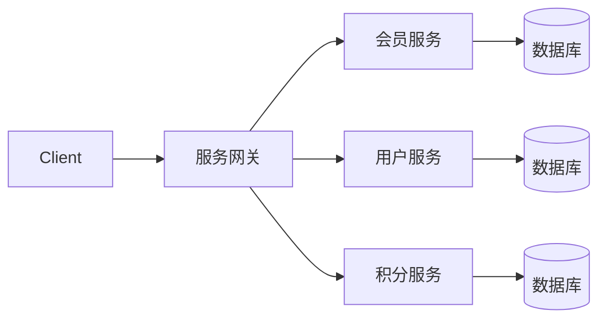

## 微服务概述
### 单体架构
**单体架构**：将业务的所有功能集中在一个项目中开发，打成一个包部署。

**优点：**

- 架构简单
- 部署成本低

**缺点：**

- 耦合度高（维护困难、升级困难）
### 分布式架构
**分布式架构**：根据业务功能对系统做拆分，每个业务功能模块作为独立项目开发，称为一个服务。

**优点：**

- 降低服务耦合
- 有利于服务升级和拓展

**缺点：**

- 服务调用关系错综复杂

分布式架构虽然降低了服务耦合，但是服务拆分时也有很多问题需要思考：

- 服务拆分的粒度如何界定？
- 服务之间如何调用？
- 服务的调用关系如何管理？

人们需要制定一套行之有效的标准来约束分布式架构。
### 微服务
微服务的架构特征：

- 单一职责：微服务拆分粒度更小，每一个服务都对应唯一的业务能力，做到单一职责
- 自治：团队独立、技术独立、数据独立，独立部署和交付
- 面向服务：服务提供统一标准的接口，与语言和技术无关
- 隔离性强：服务调用做好隔离、容错、降级，避免出现级联问题




微服务的上述特性其实是在给分布式架构制定一个标准，进一步降低服务之间的耦合度，提供服务的独立性和灵活性。做到高内聚，低耦合。
因此，可以认为**微服务**是一种经过良好架构设计的**分布式架构方案** 。

### SpringCloud
SpringCloud是目前国内使用最广泛的微服务框架。官网地址：https://spring.io/projects/spring-cloud。
SpringCloud集成了各种微服务功能组件，并基于SpringBoot实现了这些组件的自动装配，从而提供了良好的开箱即用体验
其中常见的组件包括：


### 总结

-  单体架构：简单方便，高度耦合，扩展性差，适合小型项目。例如：学生管理系统 
-  分布式架构：松耦合，扩展性好，但架构复杂，难度大。适合大型互联网项目，例如：京东、淘宝 
-  微服务：一种良好的分布式架构方案
   - 优点：拆分粒度更小、服务更独立、耦合度更低
   - 缺点：架构非常复杂，运维、监控、部署难度提高 
-  SpringCloud是微服务架构的一站式解决方案，集成了各种优秀微服务功能组件 
## 服务拆分和远程调用
任何分布式架构都离不开服务的拆分，微服务也是一样。
### 服务拆分原则

- 不同微服务，不要重复开发相同业务
- 微服务数据独立，不要访问其它微服务的数据库
- 微服务可以将自己的业务暴露为接口，供其它微服务调用


### 拆分方式
#### 纵向拆分
所谓纵向拆分，就是按照项目的功能模块来拆分。例如黑马商城中，就有用户管理功能、订单管理功能、购物车功能、商品管理功能、支付功能等。那么按照功能模块将他们拆分为一个个服务，就属于纵向拆分。这种拆分模式可以尽可能提高服务的内聚性。
#### 横向拆分
而横向拆分，是看各个功能模块之间有没有公共的业务部分，如果有将其抽取出来作为通用服务。例如用户登录是需要发送消息通知，记录风控数据，下单时也要发送短信，记录风控数据。因此消息发送、风控数据记录就是通用的业务功能，因此可以将他们分别抽取为公共服务：消息中心服务、风控管理服务。这样可以提高业务的复用性，避免重复开发。同时通用业务一般接口稳定性较强，也不会使服务之间过分耦合。
### 服务拆分示例
以课前资料中的微服务cloud-demo为例，其结构如下：

cloud-demo：父工程，管理依赖

- order-service：订单微服务，负责订单相关业务
- user-service：用户微服务，负责用户相关业务

要求：

- 订单微服务和用户微服务都必须有各自的数据库，相互独立
- 订单服务和用户服务都对外暴露Restful的接口
- 订单服务如果需要查询用户信息，只能调用用户服务的Restful接口，不能查询用户数据库
### 实现远程调用案例
#### 概览
远程调用（RPC）有两种方式：

- 基于Http协议
   - 不关心服务提供者的具体技术实现，只要对外暴露Http接口即可，更符合微服务的需要。
- 基于Dubbo协议

基本步骤

- 注册RestTemplate到Spring容器
- 调用RestTemplate的API发送请求，常见方法有： 
   - getForObject：发送Get请求并返回指定类型对象
   - PostForObject：发送Post请求并返回指定类型对象
   - put：发送PUT请求
   - delete：发送Delete请求
   - exchange：发送任意类型请求，返回ResponseEntity

---

在order-service服务中，有一个根据id查询订单的接口：

根据id查询订单，返回值是Order对象，如图：

其中的user为null

---

在user-service中有一个根据id查询用户的接口：

查询的结果如图：


#### 案例需求
修改order-service中的根据id查询订单业务，要求在查询订单的同时，根据订单中包含的userId查询出用户信息，一起返回。

因此，我们需要在order-service中 向user-service发起一个http的请求，调用http://localhost:8081/user/{userId}这个接口。
大概的步骤：

- 注册一个RestTemplate的实例到Spring容器
- 修改order-service服务中的OrderService类中的queryOrderById方法，根据Order对象中的userId查询User
- 将查询的User填充到Order对象，一起返回
#### 注册RestTemplate
首先，我们在order-service服务中的OrderApplication启动（配置）类中，注册RestTemplate实例：
```java
@SpringBootApplication
public class OrderApplication {

    public static void main(String[] args) {
        SpringApplication.run(OrderApplication.class, args);
    }

    @Bean
    public RestTemplate restTemplate() {
        return new RestTemplate();
    }
}
```
#### 实现远程调用
修改order-service服务中的OrderService类中的queryOrderById方法：


### 服务提供者与消费者
在服务调用关系中，会有两个不同的角色：

- **服务提供者**：一次业务中，被其它微服务调用的服务。（提供接口给其它微服务）
- **服务消费者**：一次业务中，调用其它微服务的服务。（调用其它微服务提供的接口）


但是，服务提供者与服务消费者的角色并不是绝对的，而是相对于业务而言。
如果服务A调用了服务B，而服务B又调用了服务C，服务B的角色是什么？

- 对于A调用B的业务而言：A是服务消费者，B是服务提供者
- 对于B调用C的业务而言：B是服务消费者，C是服务提供者

因此，服务B既可以是服务提供者，也可以是服务消费者。
## Eureka注册中心
假如我们的服务提供者user-service部署了多个实例，如图：

几个问题：

- order-service在发起远程调用的时候，该如何得知user-service实例的ip地址和端口？
- 有多个user-service实例地址，order-service调用时该如何选择？
- order-service如何得知某个user-service实例是否依然健康，是不是已经宕机？
### 常见注册中心
目前开源的注册中心框架有很多，国内比较常见的有：

- Eureka：Netflix公司出品，目前被集成在SpringCloud当中，一般用于Java应用
- Nacos：Alibaba公司出品，目前被集成在SpringCloudAlibaba中，一般用于Java应用
- Consul：HashiCorp公司出品，目前集成在SPringCloud中，不限制微服务语言

以上几种注册中心都遵循SpringCloud中的API规范，因此在业务开发使用上没有太大差异。由于Nacos是国内产品，中文文档比较丰富，而且同时具备**配置管理**功能，因此在国内使用较多。
### Eureka结构和作用
这些问题都需要利用SpringCloud中的注册中心来解决，其中最广为人知的注册中心就是Eureka，其结构如下：

回答之前的各个问题。
问题1：order-service如何得知user-service实例地址？
获取地址信息的流程如下：

- user-service服务实例启动后，将自己的信息注册到eureka-server（Eureka服务端）。这个叫服务注册
- eureka-server保存服务名称到服务实例地址列表的映射关系
- order-service根据服务名称，拉取实例地址列表。这个叫服务发现或服务拉取

问题2：order-service如何从多个user-service实例中选择具体的实例？

- order-service从实例列表中利用负载均衡算法选中一个实例地址
- 向该实例地址发起远程调用

问题3：order-service如何得知某个user-service实例是否依然健康，是不是已经宕机？

- user-service会每隔一段时间（默认30秒）向eureka-server发起请求，报告自己状态，称为心跳
- 当超过一定时间没有发送心跳时，eureka-server会认为微服务实例故障，将该实例从服务列表中剔除
- order-service拉取服务时，就能将故障实例排除了
> 注意：一个微服务，既可以是服务提供者，又可以是服务消费者，因此eureka将服务注册、服务发现等功能统一封装到了eureka-client端

因此，接下来我们动手实践的步骤包括：


### 注册中心原理
在微服务远程调用的过程中，包括两个角色：

- 服务提供者：提供接口供其它微服务访问，比如item-service
- 服务消费者：调用其它微服务提供的接口，比如cart-service

在大型微服务项目中，服务提供者的数量会非常多，为了管理这些服务就引入了**注册中心**的概念。注册中心、服务提供者、服务消费者三者间关系如下：流程如下：

- 服务启动时就会注册自己的服务信息（服务名、IP、端口）到注册中心
- 调用者可以从注册中心订阅想要的服务，获取服务对应的实例列表（1个服务可能多实例部署）
- 调用者自己对实例列表负载均衡，挑选一个实例
- 调用者向该实例发起远程调用

当服务提供者的实例宕机或者启动新实例时，调用者如何得知呢？

- 服务提供者会定期向注册中心发送请求，报告自己的健康状态（心跳请求）
- 当注册中心长时间收不到提供者的心跳时，会认为该实例宕机，将其从服务的实例列表中剔除
- 当服务有新实例启动时，会发送注册服务请求，其信息会被记录在注册中心的服务实例列表
- 当注册中心服务列表变更时，会主动通知微服务，更新本地服务列表
### 搭建eureka-server
注册中心服务端：eureka-server，这必须是一个独立的微服务
#### 引入eureka依赖
引入SpringCloud为eureka提供的starter依赖：
```xml
<dependency>
    <groupId>org.springframework.cloud</groupId>
    <artifactId>spring-cloud-starter-netflix-eureka-server</artifactId>
</dependency>
```
#### 编写启动类
给eureka-server服务编写一个启动类，一定要添加一个@EnableEurekaServer注解，开启eureka的注册中心功能：
```java
@EnableEurekaServer
@SpringBootApplication
public class EurekaApplication {
    public static void main(String[] args) {
        SpringApplication.run(EurekaApplication.class, args);
    }
}
```
#### 编写配置文件
```yaml
server:
  port: 8088
spring:
  application:
    name: eurekaserver ## eureka服务名称
eureka:
  client:
    service-url: ## eureka地址信息
      defaultZone: http://localhost:8088/eureka
logging:
  level:
    com.qzy: debug
  pattern:
    dateformat: MM-dd HH:mm:ss:SSS
```
#### 启动服务
启动微服务，然后在浏览器访问：localhost:8080
看到下面结果应该是成功了：


### 服务注册
下面将user-service注册到eureka-server中去。
#### 引入依赖
在user-service的pom文件中，引入下面的eureka-client依赖：
```xml
<dependency>
    <groupId>org.springframework.cloud</groupId>
    <artifactId>spring-cloud-starter-netflix-eureka-client</artifactId>
</dependency>
```
#### 配置文件
在user-service中，修改application.yml文件，添加服务名称、eureka地址：
```yaml
spring:
  application:
    name: userservice	## user服务名称
eureka:
  client:
    service-url:	## eureka地址信息
      defaultZone: http://localhost:8088/eureka
```
#### 启动多个user-service实例
为了演示一个服务有多个实例的场景，我们添加一个SpringBoot的启动配置，再启动一个user-service。
首先，复制原来的user-service启动配置：

然后，在弹出的窗口中，填写信息：

现在，SpringBoot窗口会出现两个user-service启动配置：
不过，第一个是8081端口，第二个是8082端口。
启动两个user-service实例：

查看eureka-server管理页面：


### 服务发现
我们将order-service的逻辑修改：向eureka-server拉取user-service的信息，实现服务发现。
#### 引入依赖
服务发现、服务注册统一都封装在eureka-client依赖，因此这一步与服务注册时一致。
在order-service的pom文件中，引入下面的eureka-client依赖：
```xml
<dependency>
    <groupId>org.springframework.cloud</groupId>
    <artifactId>spring-cloud-starter-netflix-eureka-client</artifactId>
</dependency>
```
#### 配置文件
服务发现也需要知道eureka地址，因此第二步与服务注册一致，都是配置eureka信息：
在order-service中，修改application.yml文件，添加服务名称、eureka地址：
```yaml
spring:
  application:
    name: orderservice
eureka:
  client:
    service-url:
      defaultZone: http://localhost:8088/eureka
```
#### 服务拉取和负载均衡
最后，我们要去eureka-server中拉取user-service服务的实例列表，并且实现负载均衡。
不过这些动作不用我们去做，只需要添加一些注解即可。
在order-service的OrderApplication中，给RestTemplate这个Bean添加一个@LoadBalanced注解：
```java
@SpringBootApplication
public class OrderApplication {

    public static void main(String[] args) {
        SpringApplication.run(OrderApplication.class, args);
    }

    /**
     * Bean的配置只能在配置类里;启动类也是配置类
     * LoadBalanced:负载均衡
     * 该类用来在Java代码中发送Http请求
     */
    @Bean
    @LoadBalanced
    public RestTemplate restTemplate() {
        return new RestTemplate();
    }
}
```
修改order-service服务中的cn.itcast.order.service包下的OrderService类中的queryOrderById方法。修改访问的url路径，用服务名代替ip、端口：

spring会自动帮助我们从eureka-server端，根据userservice这个服务名称，获取实例列表，而后完成负载均衡。

## Ribbon负载均衡
添加了@LoadBalanced注解，即可实现负载均衡功能，这是什么原理？
### 负载均衡原理
SpringCloud底层其实是利用了一个名为Ribbon的组件，来实现负载均衡功能的。

发出的请求明明是http://userservice/user/1，怎么变成了http://localhost:8081的呢？

### 源码跟踪
为什么只输入了service名称就可以访问了呢？之前还要获取ip和端口。
显然有人帮我们根据service名称，获取到了服务实例的ip和端口。它就是`LoadBalancerInterceptor`，这个类会在对RestTemplate的请求进行拦截，然后从Eureka根据服务id获取服务列表，随后利用负载均衡算法得到真实的服务地址信息，替换服务id。
源码跟踪：
#### LoadBalancerIntercepor

可以看到这里的intercept方法，拦截了用户的HttpRequest请求，然后做了几件事：

- `request.getURI()`：获取请求uri，本例中就是 [http://user-service/user/8](http://user-service/user/8)
- `originalUri.getHost()`：获取uri路径的主机名，其实就是服务id，`user-service`
- `this.loadBalancer.execute()`：处理服务id，和用户请求。

这里的`this.loadBalancer`是`LoadBalancerClient`类型，我们继续跟入。
#### LoadBalancerClient
继续跟入execute方法：

代码是这样的：

- getLoadBalancer(serviceId)：根据服务id获取ILoadBalancer，而ILoadBalancer会拿着服务id去eureka中获取服务列表并保存起来。
- getServer(loadBalancer)：利用内置的负载均衡算法，从服务列表中选择一个。本例中，可以看到获取了8082端口的服务

放行后，再次访问并跟踪，发现获取的是8081：

果然实现了负载均衡。

#### 负载均衡策略IRule
在刚才的代码中，可以看到获取服务使通过一个`getServer`方法来做负载均衡:

我们继续跟入：

继续跟踪源码chooseServer方法，发现这么一段代码：

我们看看这个rule是谁：

这里的rule默认值是一个`RoundRobinRule`，看类的介绍：

这不就是轮询的意思嘛。
到这里，整个负载均衡的流程我们就清楚了。

#### 总结
SpringCloudRibbon的底层采用了一个拦截器，拦截了RestTemplate发出的请求，对地址做了修改。用一幅图来总结一下：

基本流程如下：

- 拦截我们的RestTemplate请求http://userservice/user/1
- RibbonLoadBalancerClient会从请求url中获取服务名称，也就是user-service
- DynamicServerListLoadBalancer根据user-service到eureka拉取服务列表
- eureka返回列表，localhost:8081、localhost:8082
- IRule利用内置负载均衡规则，从列表中选择一个，例如localhost:8081
- RibbonLoadBalancerClient修改请求地址，用localhost:8081替代userservice，得到http://localhost:8081/user/1，发起真实请求
### 负载均衡策略
#### 策略概览
负载均衡的规则都定义在IRule接口中，而IRule有很多不同的实现类：

不同规则的含义如下：

| **内置负载均衡规则类** | **规则描述** |
| --- | --- |
| RoundRobinRule | 简单轮询服务列表来选择服务器。它是Ribbon默认的负载均衡规则。 |
| AvailabilityFilteringRule | 对以下两种服务器进行忽略：
（1）在默认情况下，这台服务器如果3次连接失败，这台服务器就会被设置为“短路”状态。短路状态将持续30秒，如果再次连接失败，短路的持续时间就会几何级地增加。
（2）并发数过高的服务器。如果一个服务器的并发连接数过高，配置了AvailabilityFilteringRule规则的客户端也会将其忽略。并发连接数的上限，可以由客户端的`<clientName>.<clientConfigNameSpace>.ActiveConnectionsLimit`属性进行配置。 |
| WeightedResponseTimeRule | 为每一个服务器赋予一个权重值。服务器响应时间越长，这个服务器的权重就越小。这个规则会随机选择服务器，这个权重值会影响服务器的选择。 |
| **ZoneAvoidanceRule** | 以区域可用的服务器为基础进行服务器的选择。使用Zone对服务器进行分类，这个Zone可以理解为一个机房、一个机架等。而后再对Zone内的多个服务做轮询。 |
| BestAvailableRule | 忽略那些短路的服务器，并选择并发数较低的服务器。 |
| RandomRule | 随机选择一个可用的服务器。 |
| RetryRule | 重试机制的选择逻辑 |

默认的实现就是`ZoneAvoidanceRule`，是一种轮询方案
#### 自定义负载均衡策略
通过定义IRule实现可以修改负载均衡规则，有两种方式：

1. 代码方式：在order-service中的OrderApplication类中，定义一个新的IRule：
```java
@Bean
public IRule randomRule(){
    return new RandomRule();
}
```

2. 配置文件方式：在order-service的application.yml文件中，添加新的配置也可以修改规则：
```yaml
userservice: ## 给某个微服务配置负载均衡规则，这里是userservice服务
  ribbon:
    NFLoadBalancerRuleClassName: com.netflix.loadbalancer.RandomRule ## 负载均衡规则
```
> **注意**，一般用默认的负载均衡规则，不做修改。

### 饥饿加载
Ribbon默认是采用懒加载，即第一次访问时才会去创建LoadBalanceClient，请求时间会很长。
而饥饿加载则会在项目启动时创建，降低第一次访问的耗时，通过下面配置开启饥饿加载：
```yaml
ribbon:
  eager-load:
    enabled: true ## 开启饥饿加载
    clients: ## 指定饥饿加载的服务名称，可以有多个
			- userservice
```
## Consul注册中心
### 快速使用
#### 安装

压缩包里是个.exe文件，随便解压到一个目录，设置一下环境变量用来快捷访问即可。

#### 常见命令
以开发模式启动服务：`consul agent -dev`
停止服务：`consul leave`
#### 配置持久化

- 作用：使得每次开机自动启动Consul并读取以前的配置。
- 步骤
   1. 在文件所在的目录新建`consul_start.bat`和`MyData`文件夹。
```shell
@echo.服务启动......
@echo off
@sc create Consul binpath= "E:\Consul\consul.exe agent -server -ui -bind=127.0.0.1 -client=0.0.0.0 -bootstrap-expect  1  -data-dir E:\Consul\MyData   "
@net start Consul
@sc config Consul start= AUTO
@echo.Consul start is OK......success
@pause
```

   2. 以**管理员**运行`consul_start.bat`
- 卸载服务
   1. 打开`powershell`
   2. 使用`get-service`获取服务列表
   3. 使用`sc delete consul`删除服务consul服务
### 服务注册与发现
```xml
  <dependency>
      <groupId>org.springframework.cloud</groupId>
      <artifactId>spring-cloud-starter-consul-discovery</artifactId>
  </dependency>
```
```yaml
spring:
  application:
    name: cloud-order-service
  cloud:
    consul:
      host: localhost
      port: 8500
      discovery:
        service-name: ${spring.application.name}
```

---

```java
@Resource
private DiscoveryClient discoveryClient;
@GetMapping("/consumer/discovery")
public String discovery() {
    List<String> services = discoveryClient.getServices();
    for (String service : services) {
        System.out.println("*****" + service);
    }

    System.out.println("========================");

    List<ServiceInstance> instances = discoveryClient.getInstances("cloud-payment-service");
    instances.forEach(e -> {
        System.out.println(e.getServiceId() + "\t" + e.getHost() + "\t" + e.getPort() + "\t" + e.getUri());
    });

    return instances.get(0).getServiceId() + "\t" + instances.get(0).getHost() + "\t" + instances.get(0).getPort() + "\t" + instances.get(0).getUri();
}
```
### 分布式配置

- 本地配置
```xml
<dependency>
  <groupId>org.springframework.cloud</groupId>
  <artifactId>spring-cloud-starter-consul-config</artifactId>
</dependency>
<dependency>
  <groupId>org.springframework.cloud</groupId>
  <artifactId>spring-cloud-starter-bootstrap</artifactId>
</dependency>
```
```yaml
spring:
  application:
    name: cloud-payment-service
  ## SpringCloud Consul 配置 for Service Discovery
  cloud:
    consul:
      host: localhost
      port: 8500
      discovery:
        service-name: ${spring.application.name}
      config:
        profile-separator: '-'  ## 默认值是 ,
        format: YAML
        watch:
          wait-time: 1  ## 修改动态刷新时间为1秒，默认值是55秒（这只是方便学习，实际数值不会写得这么少）
```
```yaml
server:
  port: 8001
spring:
  profiles:
    active: dev ## 多环境配置加载内容dev/prod，不写就是默认default配置
  cloud:
    consul:
      host: localhost
      port: 8500
      discovery:
        service-name: ${spring.application.name}
```

- Consul中Key/Value配置

`config/cloud-payment-service/data`
`config/cloud-payment-service-dev/data`
`config/cloud-payment-service-prod/data`
> 创建目录时以`/`结尾，文件则不需要`/`。
> YAML中的内容使用2个`空格`，若使用`Tab`制表符则会报错。

- Controller测试
```java
    @Value("${server.port}")
    private String serverPort;

    /**
     * 测试Consul配置文件（yml）的信息
     */
    @GetMapping("/pay/get/info")
    public String info(@Value("${qzy.info}") String qzyInfo) {
        return "port:" + serverPort + ":" + qzyInfo;
    }
```
## LoadBalancer负载均衡
```xml
<!--loadbalancer-->
<dependency>
  <groupId>org.springframework.cloud</groupId>
  <artifactId>spring-cloud-starter-loadbalancer</artifactId>
</dependency>
```
## Nacos注册中心
### 服务注册到Nacos
Nacos是SpringCloudAlibaba的组件，而SpringCloudAlibaba也遵循SpringCloud中定义的服务注册、服务发现规范。因此使用Nacos和使用Eureka对于微服务来说，并没有太大区别。
主要差异在于：

- 依赖不同
- 服务地址不同
#### 引入依赖
在cloud-demo父工程的pom文件中的`<dependencyManagement>`中引入SpringCloudAlibaba的依赖：
```xml
<dependency>
    <groupId>com.alibaba.cloud</groupId>
    <artifactId>spring-cloud-alibaba-dependencies</artifactId>
    <version>2.2.6.RELEASE</version>
    <type>pom</type>
    <scope>import</scope>
</dependency>
```
然后在user-service和order-service中的pom文件中引入nacos-discovery依赖：
```xml
<dependency>
    <groupId>com.alibaba.cloud</groupId>
    <artifactId>spring-cloud-starter-alibaba-nacos-discovery</artifactId>
</dependency>
```
#### 配置nacos地址
在user-service和order-service的application.yml中添加nacos地址：
```yaml
spring:
  cloud:
    nacos:
      server-addr: localhost:8848
```
#### 重启
重启微服务后，登录`localhost:8848/nacos`管理页面，可以看到微服务信息：


### 服务分级[存储模型]
一个**服务**可以有多个**实例**，例如我们的user-service，可以有:

- 127.0.0.1:8081
- 127.0.0.1:8082
- 127.0.0.1:8083

假如这些实例分布于全国各地的不同机房，例如：

- 127.0.0.1:8081，在上海机房
- 127.0.0.1:8082，在上海机房
- 127.0.0.1:8083，在杭州机房

Nacos就将同一机房内的实例 划分为一个**集群**。
也就是说，user-service是服务，一个服务可以包含多个集群，如杭州、上海，每个集群下可以有多个实例，形成分级模型，如图：

微服务互相访问时，应该尽可能访问同集群实例，因为本地访问速度更快。当本集群内不可用时，才访问其它集群。例如：

杭州机房内的order-service应该优先访问同机房的user-service。

#### 给user-service配置集群
修改user-service的`application.yaml`文件，添加集群配置：
```yaml
spring:
  cloud:
    nacos:
      server-addr: localhost:8848
      discovery:
        cluster-name: HZ ## 集群名称
```
重启两个user-service实例后，可以在nacos控制台看到下面结果：

再次复制一个user-service启动配置，添加属性：

```shell
-Dserver.port=8083 -Dspring.cloud.nacos.discovery.cluster-name=SH
```
启动UserApplication3后再次查看nacos控制台：


#### 同集群优先的负载均衡
默认的`ZoneAvoidanceRule`并不能实现根据同集群优先来实现负载均衡。
因此Nacos中提供了一个`NacosRule`的实现，可以优先从同集群中挑选实例。

1. 给order-service配置集群信息

修改order-service的application.yml文件，添加集群配置：
```yaml
spring:
	cloud:
		nacos:
			server-addr: localhost:8848
			discovery:
				cluster-name: HZ ## 集群名称
```

2. 修改负载均衡规则

修改order-service的application.yml文件，修改负载均衡规则：
```yaml
userservice:
  ribbon:
    NFLoadBalancerRuleClassName: com.alibaba.cloud.nacos.ribbon.NacosRule ## 负载均衡规则
```
### 权重配置
实际部署中会出现这样的场景：
服务器设备性能有差异，部分实例所在机器性能较好，另一些较差，我们希望性能好的机器承担更多的用户请求。
但默认情况下NacosRule是同集群内随机挑选，不会考虑机器的性能问题。
因此，Nacos提供了权重配置来控制访问频率，权重越大则访问频率越高。
在nacos控制台，找到user-service的实例列表，点击编辑，即可修改权重：

在弹出的编辑窗口，修改权重：


> **注意**：如果权重修改为0，则该实例永远不会被访问

### 环境隔离
Nacos提供了namespace来实现环境隔离功能。

- nacos中可以有多个namespace
- namespace下可以有group、service等
- 不同namespace之间相互隔离，例如不同namespace的服务互相不可见


#### 创建namespace
默认情况下，所有service、data、group都在同一个namespace，名为public：

我们可以点击页面新增按钮，添加一个namespace：

然后，填写表单：

就能在页面看到一个新的namespace：


#### 给微服务配置namespace
给微服务配置namespace只能通过修改配置来实现。
例如，修改order-service的application.yml文件：
```yaml
spring:
  cloud:
    nacos:
      server-addr: localhost:8848
      discovery:
        cluster-name: HZ
        namespace: 492a7d5d-237b-46a1-a99a-fa8e98e4b0f9 ## 命名空间，填ID
```
重启order-service后，访问控制台，可以看到下面的结果：

此时访问order-service，因为namespace不同，会导致找不到userservice，控制台会报错：


### Nacos与Eureka的区别
Nacos的服务实例分为两种l类型：

-  临时实例：如果实例宕机超过一定时间，会从服务列表剔除，默认的类型。 
-  非临时实例：如果实例宕机，不会从服务列表剔除，也可以叫永久实例。 

配置一个服务实例为永久实例：
```yaml
spring:
  cloud:
    nacos:
      discovery:
        ephemeral: false ## 设置为非临时实例
```
Nacos和Eureka整体结构类似，服务注册、服务拉取、心跳等待，但是也存在一些差异：


-  Nacos与eureka的共同点 
   - 都支持服务注册和服务拉取
   - 都支持服务提供者心跳方式做健康检测
-  Nacos与Eureka的区别 
   - Nacos支持服务端主动检测提供者状态：临时实例采用心跳模式，非临时实例采用主动检测模式
   - 临时实例心跳不正常会被剔除，非临时实例则不会被剔除
   - Nacos支持服务列表变更的消息推送模式，服务列表更新更及时
   - Nacos集群默认采用AP方式，当集群中存在非临时实例时，采用CP模式；Eureka采用AP方式
## Nacos配置管理
Nacos除了可以做注册中心，同样可以做配置管理来使用。
### 统一配置管理
当微服务部署的实例越来越多，达到数十、数百时，逐个修改微服务配置就会让人抓狂，而且很容易出错。我们需要一种统一配置管理方案，可以集中管理所有实例的配置。
Nacos一方面可以将配置集中管理，另一方可以在配置变更时，及时通知微服务，实现配置的热更新。


#### 在nacos中添加配置文件

1. 在本地yaml配置文件中声明：
```yaml
spring:
  cloud:
    nacos:
      config:
        file-extension: yaml #指定yaml格式的配置
```

2. Nacos配置列表


3. 在弹出的表单中，填写配置信息：

Data ID格式：`${spring.application.name}-${spring.profiles.active}.${spring.cloud.nacos.config.file-extension}`


> 注意：项目的核心配置，需要热更新的配置才有放到nacos管理的必要。基本不会变更的一些配置还是保存在微服务本地比较好。

#### 从微服务拉取配置
微服务要拉取nacos中管理的配置，并且与本地的application.yml配置合并，才能完成项目启动。
但如果尚未读取application.yml，又如何得知nacos地址呢？
因此spring引入了一种新的配置文件：bootstrap.yaml文件，会在application.yml之前被读取，流程如下：


1. 引入nacos-config依赖

首先，在user-service服务中，引入nacos-config的客户端依赖：
```xml
<!--nacos配置管理依赖-->
<dependency>
    <groupId>com.alibaba.cloud</groupId>
    <artifactId>spring-cloud-starter-alibaba-nacos-config</artifactId>
</dependency>
```

2. 添加bootstrap.yaml

然后，在user-service中添加一个bootstrap.yaml文件，内容如下：
```yaml
spring:
  application:
    name: userservice ## 服务名称
  profiles:
    active: dev #开发环境，这里是dev 
  cloud:
    nacos:
      server-addr: localhost:8848 ## Nacos地址
      config:
        file-extension: yaml ## 文件后缀名
```
这里会根据spring.cloud.nacos.server-addr获取nacos地址，再根据
`${spring.application.name}-${spring.profiles.active}.${spring.cloud.nacos.config.file-extension}`作为文件id，来读取配置。
本例中，就是去读取`userservice-dev.yaml`：


3. 读取nacos配置

在user-service中的UserController中添加业务逻辑，读取pattern.dateformat配置：

完整代码：

```java
@Slf4j
@RestController
@RequestMapping("/user")
public class UserController {

    @Autowired
    private UserService userService;

    @Value("${pattern.dateformat}")
    private String dateformat;
    
    @GetMapping("now")
    public String now(){
        return LocalDateTime.now().format(DateTimeFormatter.ofPattern(dateformat));
    }
    // ...略
}
```
在页面访问，可以看到效果：


### 配置热更新
我们最终的目的，是修改nacos中的配置后，微服务中无需重启即可让配置生效，也就是**配置热更新**。
#### 方式一
在@Value注入的变量所在类上添加注解@RefreshScope：


#### 方式二
使用@ConfigurationProperties注解代替@Value注解。
在user-service服务中，添加一个类，读取patterrn.dateformat属性：
```java
@Data
@Component
@ConfigurationProperties(prefix = "pattern")    //方式2：实现Nacos配置热更新-步骤1
public class PatternProperties {
    private String dateFormat;
}
```
在UserController中使用这个类代替@Value：


```java
@Slf4j
@RestController
@RequestMapping("/user")
public class UserController {

    @Autowired
    private UserService userService;

    @Autowired
    private PatternProperties patternProperties;

    @GetMapping("now")
    public String now(){
        return LocalDateTime.now().format(DateTimeFormatter.ofPattern(patternProperties.getDateformat()));
    }

    // 略
}
```
### 配置共享
#### 不包含环境的共享
其实微服务启动时，会去nacos读取多个配置文件，例如：

-  `[spring.application.name]-[spring.profiles.active].yaml`，例如：userservice-dev.yaml 
-  `[spring.application.name].yaml`，例如：userservice.yaml 

而`[spring.application.name].yaml`不包含环境，因此可以被多个环境共享。

1. 添加一个环境共享配置

在nacos中添加一个userservice.yaml文件：


2. 在user-service中读取共享配置

在user-service服务中，修改PatternProperties类，读取新添加的属性：

在user-service服务中，修改UserController，添加一个方法：


3. 运行两个UserApplication，使用不同的profile

修改UserApplication2这个启动项，改变其profile值：

这样，UserApplication(8081)使用的profile是dev，UserApplication2(8082)使用的profile是test。
启动UserApplication和UserApplication2
访问http://localhost:8081/user/prop，结果：

访问http://localhost:8082/user/prop，结果：

可以看出来，不管是dev，还是test环境，都读取到了envSharedValue这个属性的值。

##### 共享优先级
当nacos、服务本地同时出现相同属性时，优先级有高低之分：


#### 手动指定共享文件名
```yaml
## nacos配置
spring:
  cloud:
    nacos:
      config:
        shared-configs: #共享配置
          - dataId: shared-jdbc.yaml	## 指定共享配置文件名为shared-jdbc.yaml
            group: DEV_GROUP	## 指定配置组为DEV_GROUP
            refresh: true	## 当配置文件发生变化时，客户端会自动刷新获取最新的配置信息。
          - data-id: shared-redis.yaml	## 指定共享配置文件名为shared-redis.yaml
            group: DEFAULT_GROUP	## 指定配置组为DEFAULT_GROUP
            refresh: false	## 当配置文件发生变化时，客户端不会自动刷新获取最新的配置信息。
```
### 搭建Nacos集群
Nacos生产环境下一定要部署为集群状态，部署方式参考**《Nacos集群搭建》**
## OpenFeign远程调用
先来看我们以前利用RestTemplate发起远程调用的代码：

存在下面的问题：

- 代码可读性差，编程体验不统一
- 参数复杂URL难以维护

OpenFeign是一个声明式的http客户端，官方地址：[https://github.com/OpenFeign/feign](https://github.com/OpenFeign/feign)
其作用就是帮助我们优雅的实现http请求的发送，解决上面提到的问题。


### Feign替代RestTemplate
#### 引入依赖
我们在order-service服务的pom文件中引入feign的依赖：
```xml
<dependency>
    <groupId>org.springframework.cloud</groupId>
    <artifactId>spring-cloud-starter-openfeign</artifactId>
</dependency>
```
#### 添加注解
在order-service的启动类添加注解开启Feign的功能：


#### 编写Feign的客户端
在order-service中新建一个接口，内容如下：
```java
@FeignClient("userservice")
public interface UserClient {
    @GetMapping("/user/{id}")
    User findById(@PathVariable("id") Long id);
}
```
这个客户端主要是基于SpringMVC的注解来声明远程调用的信息，比如：

- 服务名称：userservice
- 请求方式：GET
- 请求路径：/user/{id}
- 请求参数：Long id
- 返回值类型：User

这样，Feign就可以帮助我们发送http请求，无需自己使用RestTemplate来发送了。
#### 测试
修改order-service中的OrderService类中的queryOrderById方法，使用Feign客户端代替RestTemplate：


#### 总结
使用Feign的步骤：
① 引入依赖
② 添加@EnableFeignClients注解
③ 编写FeignClient接口
④ 使用FeignClient中定义的方法代替RestTemplate
### 自定义配置
Feign可以支持很多的自定义配置，如下表所示：

| 类型 | 作用 | 说明 |
| --- | --- | --- |
| **feign.Logger.Level** | 修改日志级别 | 包含四种不同的级别：NONE、BASIC、HEADERS、FULL |
| feign.codec.Decoder | 响应结果的解析器 | http远程调用的结果做解析，例如解析json字符串为java对象 |
| feign.codec.Encoder | 请求参数编码 | 将请求参数编码，便于通过http请求发送 |
| feign. Contract | 支持的注解格式 | 默认是SpringMVC的注解 |
| feign. Retryer | 失败重试机制 | 请求失败的重试机制，默认是没有，不过会使用Ribbon的重试 |

一般情况下，默认值就能满足我们使用，如果要自定义时，只需要创建自定义的@Bean覆盖默认Bean即可。
下面以日志为例来演示如何自定义配置。
#### 配置文件方式
基于配置文件修改feign的日志级别可以针对单个服务：
```yaml
feign:  
  client:
    config: 
      userservice: ## 针对某个微服务的配置
        loggerLevel: FULL ##  日志级别，调试用FULL,平时用NULL/BASIC，日志有性能消耗
```
也可以针对所有服务：
```yaml
feign:  
  client:
    config: 
      default: ## 这里用default就是全局配置，如果是写服务名称，则是针对某个微服务的配置
        loggerLevel: FULL ##  日志级别，调试用FULL,平时用NULL/BASIC，日志有性能消耗
```
而日志的级别分为四种：

- NONE：不记录任何日志信息，这是默认值。
- BASIC：仅记录请求的方法，URL以及响应状态码和执行时间
- HEADERS：在BASIC的基础上，额外记录了请求和响应的头信息
- FULL：记录所有请求和响应的明细，包括头信息、请求体、元数据。
#### Java代码方式
也可以基于Java代码来修改日志级别，先声明一个类，然后声明一个Logger.Level的对象：
```java
public class DefaultFeignConfiguration  {
    @Bean
    public Logger.Level feignLogLevel(){
        return Logger.Level.BASIC; // 日志级别为BASIC
    }
}
```
如果要**全局生效**，将其放到启动类的@EnableFeignClients这个注解中：
```java
@EnableFeignClients(defaultConfiguration = DefaultFeignConfiguration .class)
```
如果是**局部生效**，则把它放到对应的@FeignClient这个注解中：
```java
@FeignClient(value = "userservice", configuration = DefaultFeignConfiguration .class)
```
#### 超时控制
```yaml
spring:
  cloud:
    openfeign:
      client:
        config:
          ## default 设置的全局超时时间，指定服务名称可以设置单个服务的超时时间
          default:
             #连接超时时间
             connectTimeout: 4000
             #读取超时时间
             readTimeout: 4000
          ## 为serviceC这个服务单独配置超时时间，单个配置的超时时间将会覆盖全局配置
          serviceC:
             #连接超时时间
             connectTimeout: 2000
             #读取超时时间
             readTimeout: 2000
```
```java
@FeignClient(name = "example-service")
public interface ExampleServiceClient {

    @RequestLine(value = "GET /api/example", connectTimeout = 3000, readTimeout = 5000)
    String getExampleData();
}
```
```yaml
feign:
  client:
    config:
      default:
        ribbon:
          ReadTimeout: 10000
          ConnectTimeout: 5000
```
#### 重试机制

- 当前模块的配置
```java
@Configuration
public class FeignConfig
{
    @Bean
    public Retryer myRetryer()
    {
        //return Retryer.NEVER_RETRY; //Feign默认配置是不走重试策略的

        //最大请求次数为3(1+2)，初始间隔时间为100ms，重试间最大间隔时间为1s
        return new Retryer.Default(100,1,3);
    }
}
```

- 单个请求的重试配置
```java
@FeignClient(name = "example-service")
public interface ExampleServiceClient {

    @RequestLine(value = "GET /api/example", retries = 3)
    String getExampleData();
}
```

- 自定义重试逻辑
```java
public class MyRetryer implements Retryer {

    private int maxAttempts;
    private long backoff;
    private int attempt;

    public MyRetryer(int maxAttempts, long backoff) {
        this.maxAttempts = maxAttempts;
        this.backoff = backoff;
        this.attempt = 1;
    }

    @Override
    public void continueOrPropagate(RetryableException e) {
        if (attempt++ <= maxAttempts) {
            try {
                Thread.sleep(backoff);
            } catch (InterruptedException ignored) {
                Thread.currentThread().interrupt();
            }
            return;
        }
        throw e;
    }
}
```
```yaml
feign:
  client:
    config:
      default:
        retryer: com.example.MyRetryer
```
#### 默认HttpClient修改
在 OpenFeign 中，默认使用的是 JDK 自带的 HttpURLConnection 作为 HTTP 客户端.
由于默认HttpURLConnection没有连接池，性能和效率比较低，如果采用默认，性能不强，所以加到最大。
使用HttpClient或者OKHttp效率较高。
```java
@Configuration
public class FeignConfig
{
    @Bean
    public Retryer myRetryer()
    {
        return Retryer.NEVER_RETRY; //Feign默认配置是不走重试策略的
    }
}
```
```xml
<!-- httpclient5-->
<dependency>
    <groupId>org.apache.httpcomponents.client5</groupId>
    <artifactId>httpclient5</artifactId>
    <version>5.3</version>
</dependency>
<!-- feign-hc5-->
<dependency>
    <groupId>io.github.openfeign</groupId>
    <artifactId>feign-hc5</artifactId>
    <version>13.1</version>
</dependency>
```
```yaml
##  Apache HttpClient5 配置开启
spring:
  cloud:
    openfeign:
      httpclient:
        hc5:
          enabled: true
```
#### 请求/响应压缩
Spring Cloud OpenFeign支持对请求和响应进行GZIP压缩，以减少通信过程中的性能损耗。

- 对请求和响应进行GZIP压缩
```properties
spring.cloud.openfeign.compression.request.enabled=true
spring.cloud.openfeign.compression.response.enabled=true
```

- 细粒度化设置

对请求压缩做一些更细致的设置，比如下面的配置内容指定压缩的请求数据类型并设置了请求压缩的大小下限，
只有超过这个大小的请求才会进行压缩：
```properties
spring.cloud.openfeign.compression.request.enabled=true
spring.cloud.openfeign.compression.request.mime-types=text/xml,application/xml,application/json #触发压缩数据类型
spring.cloud.openfeign.compression.request.min-request-size=2048 #最小触发压缩的大小
```
#### 日志打印
Feign 提供了日志打印功能，我们可以通过配置来调整日志级别。
从而了解 Feign 中 Http 请求的细节，对Feign接口的调用情况进行监控和输出。
日志级别：

- NONE：默认的，不显示任何日志；
- BASIC：仅记录请求方法、URL、响应状态码及执行时间；
- HEADERS：除了 BASIC 中定义的信息之外，还有请求和响应的头信息；
- FULL：除了 HEADERS 中定义的信息之外，还有请求和响应的正文及元数据。
```java
@Configuration
public class FeignConfig
{
    @Bean
    Logger.Level feignLoggerLevel() {
        return Logger.Level.FULL;
    }
}
```
```yaml
logging:
  level:
    com:
      qzy:
        cloud:
          apis:
            PayFeignApi: debug
```
### 最佳实践
最佳实践，就是使用过程中总结的经验，最好的一种使用方式。
观察发现，Feign的客户端与服务提供者的controller代码非常相似：
feign客户端：

UserController：

有没有一种办法简化这种重复的代码编写呢？

#### 继承方式
一样的代码可以通过继承来共享：

1. 定义一个API接口，利用定义方法，并基于SpringMVC注解做声明。
2. Feign客户端和Controller都集成改接口


优点：

- 简单
- 实现了代码共享

缺点：

-  服务提供方、服务消费方紧耦合 
-  参数列表中的注解映射并不会继承，因此Controller中必须再次声明方法、参数列表、注解 
#### 抽取方式
将Feign的Client抽取为独立模块，并且把接口有关的POJO、默认的Feign配置都放到这个模块中，提供给所有消费者使用。
例如，将UserClient、User、Feign的默认配置都抽取到一个feign-api包中，所有微服务引用该依赖包，即可直接使用。


#### 实现基于抽取的最佳实践
##### 抽取
首先创建一个module，命名为feign-api：

项目结构

在feign-api中然后引入feign的starter依赖

```xml
<dependency>
    <groupId>org.springframework.cloud</groupId>
    <artifactId>spring-cloud-starter-openfeign</artifactId>
</dependency>
```
然后，order-service中编写的UserClient、User、DefaultFeignConfiguration都复制到feign-api项目中


##### 在order-service中使用feign-api
首先，删除order-service中的UserClient、User、DefaultFeignConfiguration等类或接口。
在order-service的pom文件中中引入feign-api的依赖：
```xml
<dependency>
  <groupId>com.qzy.demo</groupId>
  <artifactId>feign-api</artifactId>
  <version>1.0</version>
</dependency>
```
修改order-service中的所有与上述三个组件有关的导包部分，改成导入feign-api中的包
##### 重启测试
重启后，发现服务报错了：

这是因为UserClient现在在cn.itcast.feign.clients包下，
而order-service的@EnableFeignClients注解是在cn.itcast.order包下，不在同一个包，无法扫描到UserClient。

##### 解决扫描包问题
方式一：
指定Feign应该扫描的包：
```java
@EnableFeignClients(basePackages = "cn.itcast.feign.clients")
```
方式二：
指定需要加载的Client接口：
```java
@EnableFeignClients(clients = {UserClient.class})
```
## CircuitBreaker断路器
### 服务保护方案
保证服务运行的健壮性，避免级联失败导致的雪崩问题，就属于微服务保护。
微服务保护的方案有很多，比如：

- 请求限流
- 线程隔离
- 服务熔断

这些方案或多或少都会导致服务的体验上略有下降，比如请求限流，降低了并发上限；线程隔离，降低了可用资源数量；服务熔断，降低了服务的完整度，部分服务变的不可用或弱可用。因此这些方案都属于服务**降级**的方案。但通过这些方案，服务的健壮性得到了提升，
接下来，我们就逐一了解这些方案的原理。
#### 请求限流
服务故障最重要原因，就是并发太高！解决了这个问题，就能避免大部分故障。当然，接口的并发不是一直很高，而是突发的。因此请求限流，就是**限制或控制**接口访问的并发流量，避免服务因流量激增而出现故障。
请求限流往往会有一个限流器，数量高低起伏的并发请求曲线，经过限流器就变的非常平稳。这就像是水电站的大坝，起到蓄水的作用，可以通过开关控制水流出的大小，让下游水流始终维持在一个平稳的量。


#### 线程隔离
当一个业务接口响应时间长，而且并发高时，就可能耗尽服务器的线程资源，导致服务内的其它接口收到影响。所以我们必须把这种影响降低，或者缩减影响的范围。线程隔离正是解决这个问题的好办法。
线程隔离的思想来自轮船的舱壁模式：

轮船的船舱会被隔板分割为N个相互隔离的密闭舱，假如轮船触礁进水，只有损坏的部分密闭舱会进水，而其他舱由于相互隔离，并不会进水。这样就把进水控制在部分船体，避免了整个船舱进水而沉没。
为了避免某个接口故障或压力过大导致整个服务不可用，我们可以限定每个接口可以使用的资源范围，也就是将其“隔离”起来。

如图所示，我们给查询购物车业务限定可用线程数量上限为20，这样即便查询购物车的请求因为查询商品服务而出现故障，也不会导致服务器的线程资源被耗尽，不会影响到其它接口。

#### 服务熔断
线程隔离虽然避免了雪崩问题，但故障服务（商品服务）依然会拖慢购物车服务（服务调用方）的接口响应速度。而且商品查询的故障依然会导致查询购物车功能出现故障，购物车业务也变的不可用了。
所以，我们要做两件事情：

- **编写服务降级逻辑**：就是服务调用失败后的处理逻辑，根据业务场景，可以抛出异常，也可以返回友好提示或默认数据。
- **异常统计和熔断**：统计服务提供方的异常比例，当比例过高表明该接口会影响到其它服务，应该拒绝调用该接口，而是直接走降级逻辑。


### Resilience4j
[Resilience4j-Guides-Chinese/index.md at main · lmhmhl/Resilience4j-Guides-Chinese](https://github.com/lmhmhl/Resilience4j-Guides-Chinese/blob/main/index.md)
#### 熔断/降级
熔断器（Circuit Breaker）用于保护系统免受故障和延迟影响。当系统的某个服务或组件出现故障或响应时间过长时，熔断器可以快速地打开并停止对该服务或组件的请求，从而防止系统雪崩效应的发生。
降级（Fallback）用于在主服务不可用时提供备选方案。当熔断器打开时，请求将被转发到降级逻辑中，该逻辑可以是预先定义的备选操作、静态响应或者其他可替代的服务。
```xml
<!--    断路器resilience4j    -->
<dependency>
  <groupId>org.springframework.cloud</groupId>
  <artifactId>spring-cloud-starter-circuitbreaker-resilience4j</artifactId>
</dependency>
<!--    由于断路保护等需要AOP实现，所以必须导入AOP包    -->
<dependency>
  <groupId>org.springframework.boot</groupId>
  <artifactId>spring-boot-starter-aop</artifactId>
</dependency>
```
```yaml
resilience4j:
  ##  熔断
  circuitbreaker:
    configs:
      default:
        failureRateThreshold: 50 #设置50%的调用失败时打开断路器，超过失败请求百分⽐CircuitBreaker变为OPEN状态。
        slidingWindowType: COUNT_BASED ## 滑动窗口的类型
        slidingWindowSize: 6 #滑动窗⼝的⼤⼩配置COUNT_BASED表示6个请求，配置TIME_BASED表示6秒
        minimumNumberOfCalls: 6 #断路器计算失败率或慢调用率之前所需的最小样本(每个滑动窗口周期)。如果minimumNumberOfCalls为10，则必须最少记录10个样本，然后才能计算失败率。如果只记录了9次调用，即使所有9次调用都失败，断路器也不会开启。
        automaticTransitionFromOpenToHalfOpenEnabled: true ## 是否启用自动从开启状态过渡到半开状态，默认值为true。如果启用，CircuitBreaker将自动从开启状态过渡到半开状态，并允许一些请求通过以测试服务是否恢复正常
        waitDurationInOpenState: 5s #从OPEN到HALF_OPEN状态需要等待的时间
        permittedNumberOfCallsInHalfOpenState: 2 #半开状态允许的最大请求数，默认值为10。在半开状态下，CircuitBreaker将允许最多permittedNumberOfCallsInHalfOpenState个请求通过，如果其中有任何一个请求失败，CircuitBreaker将重新进入开启状态。
        recordExceptions:
        - java.lang.Exception
    instances:
      cloud-payment-service:
        baseConfig: default	
```
```java
@Resource
private PayFeignApi payFeignApi;

@GetMapping("/feign/pay/circuit/{id}")
@CircuitBreaker(name = "cloud-payment-service", fallbackMethod = "myCircuitFallback")
public String exp(@PathVariable("id") Integer id) {
    // 实际的服务调用
    return payFeignApi.exp(id);
}

public String myCircuitFallback(Integer id, Throwable t) {
    // 容错处理逻辑，返回备用结果
    return "服务降级处理逻辑，id=" + id + "，异常信息：" + t.getMessage() + "\n系统繁忙，请稍后再试！";
}
```
#### 隔离
Bulkhead（舱壁）是一种隔离模式，用于限制并发操作的数量，以保护系统免受过载的影响。它类似于船舱的隔离，每个舱壁都有一定的容量，当达到容量上限时，新的请求将被限制或拒绝。
Bulkhead模式可以帮助控制系统资源的使用，防止某个故障或高负载的操作影响到整个系统的可用性。它可以将并发请求隔离到不同的资源池中，确保资源的可靠分配。
```xml
  <!--    隔离    -->
  <dependency>
      <groupId>io.github.resilience4j</groupId>
      <artifactId>resilience4j-bulkhead</artifactId>
  </dependency>
```
##### bulkhead
```yaml
resilience4j: 
  ## 基于bulkhead隔離
  bulkhead:
    configs:
      default:
        max-concurrent-calls: 2 ## 隔离允许的并发调用数
        max-wait-duration: 100ms ## 当达到并发调用数时，新的线程的阻塞时间
    instances:
      cloud-payment-service:
        base-config: default
```
```java
@GetMapping(value = "/feign/pay/bulkhead/{id}")
@Bulkhead(name = "cloud-payment-service", fallbackMethod = "myBulkheadFallback", type = Bulkhead.Type.SEMAPHORE)
public String myBulkhead(@PathVariable("id") Integer id) {
    // 實際的並發操作
    return payFeignApi.myBulkhead(id);
}

public String myBulkheadFallback(Throwable t) {
    return "myBulkheadFallback，隔板超出最大数量限制，系统繁忙，请稍后再试！" + t;
}
```
##### thread-pool-bulkhead
```yaml
resilience4j: 
  ## 基于thread-pool-bulkhead隔離
  thread-pool-bulkhead:
    configs:
      default:
        core-thread-pool-size: 1
        max-thread-pool-size: 1
        queue-capacity: 1
    instances:
      cloud-payment-service:
        base-config: default
```
```java
@GetMapping(value = "/feign/pay/bulkhead/{id}")
@Bulkhead(name = "cloud-payment-service", fallbackMethod = "myBulkheadPoolFallback", type = Bulkhead.Type.THREADPOOL)
public CompletableFuture<String> myBulkheadTHREADPOOL(@PathVariable("id") Integer id) {
    System.out.println(Thread.currentThread().getName() + "\t" + "enter the method!!!");
    try {
        TimeUnit.SECONDS.sleep(3);
    } catch (InterruptedException e) {
        e.printStackTrace();
    }
    System.out.println(Thread.currentThread().getName() + "\t" + "exist the method!!!");

    return CompletableFuture.supplyAsync(() -> payFeignApi.myBulkhead(id) + "\t" + " Bulkhead.Type.THREADPOOL");
}

public CompletableFuture<String> myBulkheadPoolFallback(Integer id, Throwable t) {
    return CompletableFuture.supplyAsync(() -> "Bulkhead.Type.THREADPOOL，系统繁忙，请稍后再试-----/(ㄒoㄒ)/~~");
}
```
#### 限流
限流（Rate Limiting）是一种常见的保护机制，它用于控制系统对某个资源或服务的访问速率，以防止过多的请求对系统造成压力过大或超出其承载能力。限流可以帮助平衡系统的负载，保持系统的稳定性和可用性。
```xml
  <!--resilience4j-ratelimiter限流-->
  <dependency>
      <groupId>io.github.resilience4j</groupId>
      <artifactId>resilience4j-ratelimiter</artifactId>
  </dependency>
```
```yaml
resilience4j: 
  ratelimiter:
    configs:
      default:
        limit-for-period: 3 ## 在一次刷新周期内，允许执行的最大请求数
        limit-refresh-period: 1s ## 刷新周期为1s，将允许处理的最大请求数重置为 limit-for-period
        timeout-duration: 100ms ## 线程等待权限的默认等待时间
    instances:
      cloud-payment-service:
        base-config: default
```
```java
@GetMapping(value = "/feign/pay/ratelimit/{id}")
@RateLimiter(name = "cloud-payment-service", fallbackMethod = "myRatelimitFallback")
public String myBulkhead(@PathVariable("id") Integer id) {
    return payFeignApi.myRateLimit(id);
}

public String myRatelimitFallback(Integer id, Throwable t) {
    return "你被限流了，禁止访问！";
}
```
#### 重试
Resilience4j的重试模块提供了一种在方法执行失败时自动重试的机制。它可以帮助应对临时性的故障或不稳定的情况，提高操作的成功率。
```xml
<dependency>
    <groupId>io.github.resilience4j</groupId>
    <artifactId>resilience4j-retry</artifactId>
</dependency>
```
```yaml
resilience4j:
  retry:
    configs:
      default:
        max-attempts: 3
        wait-duration: 500ms
        retry-exceptions:
        - java.io.IOException
    instances:
      cloud-payment-service:
        base-config: default
```
```java
@GetMapping("/feign/pay/retry/{id}")
@Retry(name = "cloud-payment-service", fallbackMethod = "myRetryFallback")
public String myRetryhead(@PathVariable("id") Integer id) {
    return "my Retryhead";
}
public String myRetryFallback(Integer id, Throwable t) {
    return "my Retryhead fallback" + t;
}
```
#### 限时
设置方法执行的最大时间，在超时时进行处理，以避免长时间的阻塞。
```xml
<dependency>
    <groupId>io.github.resilience4j</groupId>
    <artifactId>resilience4j-timelimiter</artifactId>
</dependency>
```
```yaml
resilience4j:
  timelimiter:
    instances:
      myTimeLimiter:
        timeoutDuration: 1s
```
```java
@RestController
public class MyController {
    @GetMapping("/doSomething")
    @TimeLimiter(name = "服務名", fallbackMethod = "回調函數")
    public String doSomething() {
        // 主要處理邏輯……
    }
}
```
## Micrometer+ZipKin分布式链路追踪
Micrometer是一个用于应用程序度量（metrics）的库，它提供了一种统一的方式来收集、存储和展示应用程序的度量数据。Micrometer支持多种度量系统，包括Prometheus、Graphite、InfluxDB等。它可以帮助开发人员监控应用程序的性能指标、请求统计和资源使用情况等。
Zipkin是一个开源的分布式跟踪系统，它可以帮助开发人员跟踪分布式系统中请求的流程和延迟，并提供可视化的界面来查看和分析链路追踪数据。Zipkin使用一种称为"Span"的数据结构来表示请求的跟踪信息，它包含了请求的起始时间、持续时间、服务名称等。
使用Micrometer和Zipkin可以实现将应用程序的度量数据和链路追踪数据发送到Zipkin服务器进行集中存储和分析的功能。


```xml
<dependencyManagement>
  <dependencies>
    <!--   链路追踪   -->
    <!--micrometer-tracing-bom导入链路追踪版本中心  1-->
    <dependency>
        <groupId>io.micrometer</groupId>
        <artifactId>micrometer-tracing-bom</artifactId>
        <version>${micrometer-tracing.version}</version>
        <type>pom</type>
        <scope>import</scope>
    </dependency>
    <!--micrometer-tracing指标追踪  2-->
    <dependency>
        <groupId>io.micrometer</groupId>
        <artifactId>micrometer-tracing</artifactId>
        <version>${micrometer-tracing.version}</version>
    </dependency>
    <!--micrometer-tracing-bridge-brave适配zipkin的桥接包 3-->
    <dependency>
        <groupId>io.micrometer</groupId>
        <artifactId>micrometer-tracing-bridge-brave</artifactId>
        <version>${micrometer-tracing.version}</version>
    </dependency>
    <!--micrometer-observation 4-->
    <dependency>
        <groupId>io.micrometer</groupId>
        <artifactId>micrometer-observation</artifactId>
        <version>${micrometer-observation.version}</version>
    </dependency>
    <!--feign-micrometer 5-->
    <dependency>
        <groupId>io.github.openfeign</groupId>
        <artifactId>feign-micrometer</artifactId>
        <version>${feign-micrometer.version}</version>
    </dependency>
    <!--zipkin-reporter-brave 6-->
    <dependency>
        <groupId>io.zipkin.reporter2</groupId>
        <artifactId>zipkin-reporter-brave</artifactId>
        <version>${zipkin-reporter-brave.version}</version>
    </dependency>
  </dependencies>
</dependencyManagement>
```
```xml
<!--micrometer-tracing指标追踪  1-->
<dependency>
    <groupId>io.micrometer</groupId>
    <artifactId>micrometer-tracing</artifactId>
</dependency>
<!--micrometer-tracing-bridge-brave适配zipkin的桥接包 2-->
<dependency>
    <groupId>io.micrometer</groupId>
    <artifactId>micrometer-tracing-bridge-brave</artifactId>
</dependency>
<!--micrometer-observation 3-->
<dependency>
    <groupId>io.micrometer</groupId>
    <artifactId>micrometer-observation</artifactId>
</dependency>
<!--feign-micrometer 4-->
<dependency>
    <groupId>io.github.openfeign</groupId>
    <artifactId>feign-micrometer</artifactId>
</dependency>
<!--zipkin-reporter-brave 5-->
<dependency>
    <groupId>io.zipkin.reporter2</groupId>
    <artifactId>zipkin-reporter-brave</artifactId>
</dependency>
```
```yaml
## zipkin图形展现地址和采样率设置
management:
  zipkin:
    tracing:
      endpoint: http://localhost:9411/api/v2/spans
  tracing:
    sampling:
      probability: 1.0 #采样率默认为0.1(0.1就是10次只能有一次被记录下来)，值越大收集越及时。
```

## Gateway服务网关
Spring Cloud Gateway 是 Spring Cloud 的一个全新项目，该项目是基于 Spring 5.0，Spring Boot 2.0 和 Project Reactor 等响应式编程和事件流技术开发的网关，它旨在为微服务架构提供一种简单有效的统一的 API 路由管理方式。
### 网关的必要性
Gateway网关是我们服务的守门神，所有微服务的统一入口。
网关的**核心功能特性**：

- 请求路由
- 权限控制
- 限流


**权限控制**：网关作为微服务入口，需要校验用户是是否有请求资格，如果没有则进行拦截
**路由和负载均衡**：一切请求都必须先经过gateway，但网关不处理业务，而是根据某种规则，把请求转发到某个微服务，这个过程叫做路由。当然路由的目标服务有多个时，还需要做负载均衡。
**限流**：当请求流量过高时，在网关中按照下流的微服务能够接受的速度来放行请求，避免服务压力过大。
在SpringCloud中网关的实现包括两种：

- gateway
- zuul

Zuul是基于Servlet的实现，属于阻塞式编程。而SpringCloudGateway则是基于Spring5中提供的WebFlux，属于响应式编程的实现，具备更好的性能。
### 快速入门
实现网关的基本路由功能。基本步骤如下：

1. 创建SpringBoot工程gateway，引入网关依赖
2. 编写启动类
3. 编写基础配置和路由规则
4. 启动网关服务进行测试
```xml
<!--网关-->
<dependency>
    <groupId>org.springframework.cloud</groupId>
    <artifactId>spring-cloud-starter-gateway</artifactId>
</dependency>
<!--nacos服务发现依赖-->
<dependency>
    <groupId>com.alibaba.cloud</groupId>
    <artifactId>spring-cloud-starter-alibaba-nacos-discovery</artifactId>
</dependency>
```
```java
@FeignClient(value = "cloud-gateway")
public interface PayFeignApi {

}
```
```yaml
server:
  port: 10010 ## 网关端口
spring:
  application:
    name: gateway ## 服务名称
  cloud:
    nacos:
      server-addr: localhost:8848 ## nacos地址
    gateway:
      routes: ## 网关路由配置
        - id: user-service ## 路由id，自定义，只要唯一即可
          ## uri: http://127.0.0.1:8081 ## 路由的目标地址 http就是固定地址
          uri: lb://userservice ## 路由的目标地址 lb就是负载均衡，后面跟服务名称
          predicates: ## 路由断言，也就是判断请求是否符合路由规则的条件
            - Path=/user/** ## 这个是按照路径匹配，只要以/user/开头就符合要求
```
我们将符合`Path` 规则的一切请求，都代理到 `uri`参数指定的地址。
本例中，将`/user/**`开头的请求，代理到`lb://userservice`，lb是负载均衡，根据服务名拉取服务列表，实现负载均衡。


网关搭建步骤：

1.  创建项目，引入nacos服务发现和gateway依赖 
2.  配置application.yml，包括服务基本信息、nacos地址、路由 

路由配置包括：

1.  路由id：路由的唯一标示 
2.  路由目标（uri）：路由的目标地址，http代表固定地址，lb代表根据服务名负载均衡 
3.  路由断言（predicates）：判断路由的规则， 
4.  路由过滤器（filters）：对请求或响应做处理
### 断言工厂
#### 基本使用
路由规则的定义语法如下：
```yaml
spring:
  cloud:
    gateway:
      routes:
        - id: item
          uri: lb://item-service
          predicates:
            - Path=/items/**,/search/**
```
其中routes对应的类型如下：是一个集合，也就是说可以定义很多路由规则。集合中的RouteDefinition就是具体的路由规则定义，其中常见的属性如下：四个属性含义如下：

- id：路由的唯一标示
- predicates：路由断言，其实就是匹配条件
- filters：路由过滤条件，后面讲
- uri：路由目标地址，lb://代表负载均衡，从注册中心获取目标微服务的实例列表，并且负载均衡选择一个访问。

我们在配置文件中写的断言规则只是字符串，这些字符串会被Predicate Factory读取并处理，转变为路由判断的条件
例如Path=/user/**是按照路径匹配，这个规则是由
`org.springframework.cloud.gateway.handler.predicate.PathRoutePredicateFactory`类来处理的，像这样的断言工厂在SpringCloudGateway还有十几个:

| **名称** | **说明** | **示例** |
| --- | --- | --- |
| After | 是某个时间点后的请求 | -  After=2037-01-20T17:42:47.789-07:00[America/Denver] |
| Before | 是某个时间点之前的请求 | -  Before=2031-04-13T15:14:47.433+08:00[Asia/Shanghai] |
| Between | 是某两个时间点之前的请求 | -  Between=2037-01-20T17:42:47.789-07:00[America/Denver],  2037-01-21T17:42:47.789-07:00[America/Denver] |
| Cookie | 请求必须包含某些cookie | - Cookie=chocolate, ch.p |
| Header | 请求必须包含某些header | - Header=X-Request-Id, \\d+ |
| Host | 请求必须是访问某个host（域名） | -  Host=**.somehost.org,**.anotherhost.org |
| Method | 请求方式必须是指定方式 | - Method=GET,POST |
| **Path** | 请求路径必须符合指定规则 | - Path=/red/{segment},/blue/** |
| Query | 请求参数必须包含指定参数 | - Query=name, Jack或者-  Query=name |
| RemoteAddr | 请求者的ip必须是指定范围 | - RemoteAddr=192.168.1.1/24 |
| Weight | 权重处理 |  |

只需要掌握**Path**这种路由工程就可以了。
#### 自定义断言
自定义断言的要点：

- 继承AbstractRoutePredicateFactory抽象类 或者 实现RoutePredicateFactory接口
- 开头任意取名，但是必须以RoutePredicateFactory结尾

案例：
在访问/pay/gateway/info时，必须带上参数userType，即?userType=silver才能正常访问。
```java
@Component
// 以My开头，RoutePredicateFactory结尾
public class MyRoutePredicateFactory extends AbstractRoutePredicateFactory<MyRoutePredicateFactory.Config> {
    public MyRoutePredicateFactory() {
        // 空参构造方法，调用super
        super(MyRoutePredicateFactory.Config.class);
    }

    // 这个类是路由断言规则 ！重要！
    @Validated
    public static class Config {
        // 定义需要配置的参数
        @Setter
        @Getter
        @NotEmpty
        private String userType; //钻、金、银等用户等级
    }

    // 重写apply方法
    @Override
    public Predicate<ServerWebExchange> apply(MyRoutePredicateFactory.Config config) {
        return new Predicate<ServerWebExchange>() {
            /**
             * 实现自定义的断言逻辑
             */
            @Override
            public boolean test(ServerWebExchange serverWebExchange) {
                //检查request的参数里面，userType是否为指定的值，符合配置就通过
                String userType = serverWebExchange.getRequest().getQueryParams().getFirst("userType");

                if (userType == null) return false;

                //如果说参数存在，就和config的数据进行比较
                if (userType.equals(config.getUserType())) {
                    return true;
                }

                return false;
            }
        };
    }


    /**
     * 支持配置参数为短格式
     */
    @Override
    public List<String> shortcutFieldOrder() {
        return Collections.singletonList("userType");
    }
}
```
```yaml
spring:
  cloud:
    gateway:
      routes:
        - id: pay_routh2
          uri: http://localhost:8001
          predicates:
            - Path=/pay/gateway/info/**
            - My=silver
```
### 过滤器工厂
GatewayFilter是网关中提供的一种过滤器，可以对进入网关的请求和微服务返回的响应做处理：

路由过滤器的种类
Spring提供了31种不同的路由过滤器工厂。例如：

| **名称** | **说明** |
| --- | --- |
| AddRequestHeader | 给当前请求添加一个请求头 |
| SetRequestHeader | 设置某个请求头的值 |
| RemoveRequestHeader | 移除请求中的一个请求头 |
| AddRequestParameter | 新增请求参数，KV形式 |
| RemoveRequestParameter | 删除URL请求参数，即使传递也是null |
| AddResponseHeader | 给响应结果中添加一个响应头 |
| RemoveResponseHeader | 从响应结果中移除有一个响应头 |
| RequestRateLimiter | 限制请求的流量 |
| PrefixPath | 添加路径前缀 |

#### 案例
##### 添加请求头
> **需求**：给所有进入userservice的请求添加一个请求头：Truth=itcast is freaking awesome!

只需要修改gateway服务的application.yml文件，添加路由过滤即可：
```yaml
spring:
  cloud:
    gateway:
      routes:
      - id: user-service 
        uri: lb://userservice 
        predicates: 
        - Path=/user/** 
        filters: ## 过滤器
        - AddRequestHeader=Truth, Itcast is freaking awesome! ## 添加请求头, KV 形式
```
当前过滤器写在userservice路由下，因此仅仅对访问userservice的请求有效。
##### 访问路径修改


| /XYZ/abc/{segment} | {segment}就是个占位符，等价于SetPath后面指定的{segment}内容 |
| --- | --- |

浏览器访问地址: http://localhost:9527/XYZ/abc/filter
实际微服务地址：http://localhost:9527/pay/gateway/filter
##### 重定向到某个页面
```yaml
  - id: pay_routh3
    uri: lb://cloud-payment-service           #匹配后提供服务的路由地址
    predicates:
      - Path=/pay/gateway/filter/** 					## 真实地址
    filters:
      - RedirectTo=302, http://www.baidu.com/ ## 302错误，则访问http://localhost:9527/pay/gateway/filter跳转到http://www.baidu.com/
```
#### 默认过滤器
如果要对所有的路由都生效，则可以将过滤器工厂写到default下。格式如下：
```yaml
spring:
  cloud:
    gateway:
      routes:
      - id: user-service 
        uri: lb://userservice 
        predicates: 
        - Path=/user/**
      default-filters: ## 默认过滤项
      - AddRequestHeader=Truth, Itcast is freaking awesome!
```
#### 总结
过滤器的作用：

1. 对路由的请求或响应做加工处理，比如添加请求头
2. 配置在路由下的过滤器只对当前路由的请求生效

defaultFilters的作用：

1. 对所有路由都生效的过滤器
### 自定义过滤器
无论是`GatewayFilter`还是`GlobalFilter`都支持自定义，只不过**编码**方式、**使用**方式略有差别。
#### 自定义GatewayFilter
自定义`GatewayFilter`不是直接实现`GatewayFilter`，而是实现`AbstractGatewayFilterFactory`。最简单的方式是这样的：
```java
@Component
public class PrintAnyGatewayFilterFactory extends AbstractGatewayFilterFactory<Object> {
    @Override
    public GatewayFilter apply(Object config) {
        return new GatewayFilter() {
            @Override
            public Mono<Void> filter(ServerWebExchange exchange, GatewayFilterChain chain) {
                // 获取请求
                ServerHttpRequest request = exchange.getRequest();
                // 编写过滤器逻辑
                System.out.println("过滤器执行了");
                // 放行
                return chain.filter(exchange);
            }
        };
    }
}
```
:::warning
**注意**：该类的名称一定要以`GatewayFilterFactory`为后缀！
:::
然后在yaml配置中这样使用：
```yaml
spring:
  cloud:
    gateway:
      default-filters:
    	- PrintAny ## 此处直接以自定义的GatewayFilterFactory类名称前缀类声明过滤器，若过滤器有参数，则末尾添加 =key,value
```
另外，这种过滤器还可以支持动态配置参数，不过实现起来比较复杂，示例：
```java
@Component
public class PrintAnyGatewayFilterFactory // 父类泛型是内部类的Config类型
		extends AbstractGatewayFilterFactory<PrintAnyGatewayFilterFactory.Config> {

    @Override
    public GatewayFilter apply(Config config) {
        // OrderedGatewayFilter是GatewayFilter的子类，包含两个参数：
        // - GatewayFilter：过滤器
        // - int order值：值越小，过滤器执行优先级越高
        return new OrderedGatewayFilter(new GatewayFilter() {
            @Override
            public Mono<Void> filter(ServerWebExchange exchange, GatewayFilterChain chain) {
                // 获取config值
                String a = config.getA();
                String b = config.getB();
                String c = config.getC();
                // 编写过滤器逻辑
                System.out.println("a = " + a);
                System.out.println("b = " + b);
                System.out.println("c = " + c);
                // 放行
                return chain.filter(exchange);
            }
        }, 100);
    }

    // 自定义配置属性，成员变量名称很重要，下面会用到
    @Data
    static class Config{
        private String a;
        private String b;
        private String c;
    }
    // 将变量名称依次返回，顺序很重要，将来读取参数时需要按顺序获取
    @Override
    public List<String> shortcutFieldOrder() {
        return List.of("a", "b", "c");
    }
	// 返回当前配置类的类型，也就是内部的Config
    @Override
    public Class<Config> getConfigClass() {
        return Config.class;
    }

}
```
然后在yaml文件中使用：
```yaml
spring:
  cloud:
    gateway:
      default-filters:
    	- PrintAny=1,2,3 ## 注意，这里多个参数以","隔开，将来会按照shortcutFieldOrder()方法返回的参数顺序依次复制
```
测试地址：`localhost:9527/pay/gateway/info?**PrintAny=1,2,3**`
控制台将输出a = 1 b = 2 c = 3

---

上面这种配置方式参数必须严格按照`shortcutFieldOrder()`方法的返回参数名顺序来赋值。
还有一种用法，无需按照这个顺序，就是手动指定参数名：
```yaml
spring:
  cloud:
    gateway:
      default-filters:
    	- name: PrintAny
    	  args: ## 手动指定参数名，无需按照参数顺序
    	    a: 1
    	    b: 2
    	    c: 3
```
#### 自定义GlobalFilter
自定义GlobalFilter则简单很多，直接实现GlobalFilter即可，而且也无法设置动态参数：
```java
@Component
public class PrintAnyGlobalFilter implements GlobalFilter, Ordered {
    @Override
    public Mono<Void> filter(ServerWebExchange exchange, GatewayFilterChain chain) {
        // 编写过滤器逻辑
        System.out.println("未登录，无法访问!");
        // 放行
        // return chain.filter(exchange);

        // 拦截
        ServerHttpResponse response = exchange.getResponse();
        response.setRawStatusCode(401);
        return response.setComplete();
    }

    @Override
    public int getOrder() {
        // 过滤器执行顺序，值越小，优先级越高
        return 0;
    }
}
```
### 全局过滤器
上一节学习的过滤器，网关提供了31种，但每一种过滤器的作用都是固定的。如果我们希望拦截请求，做自己的业务逻辑则没办法实现。
#### 全局过滤器作用
全局过滤器的作用也是处理一切进入网关的请求和微服务响应，与GatewayFilter的作用一样。区别在于GatewayFilter通过配置定义，处理逻辑是固定的；而GlobalFilter的逻辑需要自己写代码实现。
定义方式是实现GlobalFilter接口。
```java
public interface GlobalFilter {
    /**
     *  处理当前请求，有必要的话通过{@link GatewayFilterChain}将请求交给下一个过滤器处理
     *
     * @param exchange 请求上下文，里面可以获取Request、Response等信息
     * @param chain 用来把请求委托给下一个过滤器 
     * @return {@code Mono<Void>} 返回标示当前过滤器业务结束
     */
    Mono<Void> filter(ServerWebExchange exchange, GatewayFilterChain chain);
}
```
在filter中编写自定义逻辑，可以实现下列功能：

- 登录状态判断
- 权限校验
- 请求限流等
#### 自定义全局过滤器
需求：定义全局过滤器，拦截请求，判断请求的参数是否满足下面条件：

-  参数中是否有authorization， 
-  authorization参数值是否为admin 

如果同时满足则放行，否则拦截
实现：
在gateway中定义一个过滤器：
```java
//@Order(1)
@Component
public class AuthorizeFilter implements GlobalFilter, Ordered {
    @Override
    public Mono<Void> filter(ServerWebExchange exchange, GatewayFilterChain chain) {
        // 1.获取请求参数
        MultiValueMap<String, String> params = exchange.getRequest().getQueryParams();
        // 2.获取authorization参数
        String auth = params.getFirst("authorization");
        // 3.校验
        if ("admin".equals(auth)) {
            // 放行
            return chain.filter(exchange);
        }
        // 4.拦截
        // 4.1.禁止访问，设置状态码
        exchange.getResponse().setStatusCode(HttpStatus.UNAUTHORIZED);
        // 4.2.结束处理
        return exchange.getResponse().setComplete();
    }

    @Override
    public int getOrder() {
        return 1;
    }
}
```
#### 过滤器执行顺序
请求进入网关会碰到三类过滤器：当前路由的过滤器、DefaultFilter、GlobalFilter
请求路由后，会将当前路由过滤器和DefaultFilter、GlobalFilter，合并到一个过滤器链（集合）中，排序后依次执行每个过滤器：

排序的规则是什么呢？

- 每一个过滤器都必须指定一个int类型的order值，**order值越小，优先级越高，执行顺序越靠前**。
- GlobalFilter通过实现Ordered接口，或者添加@Order注解来指定order值，由我们自己指定
- 路由过滤器和defaultFilter的order由Spring指定，默认是按照声明顺序从1递增。
- 当过滤器的order值一样时，会按照 defaultFilter > 路由过滤器 > GlobalFilter的顺序执行。

详细内容，可以查看源码：
`org.springframework.cloud.gateway.route.RouteDefinitionRouteLocator#getFilters()`方法是先加载defaultFilters，然后再加载某个route的filters，然后合并。
`org.springframework.cloud.gateway.handler.FilteringWebHandler#handle()`方法会加载全局过滤器，与前面的过滤器合并后根据order排序，组织过滤器链
### 登录校验
利用自定义GlobalFilter来完成登录校验（以下实验基于hm-mall项目）。
#### JWT工具
登录校验需要用到JWT，而且JWT的加密需要秘钥和加密工具。这些在hm-service中已经有了，我们直接拷贝过来：
具体作用如下：

- AuthProperties：配置登录校验需要拦截的路径，因为不是所有的路径都需要登录才能访问
- JwtProperties：定义与JWT工具有关的属性，比如秘钥文件位置
- SecurityConfig：工具的自动装配
- JwtTool：JWT工具，其中包含了校验和解析token的功能
- hmall.jks：秘钥文件

其中AuthProperties和JwtProperties所需的属性要在application.yaml中配置：
```yaml
hm:
  jwt:
    location: classpath:hmall.jks ## 秘钥地址
    alias: hmall ## 秘钥别名
    password: hmall123 ## 秘钥文件密码
    tokenTTL: 30m ## 登录有效期
  auth:
    excludePaths: ## 无需登录校验的路径
      - /search/**
      - /users/login
      - /items/**
```
#### 登录校验过滤器
接下来，我们定义一个登录校验的过滤器：代码如下：
```java
package com.hmall.gateway.filter;

import com.hmall.common.exception.UnauthorizedException;
import com.hmall.common.utils.CollUtils;
import com.hmall.gateway.config.AuthProperties;
import com.hmall.gateway.util.JwtTool;
import lombok.RequiredArgsConstructor;
import org.springframework.boot.context.properties.EnableConfigurationProperties;
import org.springframework.cloud.gateway.filter.GatewayFilterChain;
import org.springframework.cloud.gateway.filter.GlobalFilter;
import org.springframework.core.Ordered;
import org.springframework.http.server.reactive.ServerHttpRequest;
import org.springframework.http.server.reactive.ServerHttpResponse;
import org.springframework.stereotype.Component;
import org.springframework.util.AntPathMatcher;
import org.springframework.web.server.ServerWebExchange;
import reactor.core.publisher.Mono;

import java.util.List;

@Component
@RequiredArgsConstructor
@EnableConfigurationProperties(AuthProperties.class)
public class AuthGlobalFilter implements GlobalFilter, Ordered {

    private final JwtTool jwtTool;

    private final AuthProperties authProperties;

    private final AntPathMatcher antPathMatcher = new AntPathMatcher();

    @Override
    public Mono<Void> filter(ServerWebExchange exchange, GatewayFilterChain chain) {
        // 1.获取Request
        ServerHttpRequest request = exchange.getRequest();
        // 2.判断是否不需要拦截
        if(isExclude(request.getPath().toString())){
            // 无需拦截，直接放行
            return chain.filter(exchange);
        }
        // 3.获取请求头中的token
        String token = null;
        List<String> headers = request.getHeaders().get("authorization");
        if (!CollUtils.isEmpty(headers)) {
            token = headers.get(0);
        }
        // 4.校验并解析token
        Long userId = null;
        try {
            userId = jwtTool.parseToken(token);
        } catch (UnauthorizedException e) {
            // 如果无效，拦截
            ServerHttpResponse response = exchange.getResponse();
            response.setRawStatusCode(401);
            return response.setComplete();
        }

        // TODO 5.如果有效，传递用户信息
        System.out.println("userId = " + userId);
        // 6.放行
        return chain.filter(exchange);
    }

    private boolean isExclude(String antPath) {
        for (String pathPattern : authProperties.getExcludePaths()) {
            if(antPathMatcher.match(pathPattern, antPath)){
                return true;
            }
        }
        return false;
    }

    @Override
    public int getOrder() {
        return 0;
    }
}
```
重启测试，会发现访问/items开头的路径，未登录状态下不会被拦截：
访问其他路径则，未登录状态下请求会被拦截，并且返回401状态码：

### 跨域问题
#### 什么是跨域问题
跨域：域名不一致就是跨域，主要包括：

-  域名不同： www.taobao.com 和 www.taobao.org 和 www.jd.com 和 miaosha.jd.com 
-  域名相同，端口不同：localhost:8080和localhost:8081 

跨域问题：浏览器禁止请求的发起者与服务端发生跨域ajax请求，请求被浏览器拦截的问题
解决方案：CORS，[https://www.ruanyifeng.com/blog/2016/04/cors.html](https://www.ruanyifeng.com/blog/2016/04/cors.html)
#### 解决跨域问
在gateway服务的application.yml文件中，添加下面的配置：
```yaml
spring:
  cloud:
    gateway:
      ## 。。。
      globalcors: ## 全局的跨域处理
        add-to-simple-url-handler-mapping: true ## 解决options请求被拦截问题
        corsConfigurations:
          '[/**]':	## /**:拦截一切请求
            allowedOrigins: ## 允许哪些网站的跨域请求 
              - "http://localhost:8090"
            allowedMethods: ## 允许的跨域ajax的请求方式
              - "GET"
              - "POST"
              - "DELETE"
              - "PUT"
              - "OPTIONS"
            allowedHeaders: "*" ## 允许在请求中携带的头信息
            allowCredentials: true ## 是否允许携带cookie
            maxAge: 360000 ## 这次跨域检测的有效期
```
## 微服务保护Sentinel
### 介绍和安装
Sentinel是阿里巴巴开源的一款服务保护框架，目前已经加入SpringCloudAlibaba中。官方网站：
[首页 | Sentinel](https://sentinelguard.io/zh-cn/)
Sentinel 的使用可以分为两个部分:

- **核心库**（Jar包）：不依赖任何框架/库，能够运行于 Java 8 及以上的版本的运行时环境，同时对 Dubbo / Spring Cloud 等框架也有较好的支持。在项目中引入依赖即可实现服务限流、隔离、熔断等功能。
- **控制台**（Dashboard）：Dashboard 主要负责管理推送规则、监控、管理机器信息等。

运行：

1. `java -jar sentinel.jar`
2. `java -Dserver.port=8090 -Dcsp.sentinel.dashboard.server=localhost:8090 -Dproject.name=sentinel-dashboard -jar sentinel.jar`

其它启动时可配置参数可参考官方文档：[Sentinel启动配置项](https://github.com/alibaba/Sentinel/wiki/%E5%90%AF%E5%8A%A8%E9%85%8D%E7%BD%AE%E9%A1%B9)
访问:
访问[http://localhost:8080](http://localhost:8080)页面，就可以看到sentinel的控制台了：

需要输入账号和密码，默认都是：sentinel

### 微服务整合
我们在`cart-service`模块中整合sentinel，连接`sentinel-dashboard`控制台，步骤如下：

1. 引入sentinel依赖
```xml
<!--sentinel-->
<dependency>
    <groupId>com.alibaba.cloud</groupId> 
    <artifactId>spring-cloud-starter-alibaba-sentinel</artifactId>
</dependency>
```

2. 配置控制台
```yaml
spring:
  cloud: 
    sentinel:
      transport:
        dashboard: localhost:8080 #配置Sentinel dashboard控制台服务地址
        port: 8719 #默认8719端口，假如被占用会自动从8719开始依次+1扫描,直至找到未被占用的端口
```

3. 访问`cart-service`的任意端点
重启`cart-service`，然后访问查询购物车接口，sentinel的客户端就会将服务访问的信息提交到`sentinel-dashboard`控制台。并展示出统计信息：


点击簇点链路菜单，会看到下面的页面：

簇点链路是单机调用链路，是一次请求进入服务后经过的每一个被`Sentinel`监控的资源。默认情况`Sentinel`会监控`SpringMVC`的每一个`Endpoint`（接口）
因此，我们看到`/carts`这个接口路径就是其中一个簇点，我们可以对其进行限流、熔断、隔离等保护措施。
不过，需要注意的是，我们的SpringMVC接口是按照Restful风格设计，因此购物车的查询、删除、修改等接口全部都是`/carts`路径：

默认情况下Sentinel会把路径作为簇点资源的名称，无法区分路径相同但请求方式不同的接口，查询、删除、修改等都被识别为一个簇点资源，这显然是不合适的。
所以我们可以选择打开Sentinel的请求方式前缀，把`请求方式 + 请求路径`作为簇点资源名：
首先，在`cart-service`的`application.yml`中添加下面的配置：

```yaml
spring:
  cloud:
    sentinel:
      transport:
        dashboard: localhost:8090
      http-method-specify: true ## 开启请求方式前缀
```
然后，重启服务，通过页面访问购物车的相关接口，可以看到sentinel控制台的簇点链路发生了变化：


### 流控规则
Sentinel能够对流量进行控制，主要是监控应用的QPS流量或者并发线程数等指标，如果达到指定的阈值时，就会被流量进行控制，以避免服务被瞬时的高并发流量击垮，保证服务的高可靠性。

参数含义：

| 1资源名 | 资源的唯一名称，默认就是请求的接口路径，可以自行修改，但是要保证唯一。 |
| --- | --- |
| 2针对来源 | 具体针对某个微服务进行限流，默认值为default，表示不区分来源，全部限流。 |
| 3阈值类型 | QPS表示通过QPS进行限流，并发线程数表示通过并发线程数限流。 |
| 4单机阈值 | 与阈值类型组合使用。如果阈值类型选择的是QPS，表示当调用接口的QPS达到阈值时，进行限流操作。如果阈值类型选择的是并发线程数，则表示当调用接口的并发线程数达到阈值时，进行限流操作。 |
| 5是否集群 | 选中则表示集群环境，不选中则表示非集群环境。 |

#### 阈值类型
结论：QPS的好用程度 > 并发线程数

- QPS:


- 并发线程数：


#### 流控模式
##### 直接

- **直接流控**是最基本的流量控制模式。它根据资源的 QPS（每秒请求数）来限制流量。
- 您可以设置每个资源的阈值，当请求超过这个阈值时，**Sentinel** 将拒绝请求或执行其他操作（例如返回默认值）。
- 这对于保护资源免受过多请求的影响非常有用。


##### 关联

- **关联流控**基于多个资源之间的关系来进行流量控制。
- 您可以定义资源之间的关联关系，例如一个资源的请求量与另一个资源的请求量之间的比例。
- 当关联资源的请求量超过阈值时，**Sentinel** 会对当前资源进行流量控制。
- 这对于处理依赖关系的服务非常有用，例如一个服务依赖于另一个服务的调用。


##### 链路

- **链路流控**是基于调用链路的流量控制模式。
- 它考虑了整个请求链路中的资源请求量，而不仅仅是单个资源。
- 您可以设置整个链路的阈值，以确保整个链路的流量不会超过预期。
- 这对于微服务架构中的复杂调用链非常有用。

案例：来自不同链路的请求对同一个目标访问时，实施针对性的不同限流措施，例如C请求访问就限流，D请求访问就通过。
```yaml
spring:
  cloud:
    sentinel:
      web-context-unify: false  ## controller层的方法对service层调用不认为是同一个根链路
```
```java
@Service
public class FlowLimitService
{
    @SentinelResource(value = "common")
    public void common()
    {
        System.out.println("------FlowLimitService come in");
    }
}
```
```java
@RestController
public class FlowLimitController
{
    /**流控-链路演示demo
     * C和D两个请求都访问flowLimitService.common()方法，阈值到达后对C限流，对D不管
     */
    @Resource private FlowLimitService flowLimitService;

    @GetMapping("/testC")
    public String testC()
    {
        flowLimitService.common();
        return "------testC";
    }
    @GetMapping("/testD")
    public String testD()
    {
        flowLimitService.common();
        return "------testD";
    }
}
```
方法，对C限流，对D不管")
#### 流控效果
##### 直接
快速失败（默认的流控处理）,直接失败，抛出异常Blocked by Sentinel(flow limiting)
##### 预热WarmUp
当流量突然增大的时候，希望系统从空闲状态到繁忙状态的切换的时间长一些。
默认 `coldFactor` 为 3，即请求QPS从(`threshold / 3`) 开始，经多少秒预热时长才逐渐升至设定的 QPS 阈值。
案例：单机阈值为10，预热时长设置5秒。
系统初始化的阈值为10 / 3 约等于3,即单机阈值刚开始为3(我们人工设定单机阈值是10，sentinel计算后QPS判定为3开始)；
然后过了5秒后阀值才慢慢升高恢复到设置的单机阈值10，也就是说5秒钟内QPS为3，过了保护期5秒后QPS为10。

应用场景：秒杀系统在开启的瞬间，会有很多流量上来，很有可能直接把系统打死，预热方式就是为了保护系统，慢慢把流量放进来，慢慢把阈值增长到设置的阈值

##### 排队等待

案例：按照单机阈值，一秒钟通过一个请求，10秒后的请求作为超时处理，放弃

```java
@GetMapping("/testE")
public String testE()
{
    System.out.println(System.currentTimeMillis()+"      testE,排队等待");
    return "------testE";
}
```


### 熔断规则
#### 慢调用比例
慢调用比例 (SLOW_REQUEST_RATIO)：选择以慢调用比例作为阈值，需要设置允许的慢调用 RT（即最大的响应时间），请求的响应时间大于该值则统计为慢调用。当单位统计时长（statIntervalMs）内请求数目大于设置的最小请求数目，并且慢调用的比例大于阈值，则接下来的熔断时长内请求会自动被熔断。经过熔断时长后熔断器会进入探测恢复状态（HALF-OPEN 状态），若接下来的一个请求响应时间小于设置的慢调用 RT 则结束熔断，若大于设置的慢调用 RT 则会再次被熔断。

进入熔断状态判断依据：**在统计时长内**，**实际请求数目＞设定的最小请求数**  且  **实际慢调用比例＞比例阈值** ，进入熔断状态。

1. 熔断状态(保险丝跳闸断电，不可访问)：在接下来的熔断时长内请求会自动被熔断。
2. 探测恢复状态(探路先锋)：熔断时长结束后进入探测恢复状态。
3. 结束熔断(保险丝闭合恢复，可以访问)：在探测恢复状态，如果接下来的一个请求响应时间小于设置的慢调用 RT，则结束熔断，否则继续熔断。
#### 异常比例
异常比例 (ERROR_RATIO)：当单位统计时长（statIntervalMs）内请求数目大于设置的最小请求数目，并且异常的比例大于阈值，则接下来的熔断时长内请求会自动被熔断。经过熔断时长后熔断器会进入探测恢复状态（HALF-OPEN 状态），若接下来的一个请求成功完成（没有错误）则结束熔断，否则会再次被熔断。异常比率的阈值范围是 [0.0, 1.0]，代表 0% - 100%。

不配置Sentinel，对于int age=10/0，调一次错一次报错error，页面报【Whitelabel Error Page】或全局异常
配置Sentinel，对于int age=10/0，如符合异常比例启动熔断，页面报【Blocked by Sentinel (flow limiting)】

#### 异常数
异常数 (ERROR_COUNT)：当单位统计时长内的异常数目超过阈值之后会自动进行熔断。经过熔断时长后熔断器会进入探测恢复状态（HALF-OPEN 状态），若接下来的一个请求成功完成（没有错误）则结束熔断，否则会再次被熔断。


上述配置表示，在1秒钟内最少请求2次，当异常数大于1时，会触发熔断操作断路器开启(保险丝跳闸)，微服务不可用了，熔断的时长为5秒，不再报错error而是服务降级了出提示Blocked by Sentinel (flow limiting) 

### @SentinelResource
```java
@Target({ElementType.METHOD, ElementType.TYPE})
@Retention(RetentionPolicy.RUNTIME)
@Inherited
public @interface SentinelResource {

    //资源名称，若不指定则默认为rest访问地址
    String value() default "";

    //entry类型，标记流量的方向，取值IN/OUT，默认是OUT
    EntryType entryType() default EntryType.OUT;
    //资源分类
    int resourceType() default 0;

    //处理BlockException的函数名称,函数要求：
    //1. 必须是 public
    //2.返回类型 参数与原方法一致
    //3. 默认需和原方法在同一个类中。若希望使用其他类的函数，可配置blockHandlerClass ，并指定blockHandlerClass里面的方法。
    String blockHandler() default "";

    //存放blockHandler的类,对应的处理函数必须static修饰。
    Class<?>[] blockHandlerClass() default {};

    //用于在抛出异常的时候提供fallback处理逻辑。 fallback函数可以针对所
    //有类型的异常（除了 exceptionsToIgnore 里面排除掉的异常类型）进行处理。函数要求：
    //1. 返回类型与原方法一致
    //2. 参数类型需要和原方法相匹配
    //3. 默认需和原方法在同一个类中。若希望使用其他类的函数，可配置fallbackClass ，并指定fallbackClass里面的方法。
    String fallback() default "";

    //存放fallback的类。对应的处理函数必须static修饰。
    String defaultFallback() default "";

    //用于通用的 fallback 逻辑。默认fallback函数可以针对所有类型的异常进
    //行处理。若同时配置了 fallback 和 defaultFallback，以fallback为准。函数要求：
    //1. 返回类型与原方法一致
    //2. 方法参数列表为空，或者有一个 Throwable 类型的参数。
    //3. 默认需要和原方法在同一个类中。若希望使用其他类的函数，可配置fallbackClass ，并指定 fallbackClass 里面的方法。
    Class<?>[] fallbackClass() default {};
 

    //需要trace的异常
    Class<? extends Throwable>[] exceptionsToTrace() default {Throwable.class};

    //指定排除忽略掉哪些异常。排除的异常不会计入异常统计，也不会进入fallback逻辑，而是原样抛出。
    Class<? extends Throwable>[] exceptionsToIgnore() default {};
}
```
#### 按照Rest地址限流+默认限流返回
通过访问的rest地址来限流，会返回sentinel自带默认的限流处理信息。
```java
@RestController
@Slf4j
public class RateLimitController
{
    @GetMapping("/rateLimit/byUrl")
    public String byUrl()
    {
        return "按rest地址限流测试OK";
    }
}
```

疯狂点击`localhost:8401/rateLimit/byResource`，结果会返回Sentinel自带的限流处理结果，默认

#### 按照SentinelResource资源名称限流+自定义限流返回
不想使用默认的限流提示，想要返回自定义的限流提示：
```java
@GetMapping("/rateLimit/byResource")
@SentinelResource(value = "byResourceSentinelResource",blockHandler = "handleException")
public String byResource()
{
    return "按资源名称SentinelResource限流测试OK";
}
public String handleException(BlockException exception)
{
    return "服务不可用@SentinelResource启动"+"\t"+"o(╥﹏╥)o";
}
```


#### 按照SentinelResource资源名称限流+自定义限流返回+服务降级处理
```java
@GetMapping("/rateLimit/doAction/{p1}")
@SentinelResource(value = "doActionSentinelResource",
        blockHandler = "doActionBlockHandler", fallback = "doActionFallback")
public String doAction(@PathVariable("p1") Integer p1) {
    if (p1 == 0){
        throw new RuntimeException("p1等于零直接异常");
    }
    return "doAction";
}

public String doActionBlockHandler(@PathVariable("p1") Integer p1,BlockException e){
    log.error("sentinel配置自定义限流了:{}", e);
    return "sentinel配置自定义限流了";
}

public String doActionFallback(@PathVariable("p1") Integer p1,Throwable e){
    log.error("程序逻辑异常了:{}", e);
    return "程序逻辑异常了"+"\t"+e.getMessage();
}
```

1秒内查询次数大于1，就转到自定义的限流处理逻辑（`doActionBlockHandler`），若出错，则调用`doActionFallback`。
小结：

- blockHandler，针对Sentinel配置后出现的违规情况处理
- fallback，程序异常JVM抛出的异常服务降级
- 2者可以共存
### 热点规则
#### 基本使用
热点即经常访问的数据，很多时候我们希望统计或者限制某个热点数据中访问频次最高的TopN数据，并对其访问进行限流或者其它操作。
```java
@GetMapping("/testHotKey")
@SentinelResource(value = "testHotKey",blockHandler = "dealHandler_testHotKey")
public String testHotKey(@RequestParam(value = "p1",required = false) String p1, 

                         @RequestParam(value = "p2",required = false) String p2){
    return "------testHotKey";
}
public String dealHandler_testHotKey(String p1,String p2,BlockException exception)
{
    return "-----dealHandler_testHotKey";
}
```
限流模式只支持QPS模式，固定写死了。（这才叫热点)
`@SentinelResource`注解的方法参数索引，0代表第一个参数，1代表第二个参数，以此类推……
单机阀值以及统计窗口时长表示在此窗口时间超过阀值就限流。
上面的抓图就是第一个参数有值的话，1秒的QPS为1，超过就限流，限流后调用`dealHandler_testHotKey`支持方法。

#### 参数例外项

- 普通正常限流：含有P1参数，超过指定的QPS后马上被限流。
- 例外特殊限流：期望P1参数是某个特殊值时，【普通正常限流】规则失效，它的限流阈值与众不同。


> 注意：热点参数必须是基本类型或者String

### 授权规则
在某些场景下，需要根据调用接口的来源判断是否允许执行本次请求。此时就可以使用Sentinel提供的授权规则来实现，Sentinel的授权规则能够根据请求的来源判断是否允许本次请求通过。
 在Sentinel的授权规则中，提供了 **白名单**与**黑名单** 两种授权类型。白放行、黑禁止。
```java
@Component
public class MyRequestOriginParser implements RequestOriginParser
{
    @Override
    public String parseOrigin(HttpServletRequest httpServletRequest) {
        return httpServletRequest.getParameter("serverName");
    }
}
```

此时，访问`localhost:8401/empower?serverName=test`或者`localhost:8401/empower?serverName=test2`时无法访问，被Sentinel限流。

### 规则持久化
一旦重启微服务应用，Sentinel规则将消失，生产环境需要将配置规则进行持久化
将限流配置规则持久化进Nacos保存。只要刷新8401某个rest地址，Sentinel控制台的流控规则就能看到，只要Nacos里面的配置不删除，针对8401上Sentinel上的流程规则持续有效。

1. POM依赖
```xml
  <!--SpringCloud ailibaba sentinel-datasource-nacos -->
  <dependency>
      <groupId>com.alibaba.csp</groupId>
      <artifactId>sentinel-datasource-nacos</artifactId>
  </dependency>
```

2. Nacos数据源
```yaml
spring:
  cloud:
    sentinel:
      datasource:
        ds1:
          nacos:
            server-addr: localhost:8848
            data-id: ${spring.application.name}
            group-id: SENTINEL_GROUP
            data-type: json
            rule-type: flow	## 见下图
```


3. Nacos配置


参数说明：

- resource：资源名称；
- limitApp：来源应用；
- grade：阈值类型，0表示线程数，1表示QPS；
- count：单机阈值；
- strategy：流控模式，0表示直接，1表示关联，2表示链路；
- controlBehavior：流控效果，0表示快速失败，1表示Warm Up，2表示排队等待；
- clusterMode：是否集群。
### 集成OpenFeign实现fallback服务降级

- 问题

访问者要有fallback服务降级的情况，不要持续访问9001加大微服务负担，但是通过feign接口调用的又方法各自不同，
如果每个不同方法都加一个fallback配对方法，会导致代码膨胀不好管理，工程埋雷

- 解决方案

` public @interface FeignClient`
 通过fallback属性进行统一配置，feign接口里面定义的全部方法都走统一的服务降级，一个搞定即可。

- 实现步骤
   1. 服务提供方
```xml
<!--openfeign-->
<dependency>
  <groupId>org.springframework.cloud</groupId>
  <artifactId>spring-cloud-starter-openfeign</artifactId>
</dependency>
<!--alibaba-sentinel-->
<dependency>
  <groupId>com.alibaba.cloud</groupId>
  <artifactId>spring-cloud-starter-alibaba-sentinel</artifactId>
</dependency>
<!-- 引入自己定义的api通用包 -->
<dependency>
  <groupId>com.qzy.cloud</groupId>
  <artifactId>cloud-api-commons</artifactId>
  <version>1.0-SNAPSHOT</version>
</dependency>
```
```yaml
spring:
  cloud:
    sentinel:
      transport:
        dashboard: localhost:8080 #配置Sentinel dashboard控制台服务地址
        port: 8719 #默认8719端口，假如被占用会自动从8719开始依次+1扫描,直至找到未被占用的端口
```
```java
@GetMapping("/pay/nacos/get/{orderNo}")
@SentinelResource(value = "getPayByOrderNo",blockHandler = "handlerBlockHandler")
public ResultData getPayByOrderNo(@PathVariable("orderNo") String orderNo)
{
    //模拟从数据库查询出数据并赋值给DTO
    PayDTO payDTO = new PayDTO();

    payDTO.setId(1024);
    payDTO.setOrderNo(orderNo);
    payDTO.setAmount(BigDecimal.valueOf(9.9));
    payDTO.setPayNo("pay:"+IdUtil.fastUUID());
    payDTO.setUserId(1);

    return ResultData.success("查询返回值："+payDTO);
}
public ResultData handlerBlockHandler(@PathVariable("orderNo") String orderNo,BlockException exception)
{
    return ResultData.fail(ReturnCodeEnum.RC500.getCode(),"getPayByOrderNo服务不可用，" +
            "触发sentinel流控配置规则"+"\t"+"o(╥﹏╥)o");
}
/*
fallback服务降级方法纳入到Feign接口统一处理，全局一个
public ResultData myFallBack(@PathVariable("orderNo") String orderNo,Throwable throwable)
{
    return ResultData.fail(ReturnCodeEnum.RC500.getCode(),"异常情况："+throwable.getMessage());
}
*/
```

   2. 通用模块
```xml
  <!--openfeign-->
  <dependency>
      <groupId>org.springframework.cloud</groupId>
      <artifactId>spring-cloud-starter-openfeign</artifactId>
  </dependency>
  <!--alibaba-sentinel-->
  <dependency>
      <groupId>com.alibaba.cloud</groupId>
      <artifactId>spring-cloud-starter-alibaba-sentinel</artifactId>
  </dependency>
```
```java
@FeignClient(value = "nacos-payment-provider",fallback = PayFeignSentinelApiFallBack.class)
public interface PayFeignSentinelApi
{
    @GetMapping("/pay/nacos/get/{orderNo}")
    public ResultData getPayByOrderNo(@PathVariable("orderNo") String orderNo);
}
```
```java
@Component
public class PayFeignSentinelApiFallBack implements PayFeignSentinelApi
{
    @Override
    public ResultData getPayByOrderNo(String orderNo)
    {
        return ResultData.fail(ReturnCodeEnum.RC500.getCode(),"对方服务宕机或不可用，FallBack服务降级o(╥﹏╥)o");
    }
}
```

   3. 消费模块
```xml
<!-- 引入自己定义的api通用包 -->
<dependency>
    <groupId>com.atguigu.cloud</groupId>
    <artifactId>cloud-api-commons</artifactId>
    <version>1.0-SNAPSHOT</version>
</dependency>
<!--openfeign-->
<dependency>
    <groupId>org.springframework.cloud</groupId>
    <artifactId>spring-cloud-starter-openfeign</artifactId>
</dependency>
<!--alibaba-sentinel-->
<dependency>
    <groupId>com.alibaba.cloud</groupId>
    <artifactId>spring-cloud-starter-alibaba-sentinel</artifactId>
</dependency>
```
```yaml
## 激活Sentinel对Feign的支持
feign:
  sentinel:
    enabled: true
```
```java
@EnableDiscoveryClient
@SpringBootApplication
@EnableFeignClients	//主启动类添加对Feign的支持
public class Main83
{
    public static void main(String[] args)
    {
        SpringApplication.run(Main83.class,args);
    }
}
```
```java
@Resource
private PayFeignSentinelApi payFeignSentinelApi;
@GetMapping(value = "/consumer/pay/nacos/get/{orderNo}")
public ResultData getPayByOrderNo(@PathVariable("orderNo") String orderNo)
{
    return payFeignSentinelApi.getPayByOrderNo(orderNo);
}
```
### 集成GateWay实现服务限流
需求：cloudalibaba-sentinel-gateway9528        保护          cloudalibaba-provider-payment9001
实现步骤：
```xml
<dependencies>
  <dependency>
      <groupId>org.springframework.cloud</groupId>
      <artifactId>spring-cloud-starter-gateway</artifactId>
  </dependency>
  <dependency>
      <groupId>com.alibaba.csp</groupId>
      <artifactId>sentinel-transport-simple-http</artifactId>
      <version>1.8.6</version>
  </dependency>
  <dependency>
      <groupId>com.alibaba.csp</groupId>
      <artifactId>sentinel-spring-cloud-gateway-adapter</artifactId>
      <version>1.8.6</version>
  </dependency>
  <dependency>
      <groupId>javax.annotation</groupId>
      <artifactId>javax.annotation-api</artifactId>
      <version>1.3.2</version>
      <scope>compile</scope>
  </dependency>
</dependencies>
```
```yaml
server:
  port: 9528

spring:
  application:
    name: cloudalibaba-sentinel-gateway     ## sentinel+gataway整合Case
  cloud:
    nacos:
      discovery:
        server-addr: localhost:8848
    gateway:
      routes:
        - id: pay_routh1 #pay_routh1                #路由的ID(类似mysql主键ID)，没有固定规则但要求唯一，建议配合服务名
          uri: http://localhost:9001                #匹配后提供服务的路由地址
          predicates:
          - Path=/pay/**                      ## 断言，路径相匹配的进行路由
```
```java
// 使用时只需注入对应的 SentinelGatewayFilter 实例以及 SentinelGatewayBlockExceptionHandler 实例即可
@Configuration
public class GatewayConfiguration {

    private final List<ViewResolver> viewResolvers;
    private final ServerCodecConfigurer serverCodecConfigurer;

    public GatewayConfiguration(ObjectProvider<List<ViewResolver>> viewResolversProvider, ServerCodecConfigurer serverCodecConfigurer)
    {
        this.viewResolvers = viewResolversProvider.getIfAvailable(Collections::emptyList);
        this.serverCodecConfigurer = serverCodecConfigurer;
    }

    @Bean
    @Order(Ordered.HIGHEST_PRECEDENCE)
    public SentinelGatewayBlockExceptionHandler sentinelGatewayBlockExceptionHandler() {
        // Register the block exception handler for Spring Cloud Gateway.
        return new SentinelGatewayBlockExceptionHandler(viewResolvers, serverCodecConfigurer);
    }

    @Bean
    @Order(-1)
    public GlobalFilter sentinelGatewayFilter() {
        return new SentinelGatewayFilter();
    }

    @PostConstruct //javax.annotation.PostConstruct
    public void doInit() {
        initBlockHandler();
    }


    //处理/自定义返回的例外信息
    private void initBlockHandler() {
        Set<GatewayFlowRule> rules = new HashSet<>();
        rules.add(new GatewayFlowRule("pay_routh1").setCount(2).setIntervalSec(1));

        GatewayRuleManager.loadRules(rules);
        BlockRequestHandler handler = new BlockRequestHandler() {
            @Override
            public Mono<ServerResponse> handleRequest(ServerWebExchange exchange, Throwable t) {
                Map<String,String> map = new HashMap<>();

                map.put("errorCode", HttpStatus.TOO_MANY_REQUESTS.getReasonPhrase());
                map.put("errorMessage", "请求太过频繁，系统忙不过来，触发限流(sentinel+gataway整合Case)");

                return ServerResponse.status(HttpStatus.TOO_MANY_REQUESTS)
                        .contentType(MediaType.APPLICATION_JSON)
                        .body(BodyInserters.fromValue(map));
            }
        };
        GatewayCallbackManager.setBlockHandler(handler);
    }

}
```
## 分布式事务Seata
### 概念
解决分布式事务的思想：找一个统一的**事务协调者**与多个分支事务通信，检测每个分支事务的执行状态，保证全局事务下的每一个分支事务同时成功或失败
Seata对分布式事物的协调和控制就是1+3：

- 1个XID：XID是全局事物的唯一标志，它可以在服务的调用链路中传递，绑定到服务的事务上下文中。
- 3个概念：
   - TC（Transaction Coordinator）事务协调器：**就是Seata**，负责维护全局事务和分支事务的状态，驱动全局事务提交或回滚。
   - TM（Transaction Manager）事务管理器：**标注全局的@GlobalTransactions启动入口动作的微服务模块**，比如订单模块，它是事物的发起者，负责定义全局事务的范围，并根据TC维护的全局事务和分支事务状态,作出开始事务、提交事务、回滚事务的决议。
   - RM（Resource Manager）资源管理器：**就是MySQL数据库本身**，可以是多个RM，负责管理分支事务上的资源，向TC注册分支事务汇报分支事务状态，驱动分支事务的提交或回滚。

---

SEATA工作架构：

其中，**TM**和**RM**可以理解为Seata的客户端部分，引入到参与事务的微服务依赖中即可。将来**TM**和**RM**就会协助微服务，实现本地分支事务与**TC**之间交互，实现事务的提交或回滚。而**TC**服务则是事务协调中心，是一个独立的微服务，需要单独部署。

---

三个组件相互协作，TC以Seata 服务器(Server)形式独立部署，TM和RM则是以Seata Client的形式集成在微服务中运行。


1. TM 向 TC 申请开启一个全局事务，全局事务创建成功并生成一个全局唯一的 XID；
2. XID 在微服务调用链路的上下文中传播；
3. RM 向 TC 注册分支事务，将其纳入 XID 对应全局事务的管辖；
4. TM 向 TC 发起针对 XID 的全局提交或回滚决议；
5. TC 调度 XID 下管辖的全部分支事务完成提交或回滚请求。
### 安装配置


```yaml
server:
  port: 7091
spring:
  application:
    name: seata-server
logging:
  config: classpath:logback-spring.xml
  file:
    path: ${log.home:${user.home}/logs/seata}
  extend:
    logstash-appender:
      destination: 127.0.0.1:4560
    kafka-appender:
      bootstrap-servers: 127.0.0.1:9092
      topic: logback_to_logstash
console:
  user:
    username: seata
    password: seata
seata:
  config:
    type: nacos
    nacos:
      server-addr: 127.0.0.1:8848
      namespace:
      group: SEATA_GROUP #后续自己在nacos里面新建,不想新建SEATA_GROUP，就写DEFAULT_GROUP
      username: nacos
      password: nacos
  registry:
    type: nacos
    nacos:
      application: seata-server
      server-addr: 127.0.0.1:8848
      group: SEATA_GROUP #后续自己在nacos里面新建,不想新建SEATA_GROUP，就写DEFAULT_GROUP
      namespace:
      cluster: default
      username: nacos
      password: nacos    
  store:
    mode: db
    db:
      datasource: druid
      db-type: mysql
      driver-class-name: com.mysql.cj.jdbc.Driver
      url: jdbc:mysql://localhost:3306/seata?characterEncoding=utf8&useSSL=false&serverTimezone=GMT%2B8&rewriteBatchedStatements=true&allowPublicKeyRetrieval=true
      user: root
      password: 123456
      min-conn: 10
      max-conn: 100
      global-table: global_table
      branch-table: branch_table
      lock-table: lock_table
      distributed-lock-table: distributed_lock
      query-limit: 1000
      max-wait: 5000
  ##  server:
  ##  service-port: 8091 #If not configured, the default is '${server.port} + 1000'
  security:
    secretKey: SeataSecretKey0c382ef121d778043159209298fd40bf3850a017
    tokenValidityInMilliseconds: 1800000
    ignore:
      urls: /,/**/*.css,/**/*.js,/**/*.html,/**/*.map,/**/*.svg,/**/*.png,/**/*.jpeg,/**/*.ico,/api/v1/auth/login,/metadata/v1/**
```
启动：
bin目录->cmd->seata-server.bat
### AT模式
#### 概念

- 一阶段：
   - 业务数据和回滚日志记录在同一个本地事务中提交，释放本地锁和连接资源。
- 二阶段：
   - 提交异步化，非常快速地完成。
   - 回滚通过一阶段的回滚日志进行反向补偿。


阶段一`RM`的工作：

- 注册分支事务
- 记录undo-log（数据快照）
- 执行业务sql并提交
- 报告事务状态

阶段二提交时`RM`的工作：

- 删除undo-log即可

阶段二回滚时`RM`的工作：

- 根据undo-log恢复数据到更新前

---

在一阶段，Seata 会拦截“业务 SQL”，

1. 解析 SQL 语义，找到“业务 SQL”要更新的业务数据，在业务数据被更新前，将其保存成“before image”，
2. 执行“业务 SQL”更新业务数据，在业务数据更新之后，
3. 其保存成“after image”，最后生成行锁。

以上操作全部在一个数据库事务内完成，这样保证了一阶段操作的原子性。

二阶段顺利：
因为“业务 SQL”在一阶段已经提交至数据库，所以Seata框架只需将一阶段保存的快照数据和行锁删掉，完成数据清理即可。


二阶段回滚：
Seata 需要回滚一阶段已经执行的“业务 SQL”，还原业务数据。
回滚方式便是用“before image”还原业务数据；但在还原前要首先要校验脏写，对比“数据库当前业务数据”和 “after image”，
如果两份数据完全一致就说明没有脏写，可以还原业务数据，如果不一致就说明有脏写，出现脏写就需要转人工处理。


#### 使用
```xml
<!--alibaba-seata-->
<dependency>
    <groupId>com.alibaba.cloud</groupId>
    <artifactId>spring-cloud-starter-alibaba-seata</artifactId>
</dependency>
```
```yaml
seata:
  registry:
    type: nacos
    nacos:
      server-addr: 127.0.0.1:8848
      namespace: ""
      group: SEATA_GROUP
      application: seata-server
  tx-service-group: default_tx_group ## 事务组，由它获得TC服务的集群名称
  service:
    vgroup-mapping: ## 点击源码分析
      default_tx_group: default ## 事务组与TC服务集群的映射关系
  data-source-proxy-mode: AT

logging:
  level:
    io:
      seata: info
```

```java
@Slf4j
@Service
public class OrderServiceImpl implements OrderService
{
    @Resource
    private OrderMapper orderMapper;
    @Resource//订单微服务通过OpenFeign去调用库存微服务
    private StorageFeignApi storageFeignApi;
    @Resource//订单微服务通过OpenFeign去调用账户微服务
    private AccountFeignApi accountFeignApi;


    @Override
    @GlobalTransactional(name = "zzyy-create-order",rollbackFor = Exception.class) //AT	!!!!!!!!!!!!!!!!!!!!!!!!!!!!!!!
    //@GlobalTransactional @Transactional(rollbackFor = Exception.class) //XA	!!!!!!!!!!!!!!!!!!!!!!!!!!!!!!!!!!!!!!!
    public void create(Order order) {

        //xid检查
        String xid = RootContext.getXID();

        //1. 新建订单
        log.info("==================>开始新建订单"+"\t"+"xid_order:" +xid);
        //订单状态status：0：创建中；1：已完结
        order.setStatus(0);
        int result = orderMapper.insertSelective(order);

        //插入订单成功后获得插入mysql的实体对象
        Order orderFromDB = null;
        if(result > 0)
        {
            orderFromDB = orderMapper.selectOne(order);
            //orderFromDB = orderMapper.selectByPrimaryKey(order.getId());
            log.info("-------> 新建订单成功，orderFromDB info: "+orderFromDB);
            System.out.println();
            //2. 扣减库存
            log.info("-------> 订单微服务开始调用Storage库存，做扣减count");
            storageFeignApi.decrease(orderFromDB.getProductId(), orderFromDB.getCount());
            log.info("-------> 订单微服务结束调用Storage库存，做扣减完成");
            System.out.println();
            //3. 扣减账号余额
            log.info("-------> 订单微服务开始调用Account账号，做扣减money");
            accountFeignApi.decrease(orderFromDB.getUserId(), orderFromDB.getMoney());
            log.info("-------> 订单微服务结束调用Account账号，做扣减完成");
            System.out.println();
            //4. 修改订单状态
            //订单状态status：0：创建中；1：已完结
            log.info("-------> 修改订单状态");
            orderFromDB.setStatus(1);

            Example whereCondition=new Example(Order.class);
            Example.Criteria criteria=whereCondition.createCriteria();
            criteria.andEqualTo("userId",orderFromDB.getUserId());
            criteria.andEqualTo("status",0);

            int updateResult = orderMapper.updateByExampleSelective(orderFromDB, whereCondition);

            log.info("-------> 修改订单状态完成"+"\t"+updateResult);
            log.info("-------> orderFromDB info: "+orderFromDB);
        }
        System.out.println();
        log.info("==================>结束新建订单"+"\t"+"xid_order:" +xid);

    }
}
```
### XA模式
`XA`规范 是 `X/Open` 组织定义的分布式事务处理（DTP，Distributed Transaction Processing）标准，XA 规范 描述了全局的`TM`与局部的`RM`之间的接口，几乎所有主流的数据库都对 `XA` 规范 提供了支持。
#### 两阶段提交


一阶段：

- 事务协调者通知每个事物参与者执行本地事务
- 本地事务执行完成后报告事务执行状态给事务协调者，此时事务不提交，继续持有数据库锁

二阶段：

- 事务协调者基于一阶段的报告来判断下一步操作
- 如果一阶段都成功，则通知所有事务参与者，提交事务
- 如果一阶段任意一个参与者失败，则通知所有事务参与者回滚事务
#### SEATA的XA模型
Seata对原始的XA模式做了简单的封装和改造，以适应自己的事务模型，基本架构如图：

`RM`一阶段的工作：

1. 注册分支事务到`TC`
2. 执行分支业务sql但不提交
3. 报告执行状态到`TC`

`TC`二阶段的工作：

1. `TC`检测各分支事务执行状态 
   1. 如果都成功，通知所有RM提交事务
   2. 如果有失败，通知所有RM回滚事务

`RM`二阶段的工作：

- 接收`TC`指令，提交或回滚事务
#### 优缺点
`XA`模式的优点是什么？

- 事务的强一致性，满足ACID原则
- 常用数据库都支持，实现简单，并且没有代码侵入

`XA`模式的缺点是什么？

- 因为一阶段需要锁定数据库资源，等待二阶段结束才释放，性能较差
- 依赖关系型数据库实现事务
#### AT与XA

- `XA`模式一阶段不提交事务，锁定资源；`AT`模式一阶段直接提交，不锁定资源。
- `XA`模式依赖数据库机制实现回滚；`AT`模式利用数据快照实现数据回滚。
- `XA`模式强一致；`AT`模式最终一致

可见，AT模式使用起来更加简单，无业务侵入，性能更好。因此企业90%的分布式事务都可以用AT模式来解决。


